{{{
  "title": "Getting Started with Apex Datacom Call Me Essentials Edition - Blueprint",
  "date": "5-1-2015",
  "author": "Bob Stolzberg",
  "attachments": [],
  "contentIsHTML": false
}}}

###Partner Profile
Apex Datacom is an ISV and long standing CenturyLink CCA partner (of 12+ years) which has deep domain expertise with CenturyLink Voice & Data services. Apex builds purpose built apps that in many cases tightly integrates the unique combination of CenturyLink Cloud and Voice & Data into easy to deploy productivity and marketing apps for businesses.
- Apex’s productivity and marketing apps come in different packages and editions.  
- These apps are made available as Software As A Service (SaaS) on the CenturyLink Cloud.
- The marketing oriented software package referenced in this Blueprint is Call Me Essential edition.
- Main Phone: 206.521.8980 
- Apex SaaS Sales or Technical Support:  [CTLcallme@apexdatacom.com](mailto:CTLcallme@apexdatacom.com)

### Description
Call Me is an app that leverages both the CenturyLink Cloud and CenturyLink global SIP Voice network to enable any business to quickly place a widget on their website where a prospective customer can enter their phone number and connect to a sales or services specialist at that business. 

Call Me Essential Edition Overview
- Supports any business phone line or system including cell or traditional analog or T1 phone lines 
- Preserves business Caller ID rules and phone numbers
- Supports simultaneous calls 
- Includes Microsoft SQL Express Edition database for call history logs for up to 12 months 
- Customer simply adds the Call Me widget to their public website
- Provides the clearest call connection quality of any such service 
- There is no restriction on where the customer site is hosted – need not be on CenturyLink Cloud.
- The Essential Edition Call Me ring to phone number must be in the US or Canada. 
- Call Me is provided in manner similar to an appliance where access to the machine OS is restricted.

The purpose of this KB article is to help the reader take advantage of this integration to achieve rapid time-to-value for the Call Me Essentials Edition solution.

### Offer
Apex Datacom is making their technology available for CenturyLink Cloud Users to deploy to their account.  Installation of the Call Me Essentials Edition Blueprint includes a license good for a free trial of up to 10 calls. In order to purchase a license or entitlement.  

### Audience
CenturyLink Cloud Users

### Impact
After reading this article, the user should feel comfortable getting started using Apex Call Me Essential Edition on CenturyLink Cloud.

### Prerequisite
- Access to the CenturyLink Cloud platform as an authorized user.
- Requires a CenturyLink Cloud public IP (automatically added in Blueprint)
- Requires the customer to enter a Public DNS in the Blueprint

### Postrequisite
- Use after the Free trial period will require CenturyLink SIP long distance (IPLD) account.  That account can  be ordered ahead or inline by coordinating with Apex Datacom. 

### Deploy Apex Datacom Call Me Essentials Edition Blueprint
Follow these step by step instructions to deploy a single server instance of Call Me Essentials Edition.

1.	Locate the Blueprint in the Blueprint Library. 
- Starting from the CenturyLink Control Panel, navigate to the Blueprints Library.
- 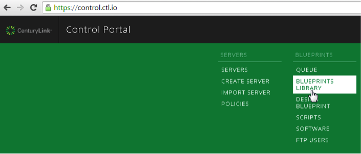
- Search for “Call Me” in the keyword search on the right side of the Blueprints Library page as shown in the image below.
- 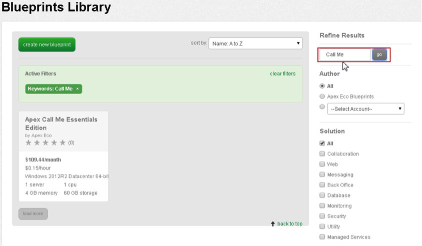
- Locate the Apex Call Me Essentials Edition Blueprint on the left side and click this.

2.	Choose the Blueprint. 
- Click on the "Deploy Blueprint" green button.
- 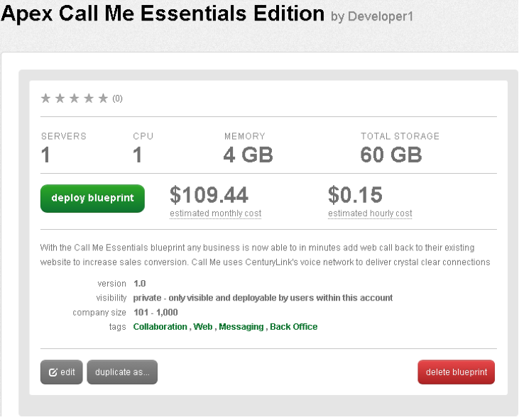

3.	Configure the Blueprint. 
- Complete the info fields required by the Blueprint wizard. An image down below highlights the fields you must complete correctly.
- On the first page, “Customize Blueprint”, ensure the following options are configured.
- Enter the Password/Confirm Password which is the root password for the server. The yellow highlight in the image below shows where to find this. Note that the password you create here for Windows is removed by Call Me so as to provide more of an appliance environment where nothing else can be added or modified to the virtual machine. Call Me is a real time voice app is best done as an appliance type solution. 
- For both Primary & Secondary DNS from the drop down select: “Manually Specify” and input 8.8.8.8 for both primary and secondary DNS servers.  It is vital to use a DNS that resolves public domains. The image below shows where to configure this in the red box outline and the green call out.
- IMPORTANT – leave all other fields as they are and scroll down till the Call Me Web Login section at the bottom. See the highlighted yellow fields at the end of the image below.
- Here you should enter as your Username your business email. 
- Take note: you will not be able to recover your password if you do not enter your correct email password.
- Also enter a strong password that has a mix of letters, numbers and special characters. 
- Be sure to keep the Call Me Web Login safely written down as you will need this login info to access the app later. 
- If you are satisfied with you entries then click the “next step 2” green button at the bottom.
- 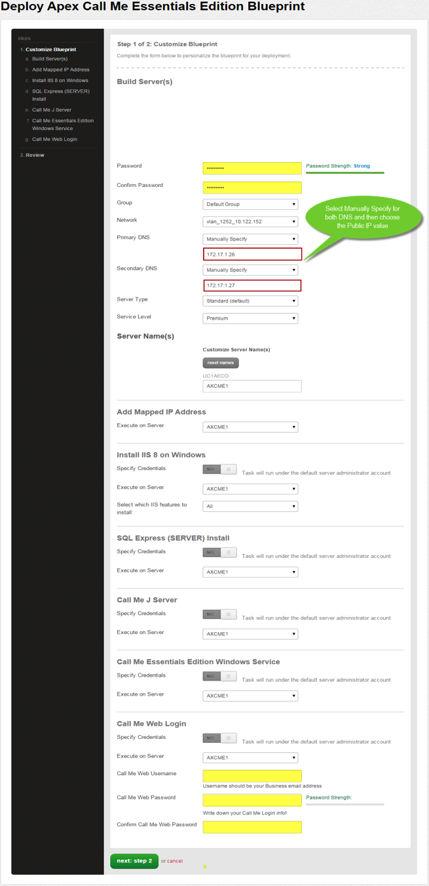

4.	Review and Confirm the Blueprint. 
- You will come to a confirmation view of what your Blueprint looks like.
- Verify your configuration details.
- Then click the “deploy Blueprint” green button at the bottom.
- 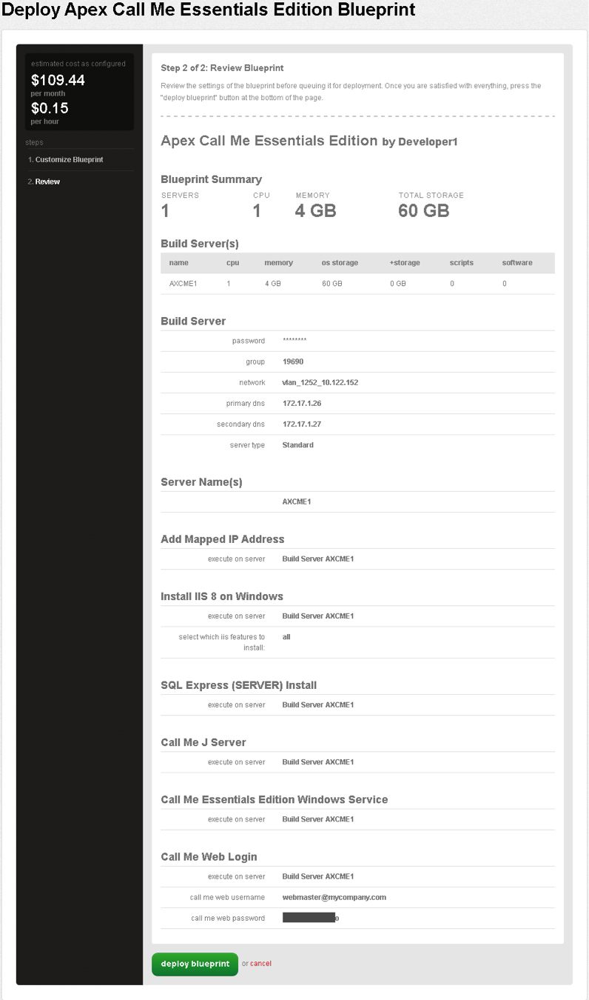

5.	Blueprint Queued & Deployed. 
- Having clicked the deploy Blueprint it will be submitted into a queue and you will be taken to a monitoring page where you can see the progress of each step the Blueprint goes through.  
- There are a total of ten steps and this will take several minutes. You do not need to stay on the monitoring page.
- You can access the queue at any time by clicking the Queue link under the Blueprints menu on the main navigation drop-down.
- Each step as it completes successfully will show a green circle indicator. Should you see a red circle indicator at any step you might be given a resume option which you should take. 
- If the Blueprint is stuck at a red indicator you should open a ticket (possibly through chat if you have this option in your CLC account) to resume the Blueprint.
- Most normally the Blueprint will complete properly. Below is what a successful deployment looks like when completed.
- 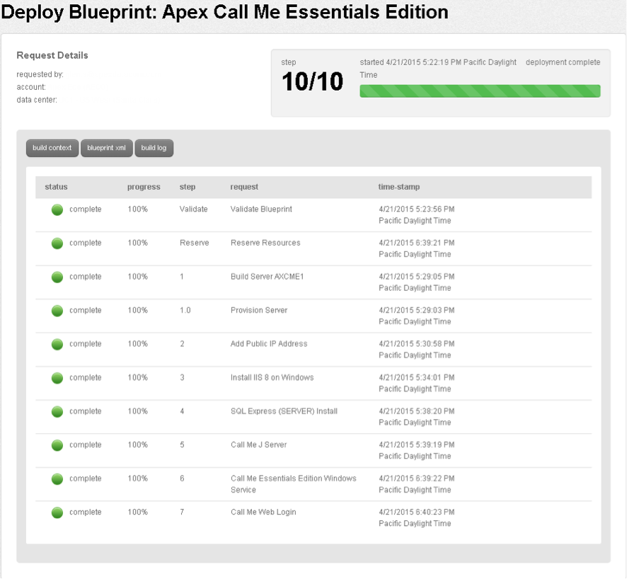

6.	Jump In! 
- Once the Blueprint completes successfully, you will receive an email stating that the Blueprint build is complete. Please do not use the application until you have received this email notification. 
- To get started you need to determine the Public IP that was automatically added for this server.
- To get this Public IP go to your CLC account and locate the newly deployed server and select it so you have a detailed dashboard view of this server. On the right hand side look for your Public IP.  See the image below for an idea.   
- IMPORTANT – do not add any additional IP addresses.
- 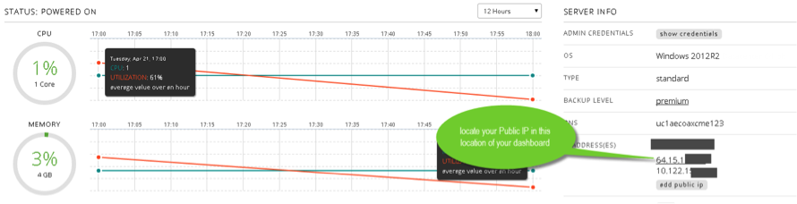

### Access Apex Call Me Application
Follow these steps to access and use the Call Me application

1.	Access Apex Call Me Web Interface
- To access the Apex Web Interface point your browser to the address given below - substituting YOUR_PUBLIC_IP with the actual value you got above.  Use any new version browser like Chrome, Firefox, Safari or IE 9+.  
- http://YOUR_PUBLIC_IP/
- This will bring you to the Call Me app web login screen as shown below. 
- Enter the username and password you created earlier in the Blueprint Call Me Web Login section.   
- 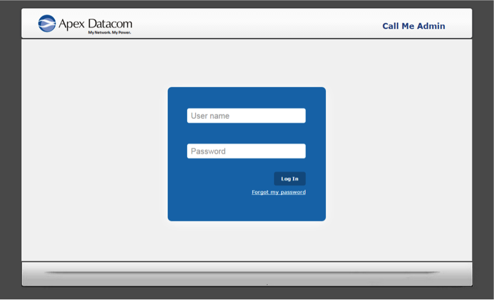

2.	Complete Call Me Registration ASAP
- Once you are logged in complete the Account Registration section immediately so Apex may contact you and work to coordinate the voice long distance integration.  
- You may find the Account Information section in the middle of the My Account page. The fields marked with a red asterisk (*) are mandatory. See image below.
- It is vital you fill in accurate information so Apex may contact you to order and provision as needed CenturyLink Long Distance (SIP IPLD).  Click the Register button when you have completed the form. 
- Note: even if you have existing CenturyLink long distance service Apex will still need to contact and coordinate with you to ensure CenturyLink’s SIP gateway is configured to your new Call Me server Public IP.  
- Once CenturyLink has processed the order as noted above, Apex will update their provisioning server and send you an email at the address given in your Registration.  
- You will see that the VOIP Information section below is disabled and greyed out before you register.  
- 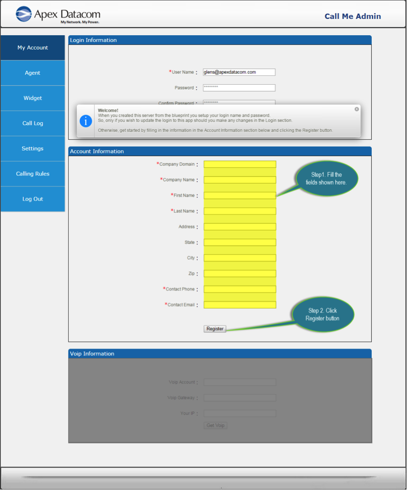

3.	Automatic Trial SIP Provisioned – Now Create An Agent 
- Once you register you will see notifications showing that both the Registration completed and a Thank you message down below in the VOIP Information section.
- Upon registering you are automatically setup with a temporary trial SIP service so you try Call Me without waiting for your production SIP IPLD to be provisioned. 

- Click on the top left Agent menu link to go the Agent page. Image below shows where with the green arrow.
- 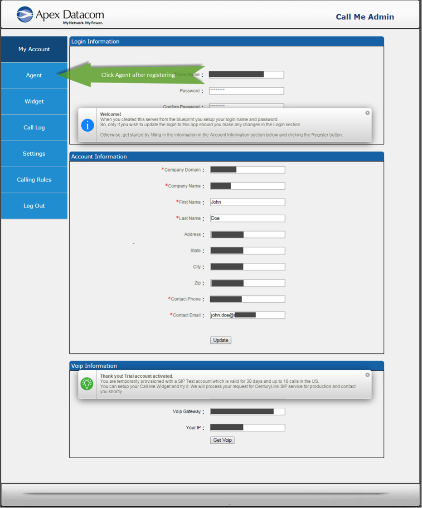

4.	Setup Your First Agent
- On the Agent page you may setup Call Me for different departments or individuals in your company. You will need to define an “agent” for each such ring to phone number at your company. 
- For example, say you have a page on your website which is a sales page and another for service. You may create a Sales Call Me widget to use on your sales page which will ring your sales department phone number.  In addition, you may create a Service Department Call Me Widget and use it similarly. 
- To setup an agent click the orange Add Agent button the top right as show in step 1 in the image below.  
- This will open the New Agent window where in step 2 where you enter the individual or sales department for Agent Name.
-  You will also enter their US or Canadian 10 digit phone number.
- Be careful not create duplicate “Agent names”.  
- Click the Add button in the New Agent form which will then show the new agent in a table on this page. 
- 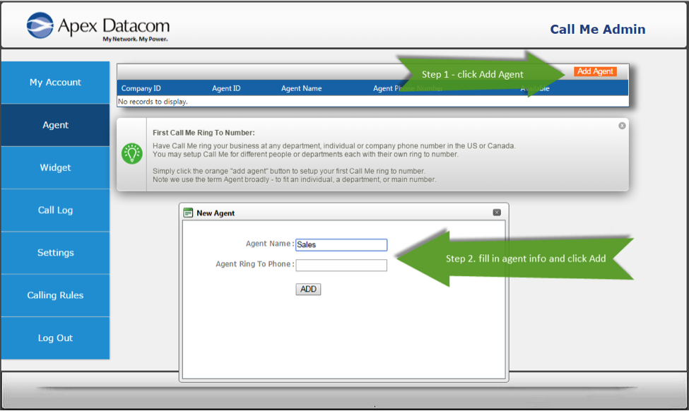

5.	Get To The Widget Page & Select Agent
- Once you have added your agents in the previous section, select the blue Widget Menu link on the left which will take you the Widget page as shown below. 
- At the Widget page select the Agent Name for whom you are creating the widget. See the notification with orange exclamation icon showing where in the image below. 
- Widgets are created fresh each time you come to this page and earlier widget designs are not saved.
- Widgets you create may be downloaded and added your webpage(s). 
- Widgets must run from a web server such as Apache or Windows IIS. 
- To change a Call Me widget on your website, simply re-create it from fresh and merge back with your website.
- 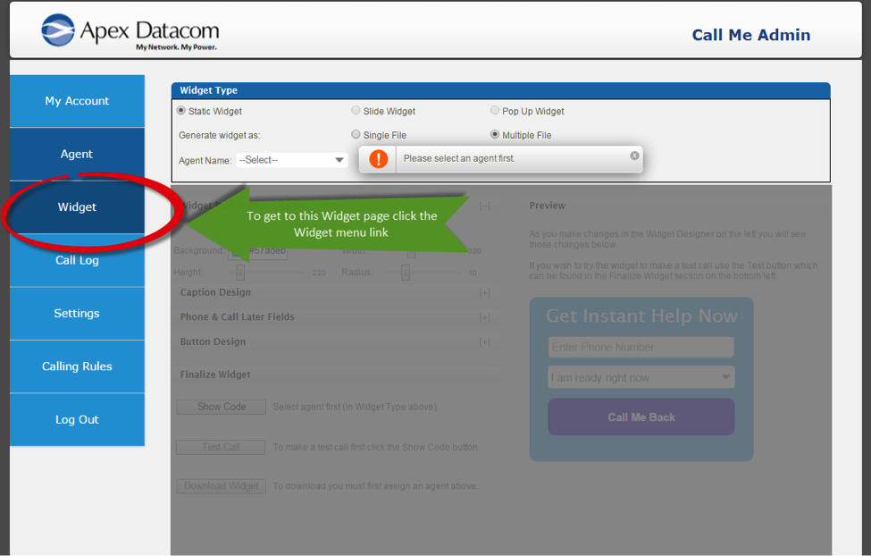

6.	Customizing Your Widget 
- You may customize the colors and look and feel of your widget to fit your web page design and company brand. 
- Once you select an agent you will see the Widget design and Preview area below restored to normal view so you may click on the left side Widget Background Design panel to expand it (see oval red circle).  
- Make changes in the background color and other elements.
- Click the plus (+) sign to maximize the other design panels to explore and modify corresponding items.
- The color codes given are in hex and other items like width are shown in pixels.
- Changes you make will be visible on the right Preview section. 
- 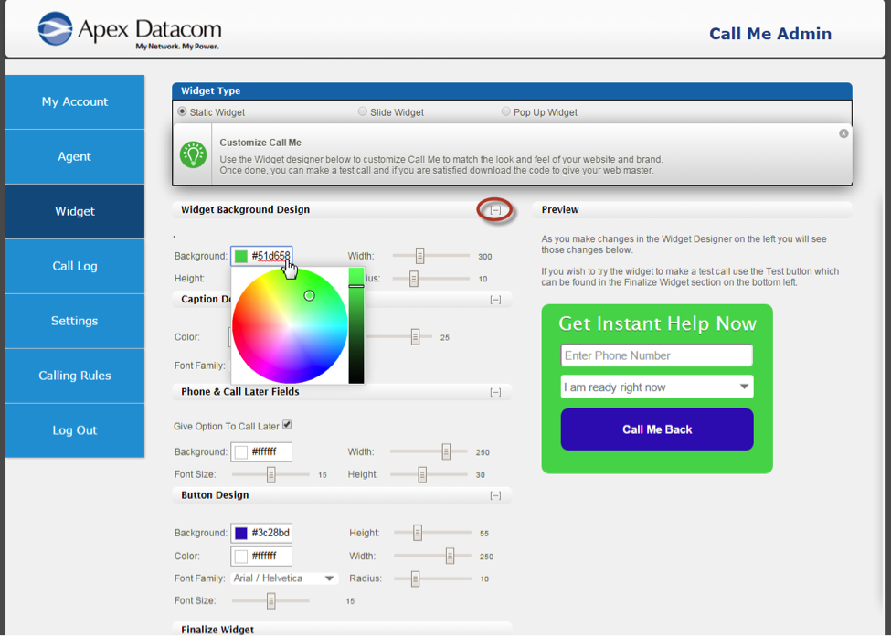

7.	Testing Your Widget 
- Once you have customized the Widget design to your liking go to the Finalize Widget panel on the lower left. See the image below to find the items outlined in the following steps.
- Click the Show Code button which will generate and show some code below.
- Next click on the Test Call button directly below. This will bring up a Make A Call pane on the right side over the Preview section. 
- You may enter your phone number in the Make A Call pane on the right to do a live test. 
- Click the Call Me Back button to trigger the test call.  The system dial will the Agent phone number first and announce “you have a web visitor call”.  
- After this the system will call the number you entered in the Make A Call widget and you will be connected to the agent so you may speak to them live. 
- Be advised during the SIP Trial service you are limited to a total of 10 calls or up to 30 days from registration – whichever comes first. 
- 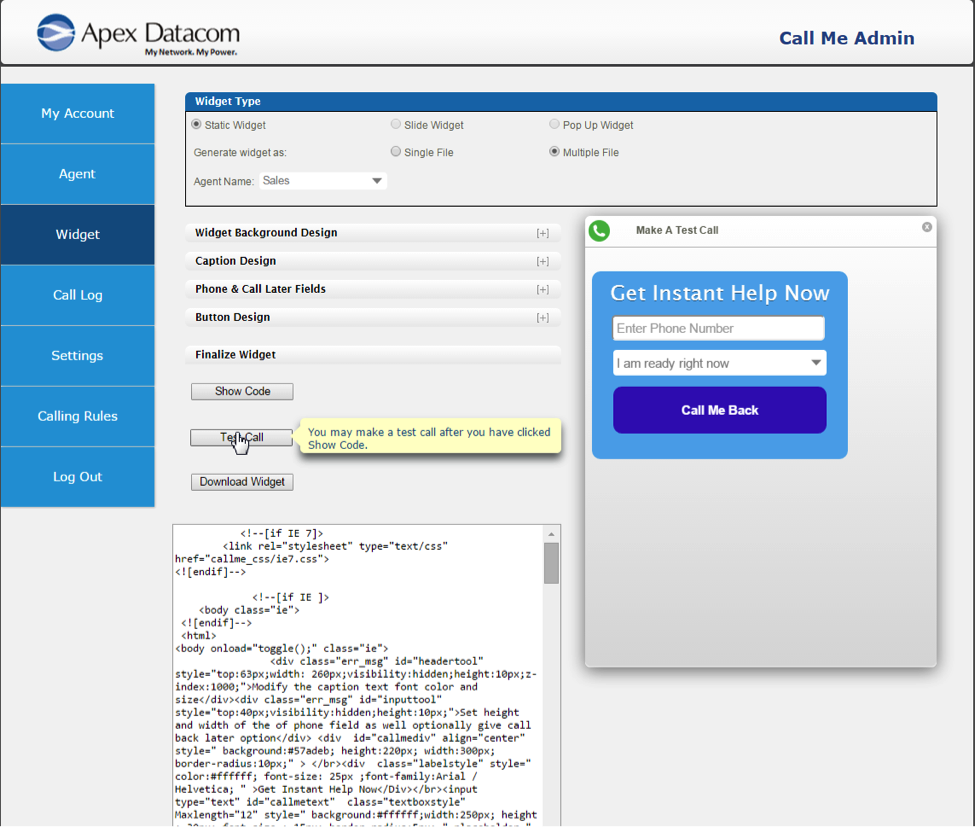

8.	Download Your Widget – Part One
- Now that you have tested the widget you may download it. Simply go back on the left under the Finalize Widget panel and click the Download Widget button as shown in the following image where you see the cursor hand and yellow highlighted help text. 
- 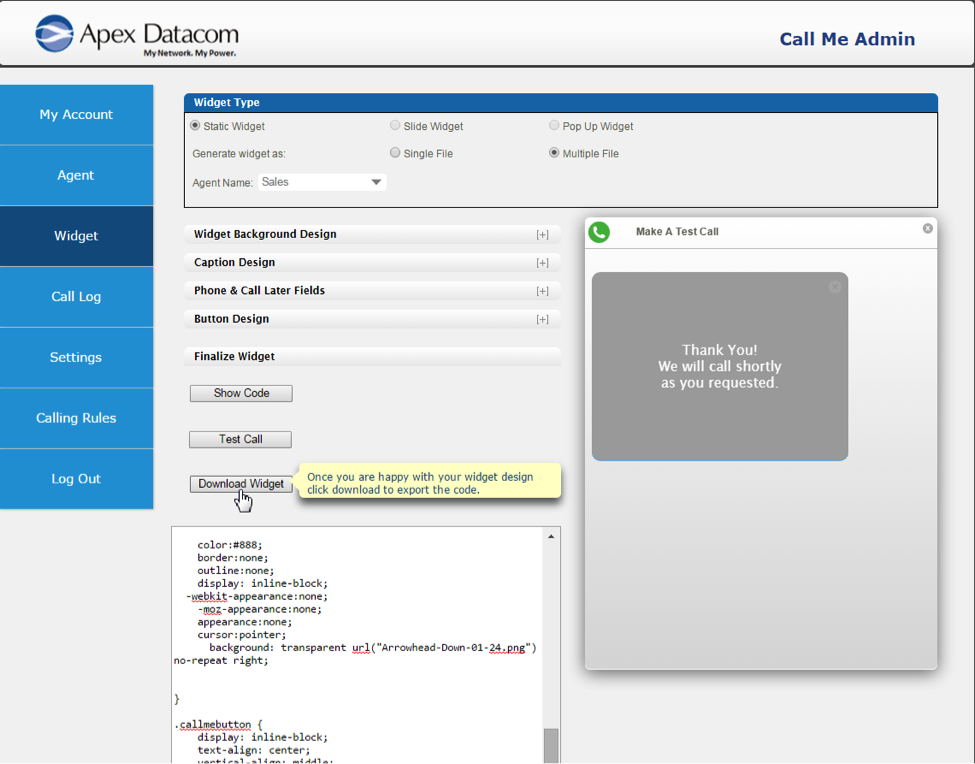

9.	Download Your Widget – Part Two
- A window will open that gives you a file to save to your PC. The screenshot below shows how this looks on a Windows PC.
- Save this file to a destination path of your choice. 
- This is a zip file which contains the widget code plus a readme.txt file
- Extract the zip file and follow the directions in the readme.txt
- In essence, you will give this zip file to your webmaster who will add the widget to your website following the information in the readme.txt
- Note the widget code will not execute any calls by simply opening the html file and running that. You will need to place this code in a web server with a configured website as referenced earlier. 
- 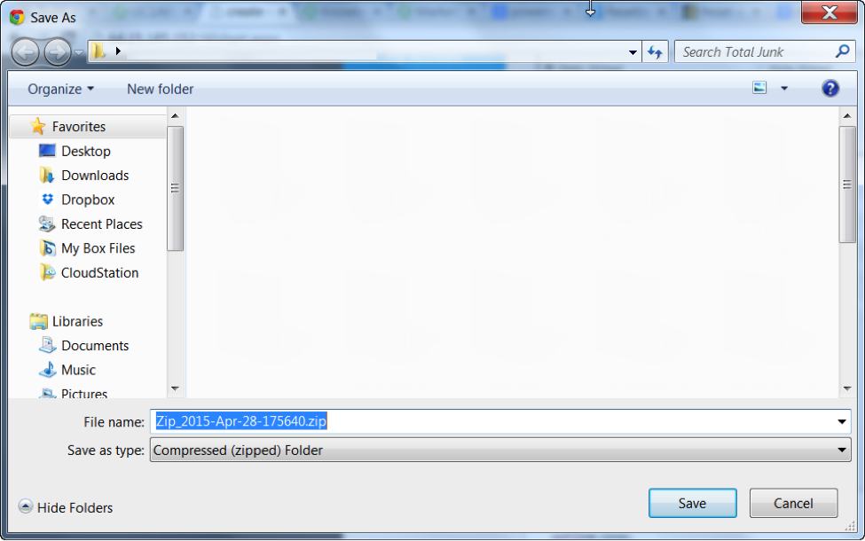

### Pricing
The costs associated with this Blueprint deployment are for the CenturyLink Cloud infrastructure only.  There are no Apex Datacom license costs or additional fees bundled in.  However, after the free trial, if you want to use the service you will need to place an order through Apex Datacom for the CenturyLink SIP long distance.  

### Frequently Asked Questions

#### How do I get my long distance provisioned to work with Call Me?
When you complete your registration within the web app, Apex will be notified and reach out to you to coordinate this. 

#### Who should I contact for support?
* For issues related to deploying the Call Me Essentials Blueprint on CenturyLink Cloud, please contact support [CTLcallme@apexdatacom.com](mailto:CTLcallme@apexdatacom.com). 
* For help on the Call Me Essentials app – please email [CTLcallme@apexdatacom.com](mailto:CTLcallme@apexdatacom.com) with your request and indicate a few times over the next few business days between 7am PST to 5pm in which you are available. You will need to ensure you are near a PC with internet access and are able you are able to attend a Webex walk through.   
* For issues related to cloud infrastructure (VM’s, network, etc), or is you experience a problem deploying the Blueprint, please open a CenturyLink Cloud Support ticket by emailing [noc@ctl.io](mailto:noc@ctl.io) or [through the support website](https://t3n.zendesk.com/tickets/new) 

