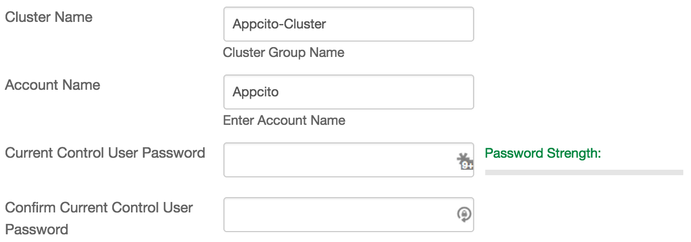
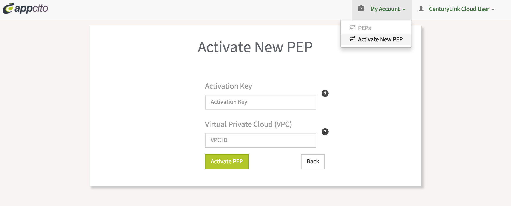

{{{
  "title": "Getting Started with Appcito CAFE - Blueprint",
  "date": "10-6-2015",
  "author": "<a href='https://twitter.com/KeithResar'>@KeithResar</a>",
  "attachments": [],
  "contentIsHTML": false
}}}


### Technology Profile


Appcito delivers cloud-based services that make it fast and easy to keep cloud applications performant, secure, available, and always improving.

Our cloud-native proxy-based service improves application delivery with a web-scale solution for load balancing, application security, continuous deployment and more. Innovative application teams rely on Appcito to make their applications hum, their users happy and their companies succeed.

http://www.appcito.com


##### Customer Support

|Sales Contact   	|
|:-	|
|support@appcito.com   	|


### Description

Appcito CAFE (Cloud Application Front End) is an easy-to-deploy, unified and cloud-native service that enables cloud application teams to select and deploy enterprise grade L4 to L7 application network services. Appcitos subscription-based service is designed to meet the needs of both application owners and DevOps and provides different tiers of service starter, business and enterprise. Its integrated, scalable and pay-as-you-go service is easy to consume and takes less than 5 minutes to get started. Service Offering: Availability Services: Elastic Load Balancing for high availability of application with built in autoscaling, analytics and feedback capabilities. Load balancing techniques include Round Robin, Weighted Average, Least Connections. Performance Optimization: Front-end optimization capabilities including Compression, Caching, Page Speed and SPDY services optimize the performance of website and mobile applications. Content switching and programmability allows policy based URL re-direction to customize application end user experience Application Security: Detection and protection from application from DDOS attacks; Web Application Firewall for top OWASP attack detection and prevention like SQL injection or cross-site scripting types of attacks; Elastic SSL to enable application transport security and prevent snooping, phishing attacks Continuous Deployment: Blue/Green upgrades facilitates policy-based redirection of application traffic (traffic steering).


### Audience

CenturyLink Cloud Users


### Prerequisites

* Access to the CenturyLink Cloud platform as an authorized user


### Postrequisites

* A functioning account on the Appcito platform http://ctlcafe.appcito.com/#signup


### Steps to Deploy a New Appcito ADC

1. **Locate the Blueprint in the Blueprint Library**

 Starting from the CenturyLink Control Panel, navigate to the Blueprints Library. Search for "Appcito" in the keyword search on the right side of the page.

  

2. **Click the Deploy Blueprint button.**

3. **Set Required parameters.**

  

  * **Cluster Name**
  * **Account Name**
  * **Control User Password** - The password associated with your control.ctl.io login

4. **Set Optional Parameters**

  Password/Confirm Password (This is the root password for the server. Keep this in a secure place).  

  Set DNS to “Manually Specify” and use “8.8.8.8” (or any other public DNS server of your choice).

  Optionally set the server name prefix.

  The default values are fine for every other option.

5. **Review and Confirm the Blueprint**

6. **Deploy the Blueprint**

  Once verified, click on the **deploy blueprint** button. You will see the deployment details stating the Blueprint is queued for execution.

7. **Deployment Complete**

  Once the Blueprint has finished execution you will receive an email confirming the newly deployed assets within a few minutes.  If you do not receive an email like the one shown below you may have had a deployment error - review the *Blueprint Build Log* to for error messages.

8. **Complete Activation**

 * Login to your newly created server and take note of the *Appcito Activation Key* displayed on login:

   ```
   Welcome to Appcito PEP image built on Wed Sep 23 17:47:37 UTC 2015

   Appcito Activation Key:  630377EA-621B-11E5-B289-5B1EDFA4CB8D
   Please signup/login into your account at http://ctlcafe.appcito.com to activate Appcito Load balancer
   ```
 * [Login to your existing Appcito account](http://ctlcafe.appcito.com/) or [sign up for a new one](http://ctlcafe.appcito.com/#signup)
 * Click on `My Account` then click on `Activate PEP`
   


### Pricing

The costs listed above in the above steps are for the infrastructure only.

After deploying this Blueprint, you may secure entitlements to the technology using the following steps:

 * Email: support@appcito.com

Additional resources:

* [Introduction to Appcito CAFE](http://support.appcito.com/support/solutions/articles/5000478428)
* [Plans and Pricing](http://www.appcito.com/appcito-cafe/plans/)
* [Features and Capabilities](http://www.appcito.com/appcito-cafe/)

### Frequently Asked Questions

**Where do I obtain my license?**

Contact support@appcito.com.

**Who should I contact for support?**

* For issues related to deploying Appcito, visit http://support.appcito.com, call (408) 560-3320, or email support@appcito.com.
* For issues related to cloud infrastructure, please open a ticket using the [CenturyLink Cloud Support Process](../../Support/how-do-i-report-a-support-issue.md).
