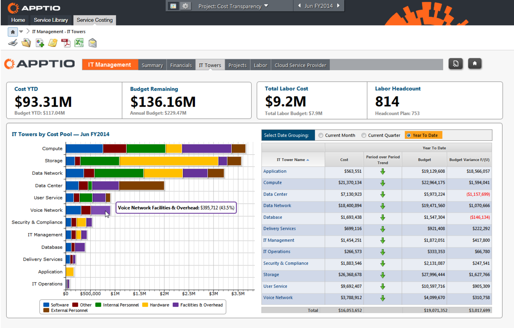

{{{
  "title": "Getting Started With Apptio",
  "date": "12-02-2015",
  "author": "<a href='https://twitter.com/KeithResar'>@KeithResar</a>",
  "attachments": [],
  "contentIsHTML": false
}}}

### Technology Profile

Providing the industry's most comprehensive view of cloud costs. Real-time analytics, standardized costing, and a partnership with Lumen Cloud allow for complete analysis of public, private, and hybrid cloud computing environments.

https://www.apptio.com/

##### Customer Support

| Sales Contact  |
|:- |
| [Contact Apptio](http://www.apptio.com/about/contact)  |

### Description
Apptio is the leading provider of cloud-based Technology Business Management (TBM) software that helps CIOs manage the business of IT. Apptio's suite of applications use business analytics to provide facts and insights about technology cost, value, and quality, so IT leaders can make faster, data-driven decisions. The purpose-built applications help companies align technology spend to business outcomes and automate IT processes like cost transparency, benchmarking, showback/chargeback, operational efficiency, and planning. 

Powering Apptio's applications is a next generation, in-memory cost analytics platform that takes data directly from all financial, operational, and billing systems, and powers applications that give customers deep insight. This insight spans infrastructure, applications, and business services, both on-premises and in the cloud. Hundreds of customers, including more than one-third of the Fortune 100, choose Apptio as their business system of record for IT.

### Steps to Access
For more information on Apptio's Cost Transparency application, please visit: http://www.apptio.com/applications/cost-transparency

### Frequently Asked Questions

**Where do I obtain my license?**
[Contact Apptio](http://www.apptio.com/about/contact).

**Who should I contact for support?**
* For issues related to using Apptio [contact Apptio support](http://www.apptio.com/about/contact).
* For issues related to cloud infrastructure, please open a ticket using the [Lumen Cloud Support Process](../../Support/how-do-i-report-a-support-issue.md).
