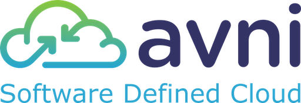

{{{
"title": "Getting Started with Avni Software Defined Cloud - Partner Template",
"date": "08-13-2015",
"author": "Bob Stolzberg",
"attachments": [],
"contentIsHTML": false
}}}

### Partner Profile
Avni – pioneer of Software Defined Cloud which simplifies production deployment of applications and network services in virtual clouds.

For more information, visit [Avni](http://www.avni.io).

#### Contact AVNI
##### Avni Sales and Support:
* Email Support - [contact@avni.io](mailto:contact@avni.io)
* Telephone Support - (650) 224-2637
* Web Support - [http://www.avni.io](http://www.avni.io)
* Sales and Marketing - [contact@avni.io](mailto:contact@avni.io) or call (240) 375-9380

### Description
Avni offers the first Software Defined Cloud platform to automate the deployment of applications and network services to private, public or hybrid clouds. Avni easily orchestrates new or existing multi-tier applications, gathers metrics from application and network services, derives intelligent insights, and takes proactive actions to ensure availability, performance, and application/network SLA based on policy. Companies in retail, financial services and media industries rely on Avni’s platform to bring new services to market quickly. Avni is headquartered in Silicon Valley in Milpitas, Calif. with additional development facilities in Bengaluru, India. Visit us at [http://www.avni.io](http://www.avni.io)

### Solution Overview
Applications have increasingly become the demand driver for bringing new products and services to market. To stay ahead of the competition and improve quality of experience, many companies are moving their apps to private, public or hybrid clouds. However, creating a production environment on clouds can be complex and vary for each app. In addition, because customers expect to be locked-in to whatever cloud they use, the process to select a cloud has become complex and time consuming. Existing solutions only solve part of the problem or force customers to abandon their favorite tools.

Avni solves those problems providing cloud virtualization, which abstracts away the choice of cloud, and a comprehensive deployment architecture, which simplifies the integration of application logic with data traffic and orchestration, and enables auto-SLA across a distributed production environment. The Avni SDC software accomplishes all that while working with customers’ existing Dev, Virtualization, and DevOps tools and technologies.

The result is lower costs, faster to time to market, and the ability to make infrastructure or application changes in minutes.

Avni has certified their Software Defined Cloud to manage workloads on the CenturyLink Cloud platform.

### Offer
Avni has provided a Virtual Appliance - called a Partner Template - that can be deployed to your CenturyLink Cloud account via a Service Task. Although Service Tasks are ordinarily billed to the end user account, CenturyLink will provide a refund for the Service Task costs associated with deploying the Avni Partner Template. Please follow the process below to request credit. In order to purchase a license or entitlement, please contact Avni Sales using the contact information above.

For the first time in the cloud industry, Avni has made it possible to automate and simplify every aspect of infrastructure design, build-out, re-architect, and scale private, hybrid, and public clouds. With the Avni SDC software, you can now deploy apps in minutes – not in weeks or months – and see immediate, measurable and significant savings in OpEx and CapEx.

Customers can use Avni for Dev/Test, DevOps automation, existing business-critical multi-tier apps in production, scale-out micro-services based apps, etc. In all cases, existing

The Avni SDC software is the first solution to integrate all the critical technologies so that you can deploy your existing apps in minutes in any cloud. For more information on SDC, use the contact information above.

### Audience
- CenturyLink Cloud Users

### Impact
After reading this article, the user should feel comfortable deploying the Avni SDC technology on CenturyLink Cloud. Avni has provided a Virtual Appliance - what we call a Partner Template - that can be deployed to your CenturyLink Cloud account via a Service Task.

This deployment process for Partner Templates currently requires manual interaction via the Service Task process, but will be further automated in future releases of the CenturyLink Cloud Platform.

If you are interested in seeing this type of Partner Template deployment as an automated feature in the future, please share your input with us at [features@ctl.io](mailto:features@ctl.io).

### Prerequisite
* User requires access to the SDC Cloud platform as an authorized user.
* Access to the CenturyLink Cloud platform as an authorized user.
* Identify a Network VLAN you want the Avni SDC VM to reside on

### Postrequisite
* If you want to access your Avni SDC over the internet, please perform the following tasks once your Avni SDC has been deployed to your account.

* [Add a Public IP](../../Network/how-to-add-public-ip-to-virtual-machine.md) to your server through Control Portal

* If required, [allow incoming traffic for the admin port](../../Network/how-to-add-public-ip-to-virtual-machine.md) by clicking on the Servers Public IP in Control Portal. Warning: Please make sure your firewall rules are properly configured to only allow specific source traffic. If you do not configure source traffic rules you risk exposing your VM to the entire internet. Note: When accessing your VM for the first time or for any administration, we recommend you connect to your CenturyLink Cloud environment via Client VPN.

### Detailed Steps to Deploy Avni SDC
Avni SDC deploys in a virtual appliance model, as a CenturyLink Cloud *Partner Template*. Follow these step by step instructions to deploy a Avni SDC in to your CenturyLink Cloud account:

* Open a service task request ticket via email to ServiceTasks@ctl.io with the following details. **You will need to edit some of the information below**.

----
TO: ServiceTasks@ctl.io

EMAIL SUBJECT: Ecosystem Partner Template Import Request

CLC Support Team,

Please create a ticket to import the Ecosystem Partner Template image  referenced below to my CenturyLink Cloud Account:
* Import CenturyLink Ecosystem Partner Source Image: Avni SDC
* My CenturyLink Cloud Account Alias: ####
* My CenturyLink Cloud Account PIN:  ######
* Data Center to import image to: ###
* Server Name to import image as: ACAPP
* VLAN in the account to add the Server to: ########

Please let me know if you have any questions or issues. Kindly send me a reply once the work has been completed and let us know the IP address of the server where this technology has been deployed.

Thank you very much,

Your_Name_Here

-----

### Accessing and Configuring your Avni SDC partner template
Follow these steps to access and configure your Avni SDC partner template once you receive an email from Service Tasks confirming the partner template has been deployed to your account.

1. Contact Avni support team at contact@avni.io for trial license, SDC launch instruction manual and user guide
2. Follow the instructions to launch Avni SDC controller VM and note down the VM’s public IP
3. Go to <Avni-SDC-Controller-Public-IP>:8090 and bootstrap the SDC controller using following information:
   *	Controller IP: <Avni-SDC-Controller-Public-IP>
   *	Username: <CenturyLink-Username>
   *	Password: <CenturyLink-Password>
   *	Server Group Name: <CenturyLink-Server-Group-Name> (for example, Default Group)
   *	Region: <Datacenter-Region-Code> (for example, it should be WA1 for Seattle datacenter)
   *	Image Name: <AVNI-SDC-Template-name>: For the template name please refer to the Avni SDC launch instruction manual and user guide.
   *	Avni VMs Network: <Network-For-SDC-VMs>

Refer to Avni SDC user guide for more information.

### Pricing
There are no Avni license costs included. The cost to deploy the Avni SDC Partner Template will be billed as a Service Task, but CenturyLink will provide a credit for those costs. In order to receive a credit, please follow the instructions below. More information about Service Tasks and fees is [available here](http://www.ctl.io/service-tasks).

#### Avni Pricing
1. Software Defined Cloud Controller (CTL SDC CNTRL): $25,000/Instance/Year
2. Software Defined Network Services (CTL SDN SVC): $100/Instance/Year
3. Application VM Management (CTL APP VMM): $100/Instance/Year

Please contact Avni directly to purchase a license by emailing [Avni](mailto:contact@avni.io).

#### Process to request credit for Service Task fee
Follow this process to request credit on your account to re-imburse any expense to deploy the Partner Template.

* Please copy and paste the email below and send it to [ECOSystem@centurylink.com](mailto:ECOSystem@centurylink.com)

----

TO: ECOSystem@centurylink.com

EMAIL SUBJECT: Requesting Credit for Avni SDC Partner Template Deployment

CLC Ecosystem Team,

I am requesting a credit be placed on my account to cover the fees associated with deploying the Avni SDC Partner Template to my account under the Service Task deployed on MM/DD/YYYY. My CenturyLink Cloud username or account alias the credit needs to be placed on is ######

Thank you very much, your_name_here

----

### Frequently Asked Questions

#### Where do I obtain my Avni License?
Existing CenturyLink  Customers can contact their Account Representative for help obtaining a Avni license, or contact Avni directly:
* Web - [http://www.avni.io](http://www.avni.io)
* Sales and Marketing - Email [contact@avni.io](mailto:contact@avni.io) or Call (240) 375-9380

#### Who should I contact for support?
* For issues regarding the Avni SDC virtual appliance, please contact Avni:
  * Email Support - [contact@avni.io](mailto:contact@avni.io)
  * Telephone Support - (650-224-2637
  * Web Support - [http://www.avni.io](http://www.avni.io)

* For issues related to CenturyLink cloud infrastructure (VMs, storage, network, etc.), or if you experience a problem deploying the partner template, please open a CenturyLink Cloud Support ticket by emailing [noc@ctl.io](mailto:noc@ctl.io) or [through the support website](https://t3n.zendesk.com/tickets/new).
