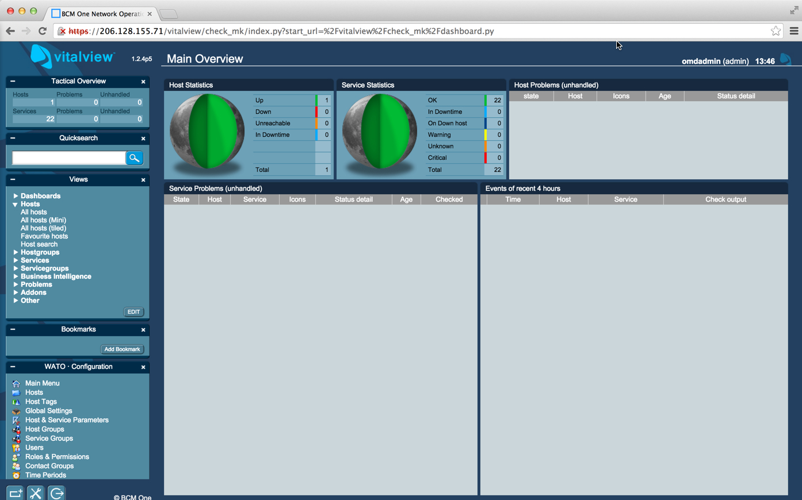

{{{
  "title": "Getting Started with BCMOne Vital View - Blueprint",
  "date": "01-05-2015",
  "author": "Bob Stolzberg",
  "attachments": [],
  "contentIsHTML": false
}}}

### Partner Profile
* BCMOne Vital View - Intelligent monitoring platform
* http://www.bcmone.com/vitalview
* CenturyLink Cloud Account Alias: BCM

### Customer Support:
* 24x7 Email Support - [support@bcmone.com](mailto:support@bcmone.com)
* Telephone Support - (888) 543-2000
* Sales and Marketing - [Vital View Sales](mailto:VitalViewNewReg@BCMOne.com)

### Description
Vital View has integrated their technology with the CenturyLink Cloud platform. The purpose of this KB article is to help the reader take advantage of this integration to achieve rapid time-to-value for this intelligent monitoring solution.

### Audience
CenturyLink Cloud Users

### Impact
After reading this article, the user should feel comfortable getting started using the Vital View technology on CenturyLink Cloud.

### Prerequisite
* Access to the CenturyLink Cloud platform as an authorized user.
* If you want to access Vital View from the internet or a Mobile Device, you will need to manually add a Public IP address to the VitalView server. For more information, view this [Knowledge Base](http://www.ctl.io/knowledge-base/network/how-to-add-public-ip-to-virtual-machine.md) article.

###  Detailed Steps
Follow these step by step instructions to get started with a single-server Vital View deployment.
1. Locate the Blueprint in the Blueprint Library.
   * Login to the Control Portal. From the Nav Menu on the left, click **Orchestration > Blueprints Library**.
   * Search for “Vital View” in the keyword search on the right side of the page.
   * Click the “Install Vital View” Blueprint.

2. Choose the Blueprint.
   * Click the `deploy blueprint` button.

3. Configure the Blueprint.
   * Complete the information/fields required by the Blueprint wizard.
   * On the first page, “Customize Blueprint”, ensure the following options are configured.
     * Password/Confirm Password (This is the root password for the server. Keep this in a secure place).
     * Set DNS to “Manually Specify” and use “8.8.8.8” (or any other public DNS server of your choice).
     * Optionally set the server name prefix.
     * Provide information in additional fields.

4. Review and Confirm the Blueprint.
   * Click `next: step 2`.
   * Verify your configuration details.

5. Deploy the Blueprint.
   * Once verified, click the `deploy blueprint` button. You will see the deployment details along with an email stating the Blueprint is queued for execution.
   * This will kick off the Blueprint deploy process and load a queue page to allow you to track the progress of the deployment.
   * To monitor progress, click **Queue** from the Nav Menu on the left.

6. Get Busy!
   * Once the Blueprint completes successfully, you will receive an email stating that the Blueprint build is complete. Please do not use the application until you have received this email notification.
   * Once the process has completed ­ you will need to determine the your IP address for the newly deployed host. If you navigate to the “Servers” panel and look for the IP addresses. Note the IP address, it will be required in future steps. See the image below for help.
   * **Important**: If you want to access Vital View from the internet you will need to manually add a Public IP address to the Vital View server via the CenturyLink Cloud control portal. For more information, view this [Knowledge Base](http://www.ctl.io/knowledge-base/network/how-to-add-public-ip-to-virtual-machine.md) article.
   * You will need to copy the IP address. It will be required in future steps.

7. Access The Vital View dashboard Interface.
   * The Vital View web interface is accessible via https on port `443` of the server’s public or private IP address. Go ahead and navigate to the dashboard now. Ignore the warning about SSL certificate and continue.
   * https://IPADDRESS/vitalview/check_mk/login.py&nbsp
   * Mobile Devices can access the service by connecting to the Public IP address on the VitalView server.
   * Create An Account - Once you’ve loaded the web interface, go ahead and create the account, you will automatically be logged in.
   

### Pricing
The costs listed above in Steps 1 and 2 are for the CenturyLink Cloud infrastructure only. There are no Vital View license costs or additional fees bundled in. After deploying this Blueprint, the user can secure entitlements to the Vital View technology by using the following steps:
* Contact BCMOne Vital View Support via telephone: (855) 662-7722
* Contact Vital View via the [contact page one their website](https://cloudmine.me/contact/).

### Frequently Asked Questions
**Where do I obtain my&nbsp;Vital View License?**
* Contact BCMOne Vital View via telephone: (855) 543-2000
* Contact BCMOne Vital View via Email Support - [support@bcmone.com](mailto:support@bcmone.com)
* Contact BCMOne Vital View via their [website](http://www.bcmone.com/vitalview)

**Who should I contact for support?**
* For issues related to deploying the Vital View Blueprint on CenturyLink Cloud, please contact [support@bcmone.com](mailto:support@bcmone.com).
* For issues related to cloud infrastructure (VMs, network, etc.), or if you experience a problem deploying the Blueprint or Script Package, please open a CenturyLink Cloud Support ticket by emailing [help@ctl.io](mailto:help@ctl.io) or [through the CenturyLink Cloud Support website](https://t3n.zendesk.com/tickets/new).
