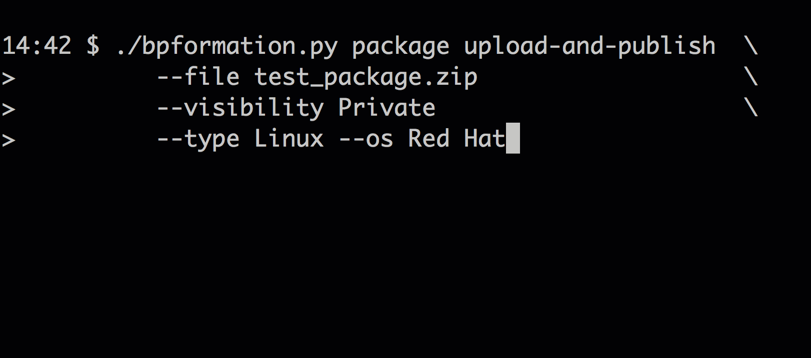
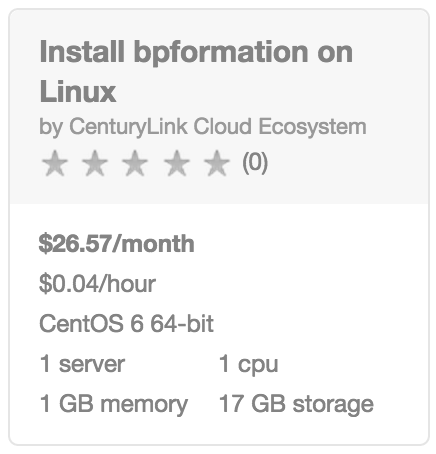

{{{
  "title": "Getting Started with bpformation - Blueprint",
  "date": "06-23-2015",
  "author": "<a href='https://twitter.com/KeithResar'>@KeithResar</a>",
  "attachments": [],
  "contentIsHTML": false
}}}

### Overview

After reading this article, the reader should feel comfortable deploying a [bpformation](https://github.com/CenturyLinkCloud/bpformation) client and using it to orchestrate Lumen Cloud.

### Description
bpformation is used to help you gain access to a command line interface CLI that interacts with the Lumen Cloud Blueprints packaging and workflow services. Query, change, add, and execute Lumen Cloud automation using a cross-platform CLI and definitions defined in common JSON files.

https://github.com/CenturyLinkCloud/bpformation

### Audience

Lumen Cloud Users

#### Steps
1. Locate the Blueprint in the Blueprint Library.

   

   * Login to the Control Portal. From the Nav Menu on the left, click **Orchestration > Blueprints Library**.
   * Search for “bpformation” in the keyword search on the right side of the page.

2. Click the `deploy blueprint` button.

3. Review and Confirm the Blueprint.

4. Deploy the Blueprint.
   * Once verified, click the `deploy blueprint` button. You will see the deployment details stating the Blueprint is queued for execution.
   * This will kick off the Blueprint deploy process and load a page where you can track the deployment progress. Deployment will typically complete within 15 to 20 minutes.

### About Community Releases on Lumen Cloud
Lumen Cloud publishes a variety of packaged and certified community releases of OSS or otherwise generally available software solutions. These certifications are limited to successful deployment of assets on cloud servers and do not extend onto ongoing software configuration, guarantees, or support.

Have a suggestion for other software to include within the Lumen Cloud Blueprints Library? Email ECOSystem@centurylink.com.

### Frequently Asked Questions
**Who should I contact for support?**
* For issues related to cloud infrastructure, please open a ticket using the
  [Lumen Cloud Support Process](../../Support/how-do-i-report-a-support-issue.md).

* For issues relating to the *bpformation* tool itself review the [Github site](https://github.com/CenturyLinkCloud/bpformation) and log
  [Issues](https://github.com/CenturyLinkCloud/bpformation/issues) as needed.
