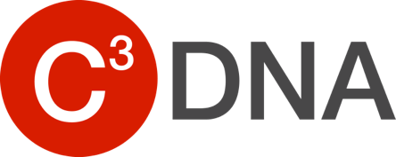
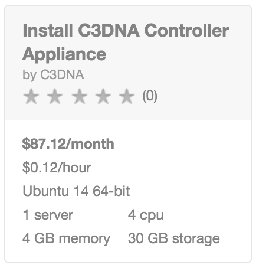
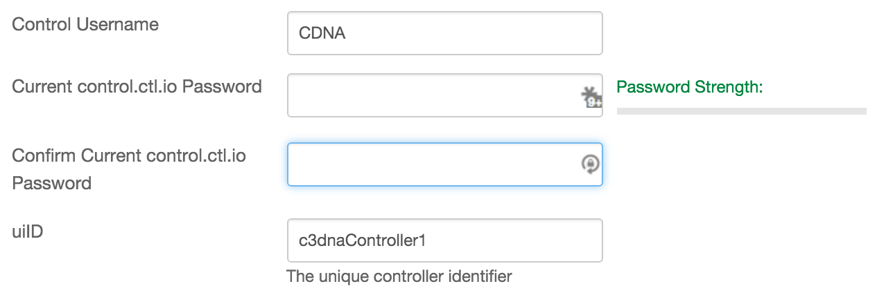
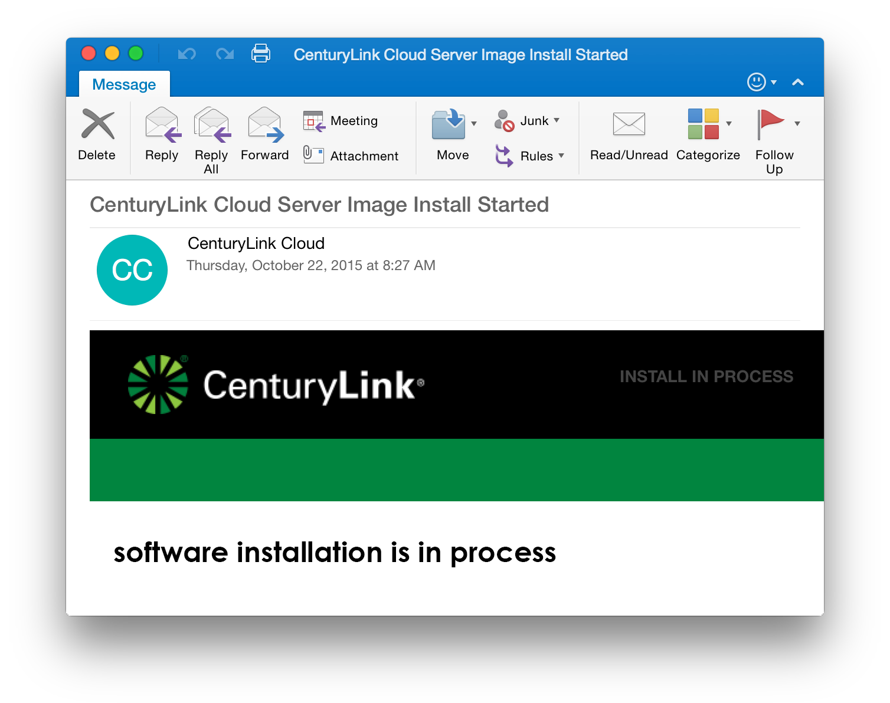
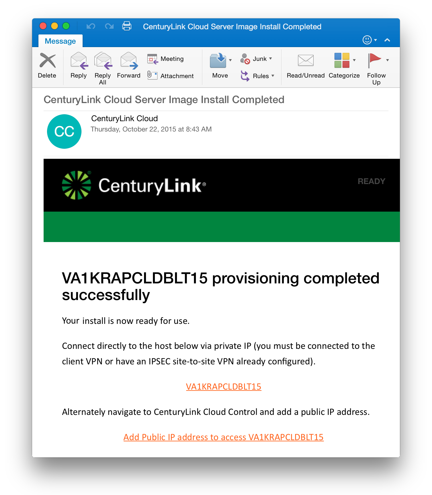
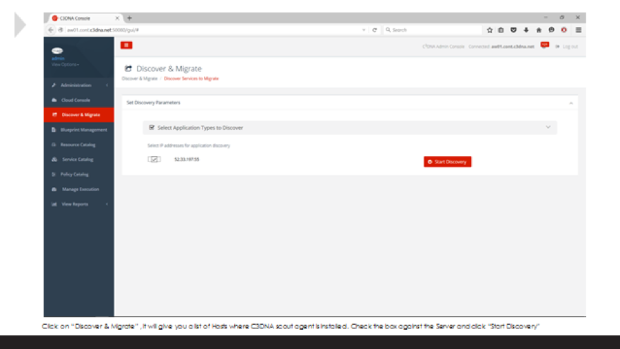
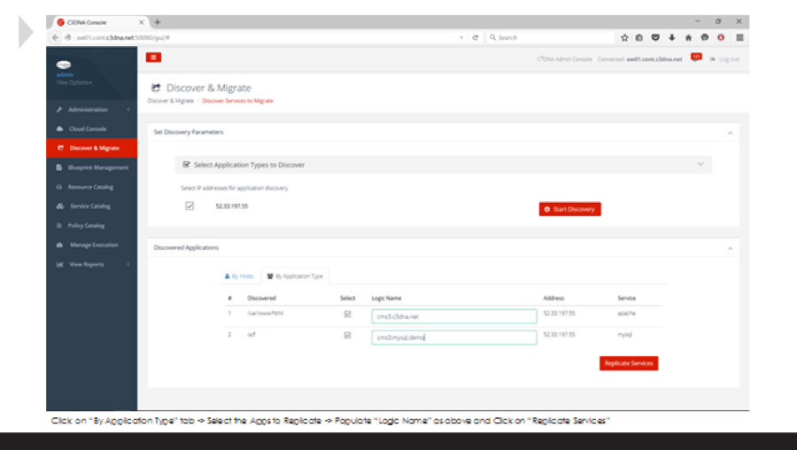
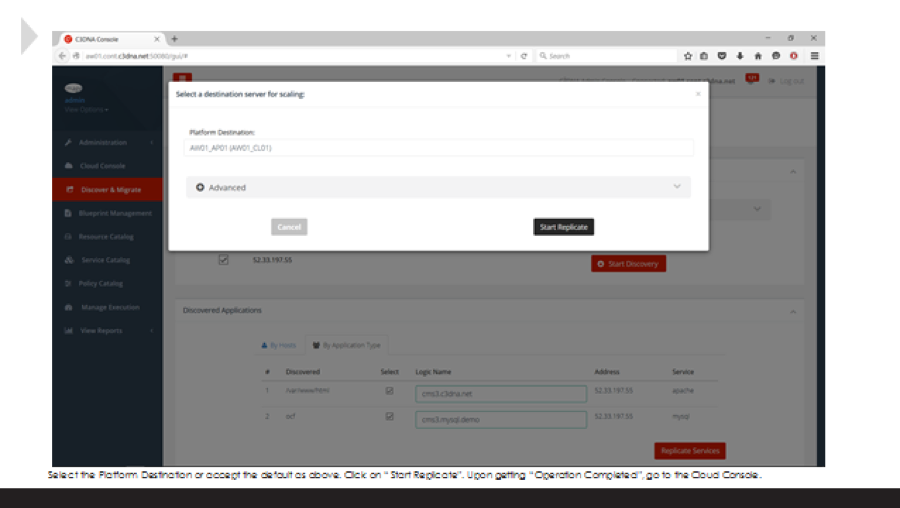
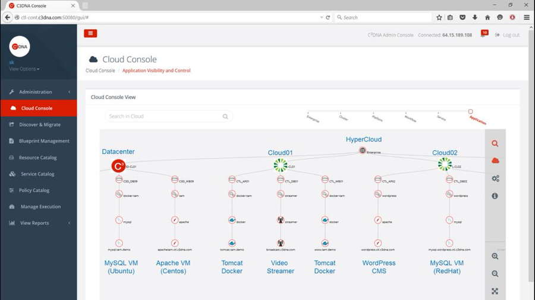

{{{
  "title": "Getting Started with C3DNA Appliance",
  "date": "12-15-2015",
  "author": "<a href='https://twitter.com/KeithResar'>@KeithResar</a>",
  "attachments": [],
  "contentIsHTML": false
}}}

### Technology Profile

C3DNA provides a single platform to support Self-reliant Application Lifecycle Management including migrating entire applications between data centers by just moving the App in only 4 easy steps: Discover, Profile, Migrate, and Assure.

http://www.c3dna.com/product.html

##### Customer Support
| Sales Contact  | Support Contact  |
|:- |:- |
| sales@c3dna.com  | support@c3dna.com  |

### Description
C3DNA’s self-reliant Application Lifecycle Management platform is completely Application driven. By “focusing on the App” we enable easy migration of entire applications between data centers. Our platform tackles the problem at the source and delivers application portability at the app layer. Applications become infrastructure agnostic, self-reliant, portable across clouds and can be “cloudify” in a few steps.

### Audience
Lumen Cloud Users

### Prerequisites
* Access to the Lumen Cloud platform as an authorized user
* control.ctl.io account with password authentication (two-factor authentication not yet supported)

### Steps to Deploy a New Appliance
1. Locate the Blueprint in the Blueprint Library.
   * Login to the Control Portal. From the Nav Menu on the left, click **Orchestration > Blueprints Library**.
   * Search for "C3DNA Controller Appliance" in the keyword search on the right side of the page.

   

2. Click the `deploy blueprint` button.

3. Set Required parameters.

   

   * **Control Username** - The username used to login to control.ctl.io
   * **Control User Password** - The password associated with your control.ctl.io login
   * **uiID** - User specified unique identified for the controller

4. Set Optional Parameters.
   * Password/Confirm Password (This is the root password for the server. Keep this in a secure place).  
   * Set DNS to “Manually Specify” and use “8.8.8.8” (or any other public DNS server of your choice).
   * Optionally set the server name prefix.
   * The default values are fine for every other option.

5. Review and Confirm the Blueprint.

6. Deploy the Blueprint.
   * Once verified, click the `deploy blueprint` button.
   * You will see the deployment details stating the Blueprint is queued for execution.

7. Deployment Complete.
   * Once the Blueprint has finished execution you will receive a number of emails.
   * The first will indicate the server has been deployed and the second will come a few minutes later once the appliance has been fully activated.
   * If you do not receive an email like the one shown below you may have had a deployment error - review the *Blueprint Build Log* to for error messages.

  

    *Email #1: Appliance deploy started*
    
  

  

    *Email #2: Appliance deploy complete*
    
  

   

  Wait for the second email indicating your appliance is ready for use before attempting to access the resource.

8. Begin using C3DNA** - Migrate entire apps between data centers.

   
   * Click on “Discover & Migrate” it will give a list of Hosts where C3DNA scout agent is installed. Check the box against the Server and click “Start Discovery”.

   
   * Select the Apps to Replicate Populate “Logic Name” as above and Click on “Replicate Services”.

   
   * Click on “Start Replicate”. Upon getting “Operation Completed”, go to the Cloud Console.

   
   * The application and the associated database have been successfully replicated.

### Pricing
The costs listed above in the above steps are for the infrastructure only. This install includes a free trial for one application (maximum of 30 platforms, 2 web, 1 standard app, 1 standard DB).

After deploying this Blueprint, you may secure additional entitlements to the technology using the following steps:
* Email: sales@c3dna.com

### Frequently Asked Questions
**Where do I obtain my license?**
* Email sales@c3dna.com.

**Who should I contact for support?**
* For issues related to deploying C3DNA email support@c3dna.com.
* For issues related to cloud infrastructure, please open a ticket using the [Lumen Cloud Support Process](../../Support/how-do-i-report-a-support-issue.md).
