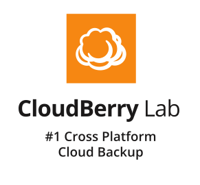
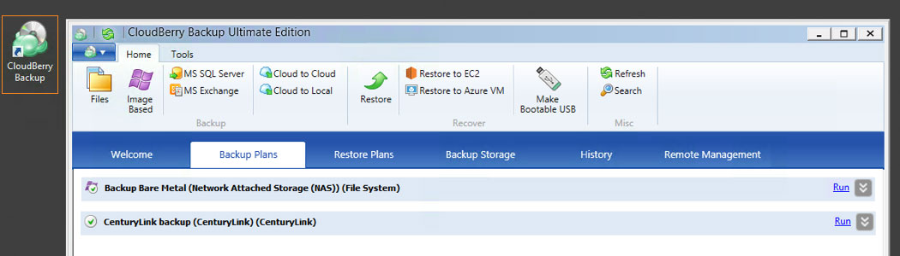
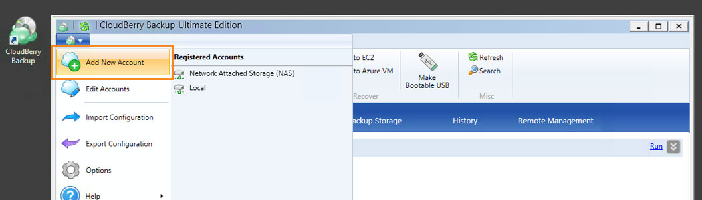
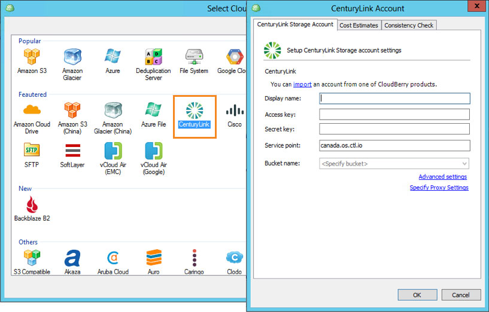
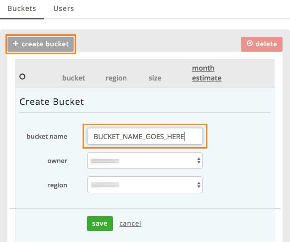
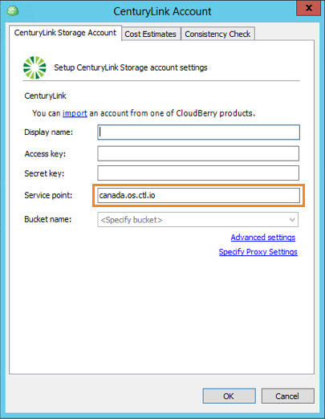
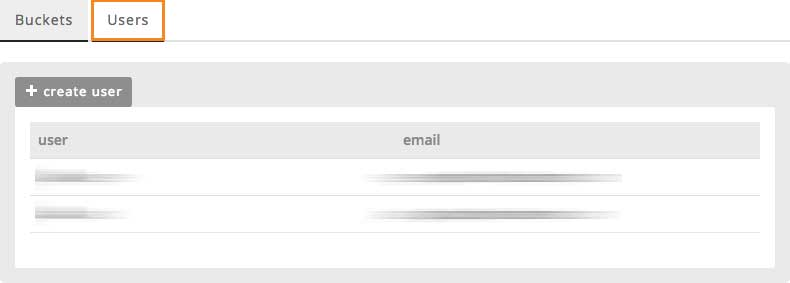
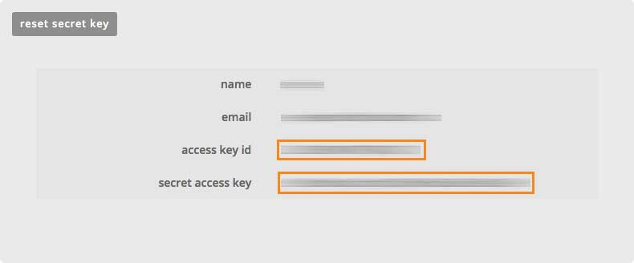
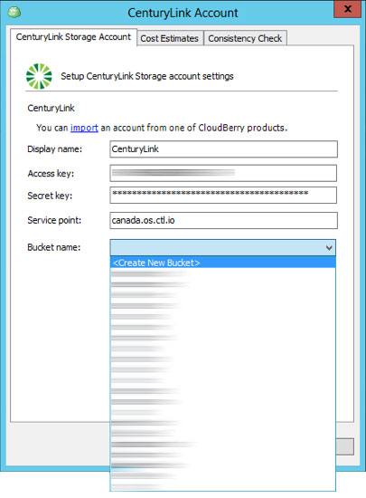
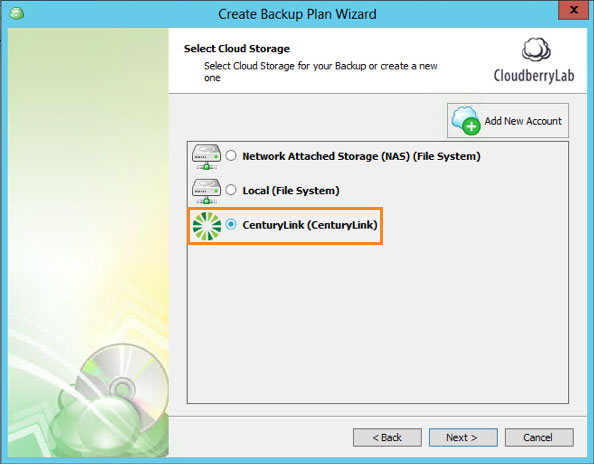

{{{
  "title": "Getting Started with Cloudberry Lab Backup Enterprise - Blueprint",
  "date": "08-14-2016",
  "author": "<a href='https://twitter.com/EvgenyRudinsky'>@EvgenyRudinsky<a/>",
  "attachments": [],
  "contentIsHTML": false
}}}

### Partner Profile
CloudBerry Lab - Provides data backup solutions that allow backing up to all top cloud storage services.

[http://www.cloudberrylab.com](http://www.cloudberrylab.com)

#### Contact Cloudberry lab
##### Customer Sales and Support:
* Customer support
  * Email: [support@cloudberrylab.com](mailto:support@cloudberrylab.com)
  * Telephone: (212) 863 9918
* Solution Architects group
  * Email: [sa-team@cloudberrylab.com](mailto:sa-team@cloudberrylab.com)
  * Telephones: US 1 (917) 720 3791; UK 44 (0) 20 7193 0300
* Sales team
  * Email: [sales@cloudberrylab.com](mailto:sales@cloudberrylab.com)
  * Telephone: (212) 863 9918

### Description
CloudBerry Lab has integrated their backup technology with the CenturyLink Cloud platform. The purpose of this KB article is to help the reader take advantage of this integration to achieve rapid time-to-value for this Backup to Cloud Object Storage solution.

The evolution of cloud  technology saw cloud storage as a great tool to offload on premise storage economics into the cloud. Thanks to ever-increasing Internet bandwidth and declining storage prices, keeping backups in the cloud has become a viable alternative to traditional on-site data storage for SMBs. Many companies often overlook key considerations when it comes to online backup:
* Reliable Storage. When moving backup data offsite, a company should ensure the cloud storage service is reliable, cost-effective, yet high-performing.
* Data Security. Security is a top concern when business data is taken to the cloud. Company's private data could be compromised if the solution lacks the right features.
* Restore Capabilities. Backup data stored at a remote facility should be always at a recoverable state, accessible at any time, and allow point-in-time object-level restore.

### Solution Overview
CloudBerry Backup is a reliable, powerful and affordable cloud backup solutions that is fully compatible with CenturyLink object storage. In addition to offering real-time and/or scheduled regular backups, it allows you to:
* Store backups in a CenturyLink user-owned account.
* Encrypt data via 256-bit AES encryption with user-controlled password.
* Check backup consistency to ensure data is in a recoverable state.
* Free restores No need for a commercial license to restore data.

Technology from CloudBerry Lab helps CenturyLink Cloud customers address the business challenge of secure and easy-to-use backup-to-cloud by implementing Cloudberry Lab backup solution - now available as part of the CenturyLink Cloud Blueprint Engine.

### Offer
CloudBerry Labs has included a free, 15-day trial license with the Blueprint deployment. Users can try the software during that time period without restriction.

### Audience
CenturyLink Cloud Users, Administrators, Engineer, Backup Operators, Storage Enthusiasts

### Impact
After reading this article, the user should feel comfortable getting started using the partner technology on CenturyLink Cloud.

After executing the steps in this Getting Started document, the users will have a functioning backup-agent installed on a virtual server upon which they can start backing up their data to CenturyLink Object Storage.

### Prerequisite
* Access to the CenturyLink Cloud platform as an authorized user.
* Existing Windows Platform server to deploy to.
* Configure the VPN access to the virtual server.

### Deploy CloudBerry Labs Blueprint
Follow these step by step instructions to deploy Cloudberry Backup Enterprise Edition on your server and connect to you CenturyLink Object Storage account.

1. Open the Blueprint Library.
   * Login to the Control Portal. From the Nav Menu on the left, click **Orchestration > Blueprints Library**.

2. Search for the Blueprint.
   * To search for the Blueprint, type “Cloudberry Backup Enterprise for Desktop and Server” under “Refine Results” in the right panel and click the `Go` button.

3. Choose the Blueprint.
   * Click on the Blueprint titled “CloudBerry Backup Enterprise for Desktop and Server”.

4. Deploy the Blueprint.
   * Click the `deploy blueprint` button to begin configuring your installation.

5. Configure the Blueprint.
   * On the first page, “Customize Blueprint”, ensure the following options are configured.
   * Choose the server, you would like to install Cloudberry Backup Enterprise on.
   * Enter the e-mail, which you would like to use for trial activation.
   * Then, click `next step 2`.

6. Review and Confirm the Blueprint.
   * You will come to a confirmation view of what your Blueprint looks like.
   * Verify your configuration details.
   * Then, click `deploy blueprint`.

7. Monitor the Activity Queue.
   * After clicking Deploy Blueprint, the job will be submitted into a queue and you will be taken to a monitoring page where you can see the progress of each step the Blueprint goes through.
   * To monitor progress, click **Queue** from the Nav Menu on the left.

8. Jump In!
   * Once the Blueprint completes successfully, you will receive an email stating that the Blueprint build is complete.
   * Please do not use the application until you have received this email notification.

### Access and use Cloudberry
Follow these steps to access and use the CloudBerry software.

1. Access the VM.
   * Please, log in to your server using the VPN Access.

2. Launch the software.
   * You will see a Cloudberry Backup Enterprise Edition Icon on the desktop.
   * Double click it to launch.

    

3. Add an account.
   * Go to “File” > “Add new account”.

    

4. Choose CenturyLink

    

5. You’ll be requested to enter your CenturyLink Cloud Storage account credentials.

  

6. To add CenturyLink Cloud Storage: Via your web browser, in your CenturyLink Cloud Portal, navigate to “Object Storage” in the top menu.

  

7. Press “Create the bucket”, then enter the bucket name.

  

8. Go to the bucket properties.

  

9. Copy the endpoint without bucket name paste it to the account credentials window in Cloudberry Backup.

  

10. Paste it to the account credentials window in Cloudberry Backup > Service point.

  

  NB! by default it is "canada.os.ctl.io", but if you've being instructed to use different, follow and change (e.g. ca.tier3.io).

11.	Go back to the buckets window and choose the tab “Users”.

  

12.	Choose the user.

  

13.	Copy your secret and access keys.

  

14.	Paste your secret and access keys to the account credentials window in Cloudberry Backup and enter any Display name you like.

  

15. Now you can see all the buckets you have created through your CenturyLink dashboard and create new buckets.
   * Select existing bucket or create new and press "OK".

      

16.	To start creating your first backup plan, press the button “Files”.

    * Proceed to the second step and choose the "CenturyLink" option.
    * Then the connection you have created.

        

17.	All further information you can in the Help topics:

  

### Pricing
The costs associated with this Blueprint deployment are for the CenturyLink Cloud infrastructure only. There are no CloudBerry Labs license costs or additional fees bundled in.

By the first run of Cloudberry Backup you activate the free trial, which is valid for 15 days. As soon as the trial expires, you’ll be able to buy the license online using your credit card. You can also purchase it anytime through Cloudberrylab.com by visiting [this link](http://www.cloudberrylab.com/enterprise-cloud-backup-software.aspx).

### Frequently Asked Questions

#### Where do I get my full CloudBerry License?
You can purchase online by visiting [this link](http://www.cloudberrylab.com/enterprise-cloud-backup-software.aspx).

#### Who should I contact for support?
* For issues directly related to the Cloudberry lab software or licensing, please contact [support@CloudBerryLab.com](mailto:support@cloudberrylab.com) or via telephone: (212) 863 9918.
* For issues related to cloud infrastructure (VMs, network, etc.), or if you experience a problem deploying the Blueprint, please open a CenturyLink Cloud Support ticket by emailing [noc@ctl.io](mailto:noc@ctl.io) or [through the support website](https://t3n.zendesk.com/tickets/new).
