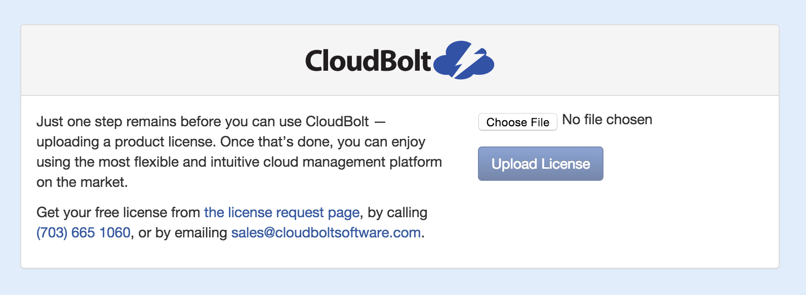

{{{
  "title": "Getting Started with CloudBolt - Appliance",
  "date": "10-22-2015",
  "author": "<a href='https://twitter.com/KeithResar'>@KeithResar</a>",
  "attachments": [],
  "contentIsHTML": false
}}}

### Technology Profile
CloudBolt Software provides a single platform for managing IT infrastructure, orchestration, and automation tools and enabling user self-service through an intuitive service catalog.

http://www.cloudbolt.io

##### Customer Support
| Sales Contact | Support Contact |
|:- |:- |
| sales@cloudbolt.io | support@cloudbolt.io |

### Description
CloudBolt is an intuitive cloud management platform that delivers automated provisioning, unified IT management, chargeback/showback reporting, and interactive service catalogs for user self-service. It integrates both new and existing virtualization and private cloud environments with public clouds, automation scripting tools, and domain‐specific technologies.

### Audience
Lumen Cloud Users

### Prerequisites
* Access to the Lumen Cloud platform as an authorized user
* control.ctl.io account with password authentication (two factor authentication not yet supported)

### Steps to Deploy a New CloudBolt Appliance
1. Locate the Blueprint in the Blueprint Library.
   * Login to the Control Portal. From the Nav Menu on the left, click **Orchestration > Blueprints Library**.
   * Search for "CloudBolt Appliance" in the keyword search on the right side of the page.

2. Click the `deploy blueprint` button.

3. Set Required parameters.
   * **Control User Password** - The password associated with your control.ctl.io login

4. Set Optional Parameters.
   * Password/Confirm Password (This is the root password for the server. Keep this in a secure place).
   * Set DNS to “Manually Specify” and use “8.8.8.8” (or any other public DNS server of your choice).
   * Optionally set the server name prefix.
   * The default values are fine for every other option.

5. Review and Confirm the Blueprint.

6. Deploy the Blueprint.
   * Once verified, click the `deploy blueprint` button.
   * You will see the deployment details stating the Blueprint is queued for execution.

7. Deployment Complete.
   * Once the Blueprint has finished execution you will receive a number of emails.
   * The first will indicate the server has been deployed and the second will come a few minutes later once the appliance has been fully activated.
   * If you do not receive an email like the one shown below you may have had a deployment error - review the *Blueprint Build Log* to for error messages.

  

    *Email #1: Appliance deploy started*
    
  

  

    *Email #2: Appliance deploy complete*
    
  

   

   * Wait for the second email indicating your appliance is ready for use before attempting to access the resource.

8. Accessing Your Appliance.
   * Access your appliance by navigating to the server's private IP address with your web browser and uploading a license key
   

9. Get Going!
   * You’re now ready to integrate Lumen Cloud with your configuration managers, provisioning engines, and other tools to deploy systems and publish them in the CloudBolt Service Catalog.
   * Review CloudBolt's [Installation and configuration information is available](http://docs.cloudbolt.io/installation.html#complete-the-quick-setup-wizard) to begin using the service.

### Pricing
The costs listed above in the above steps are for the infrastructure only. After deploying this Blueprint, you may secure entitlements to the technology using the following steps:
* Email: sales@cloudbolt.io

### Additional resources:
* [CloudBolt Documentation](http://docs.cloudbolt.io/index.html)

### Frequently Asked Questions
**Where do I obtain my license?**
* Contact sales@cloudbolt.io.

**Who should I contact for support?**
* For issues related to deploying CloudBolt email support@cloudbolt.io.
* For issues related to cloud infrastructure, please open a ticket using the [Lumen Cloud Support Process](../../Support/how-do-i-report-a-support-issue.md).
