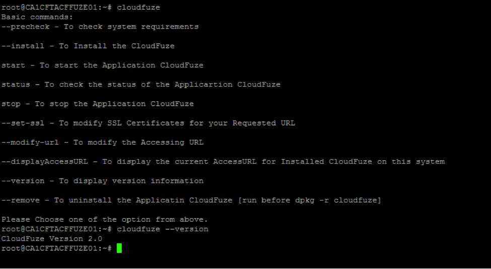
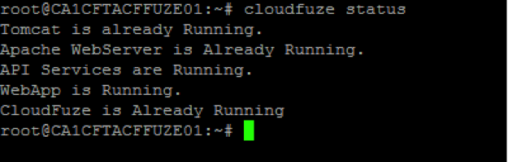
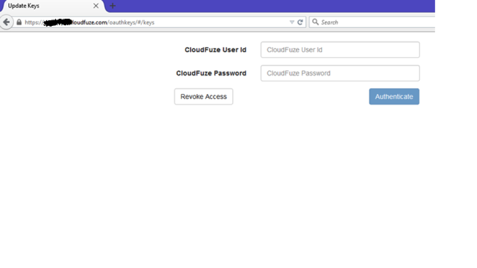
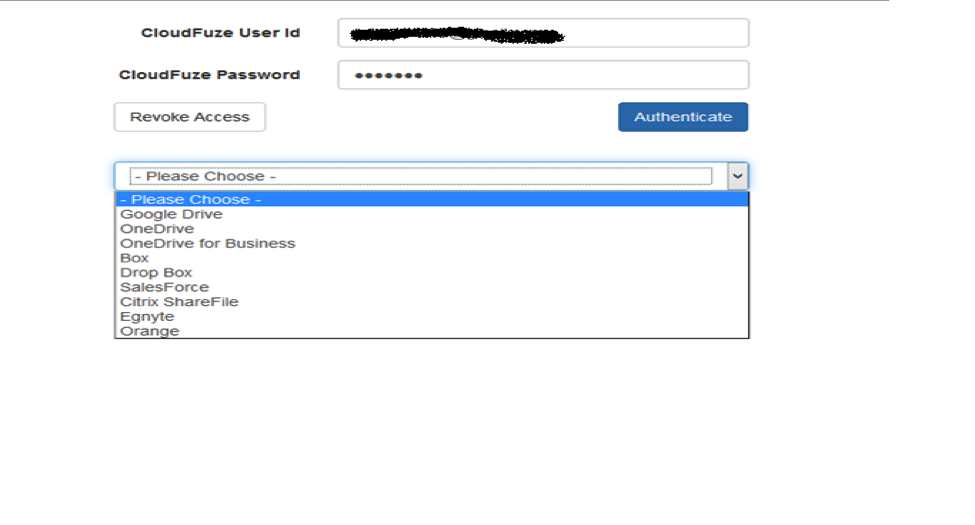
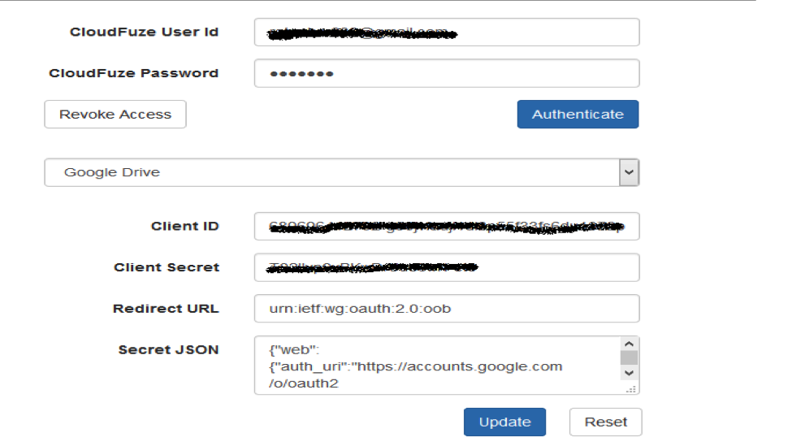
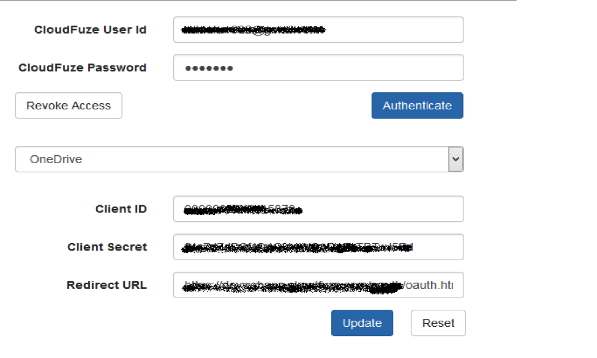
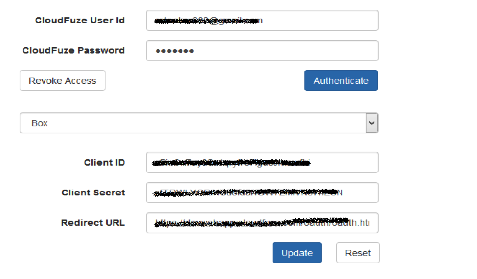
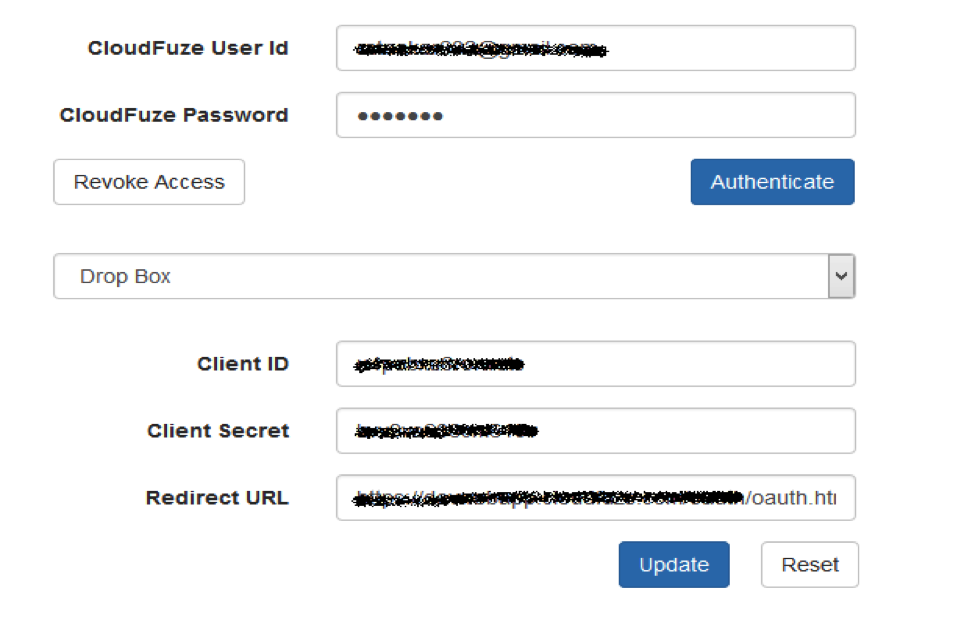

{{{
  "title": "Getting Started with CloudFuze - Blueprint",
  "date": "10-30-2015",
  "author": "Bob Stolzberg",
  "attachments": [],
  "contentIsHTML": false
}}}

### Partner Profile
CloudFuze was founded with the goal of leading the next phase in the evolution of cloud storage with regard to document and file management. Our aim is to enable individuals, companies and software developers to connect to and reap the benefits of the expanded set of file management and storage options without the need to deal with their complexities or security exposure potential.

The CloudFuze platform offers seamless connectivity to the growing universe of public, private and hybrid cloud storage options and also enterprise content management systems. More significantly, the CloudFuze platform provides a robust set of management capabilities that make it possible to collaborate and manage files and documents regardless of where they reside. Finally, CloudFuze supports the increasingly mobile workforce by offering its functionality on a variety of devices. The result is that CloudFuze customers can use a single platform across all of their devices to access and manage any file or document regardless of where it is stored.

[http://www.CloudFuze.com](http://www.CloudFuze.com)

#### Contact CloudFuze
##### Customer Sales and Support:
* Support Email - [support@CloudFuze.com](mailto:support@CloudFuze.com)
* Support Telephone - (888) 279-8393
* Sales Email - [sales@CloudFuze.com](mailto:sales@CloudFuze.com)

### Description
CloudFuze transforms the way you share, manage and collaborate with your most valuable corporate information. Designed without compromise between security and ease-of-use, CloudFuze allows every employee to securely work across teams, with customers, and with partners - on any device, anywhere. Adopt CloudFuze as your secure content platform to keep sensitive documents out of email and away from insecure consumer services.

Embrace the cloud storage era using CloudFuze technology to aggregate content, drive organizational alignment, discover experts, and connect applications and people with content, information pools, and video services. These simple to use but powerful solutions spur innovation, transform business processes, and distribute knowledge across the organization, all while protecting sensitive information and intellectual property.

#### Simple and Secure Sharing
CloudFuze lets you quickly and easily work securely with anyone – even if they’re outside your firewall. Share large files, view and comment on any kind of document, and connect with coworkers – no matter what device they use.

#### Support for Personal Devices
Securing employee-owned devices and supporting different mobile platforms, however, can create complex issues for IT departments. CloudFuze supports Bring Your Own Device (BYOD) programs by enabling unprecedented device choice and supporting the device ownership models you choose without compromising the security and management of your mobile fleet. CloudFuze facilitates a flexible model for IT to manage user accessing and sharing of content not matter what device is being deployed by the end user. No more need for VPN’s or FTP servers. CloudFuze gives users access to everything from the desktop, to the web, to whatever mobile device in whatever location.

#### Powerful Administrative Controls
Take control of users and files with CloudFuze’s administrative features – a powerful Admin Console that lets you see every piece of content in your company. Need to find who has access to budgets and change their usage rights?  CloudFuze Enterprise is the answer.

#### Simple File Migration
Get your data where you want it with a simple drag and drop while optimizing your storage spend

### Audience
Lumen Cloud Users, Cloud Storage Enthusiasts

### Impact
After reading this article, the user should feel comfortable getting started using the partner technology on Lumen Cloud.

After executing the steps in this Getting Started document, the users will have a functioning CloudFuze solution

### Offer
CloudFuze has included a free 30 day trial in a specific Trial Blueprint. If you are deploying the CloudFuze Production Server or Installing the CloudFuze Server on Existing Hardware please complete [this contact form] (http://www.CloudFuze.com/centurylink) so that a CloudFuze representative can help you setup a license on your CloudFuze Server.

### Prerequisite
If you are deploying from “Lumen Blueprints Library” all the prerequisites are configured. There is no need to perform any tasks.

CloudFuze runs best on CentOS v6.5, with a server that has a minimum of 4 ours, and 16GB or RAM.

### Postrequisite
Public clouds auth configurations. You need to get all required Public Clouds API Keys. More details provided after Deployment procedure.

### Deploy CloudFuze Blueprint
Follow these step by step instructions to deploy CloudFuze.

1. Open the Blueprint Library.
   * Login to the Control Portal. From the Nav Menu on the left, click **Orchestration > Blueprints Library**.

2. Search for the Blueprint.
   * To search for the CloudFuze Blueprint, type “CloudFuze” under “Refine Results” in the right panel and click the `Go` button.

3. Select the Blueprint.
   * Select the CloudFuze Blueprint.

4. Choose and Deploy the Blueprint.
   * Click the `deploy blueprint` button to begin configuring your installation.

5. Configure the Blueprint.
   * On the first page, “Customize Blueprint”, ensure the following options are configured:
   * Company Name
   * Your Domain, enter a Fully Qualified Domain Name, e.g., company.cloudfuze.com
   * Admin User ID email address
   * Admin Password

6. Review and Confirm the Blueprint.
   * You will come to a confirmation view of what your Blueprint looks like.
   * Verify your configuration details.
   * Then click the `deploy blueprint` button at the bottom.

7. Monitor the Activity Queue.
   * After clicking Deploy Blueprint, the job will be submitted into a queue and you will be taken to a monitoring page where you can see the progress of each step the Blueprint goes through.
   * To monitor progress, click **Queue** from the Nav Menu on the left.

8. Jump In!
   * Once the Blueprint completes successfully, you will receive an email stating that the Blueprint build is complete. Please do not use the application until you have received this email notification.
   * Please open the Blueprint Build log after completing and note the apiURL's listed in the Accessing URL's section.

### Access and use CloudFuze
Follow these steps to access and use the CloudFuze software.
1. Access the VM
   * Please, connect to your server using the VPN access [Click here for VPN configuration instructions](../../Network/Lumen Cloud/how-to-configure-client-vpn.md), ssh to your server and login as root.
   * To access CloudFuze, please add newly created domains (e.g., displayed in above Jump In step to view build log) in DNS server record ‘A’.

   

2. Check the status of app CloudFuze.
   

3. How to generate Oauth keys for required public clouds
Follow these instructions to generate the necessary Oauth keys from your provider.

1. Google Drive
   * Create a project in [https://console.developers.google.com](https://console.developers.google.com)
   * Enable Drive API.
   * Add credentials with “Oauth 2.0 Client ID ”.
   * Set redirect Url to https://{domain}/oauth/oauth.html.
   * Note Client ID, Client secret and Json to enter in CloudFuze application.

2. Box
   * Create a app in [https://developers.box.com/](https://developers.box.com/).
   * Choose “Box Content” radio.
   * Set redirect Url to https://{domain}/oauth/oauth.html.
   * Note client_id, client_secret to enter in CloudFuze application.

3. Dropbox
   * Create a app in [https://www.dropbox.com/developers/apps](https://www.dropbox.com/developers/apps)
   * Choose “Dropbox API APP”.
   * Choose “No -  My app needs access to files already on Dropbox”.
   * Choose “All file types - My app needs access to a user's full Dropbox.”
   * Configure app.
   * Set redirect Url to https://{domain}/oauth/oauth.html.
   * Note App key, App secret to enter in CloudFuze application.

4. OneDrive
   * Create a app in [https://dev.onedrive.com/](https://dev.onedrive.com/).
   * Set redirect Url to https://{domain}/oauth/oauth.html.
   * Note Client ID, Client secret(v1) to enter in CloudFuze application.

5. Configuring Oauth in CloudFuze.
   Follow these instructions to configure Oauth in CloudFuze:
   * Paste below link in browser:
     * https://{domain}/oauthkeys
     * Example: https://mydomain.cloudfuze.com/oauthkeys
     

   * After entering ADMIN credentials in above screen, click on “Authenticate”. Below screen will be displayed.
     

   * Select each cloud. Enter Client ID , Client Secret, and Application redirect URL. Click on `Update`.
     * For Google Drive:
     

     * For One Drive
     

     * Box
     

     * Dropbox
     

   * **IMPORTANT**: After updating all, please click on “Revoke Access” to logout from page.

6. Please go through the [CloudFuze UserGuide](#Userguide).

### Pricing
The costs associated with this Blueprint deployment are for the Lumen Cloud infrastructure only. There are no CloudFuze license costs or additional fees bundled in. Contact [sales@cloudfuze.com](mailto:sales@cloudfuze.com) for product pricing information.

### Frequently Asked Questions

#### Where do I get my CloudFuze License?
* The CloudFuze on Lumen Cloud is provided in a bring-your-own-license model. Please contact [sales@CloudFuze.com](mailto:sales@CloudFuze.com) to activate your CloudFuze license.

#### Where should I get CloudFuze 2.0 User Guide? And How to Use CloudFuze 2.0 ?
* [https://www.cloudfuze.com/enterprise-user-guide](https://www.cloudfuze.com/enterprise-user-guide)
* [https://www.cloudfuze.com/admin-console-guide](https://www.cloudfuze.com/admin-console-guide)
* [https://www.cloudfuze.com/tutorial-2-0/](https://www.cloudfuze.com/tutorial-2-0/)
* [https://www.cloudfuze.com/blog/](https://www.cloudfuze.com/blog/)

#### My deploy failed, what next ?
* Please Contact [support@cloudfuze.com](mailto:support@cloudfuze.com). And send the Blueprint build logs and the cloudfuze installation logs at location “/var/log/cloudfuze/” on the server.

#### Who should I contact for support?
* For issues related to deploying the CloudFuze Blueprint on Lumen Cloud, please contact [support@CloudFuze.com](mailto:support@CloudFuze.com) or via telephone: (888) 600-6996.
* For issues related to cloud infrastructure (VMs, network, etc.), or if you experience a problem deploying the Blueprint, please open a Lumen Cloud Support ticket by emailing [help@ctl.io](mailto:help@ctl.io) or [through the support website](https://t3n.zendesk.com/tickets/new) .
