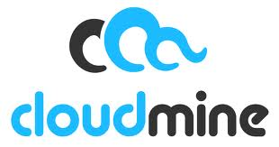
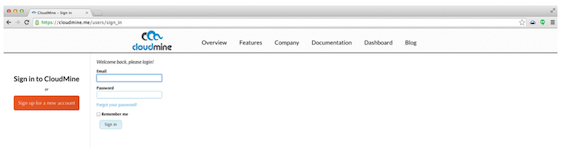
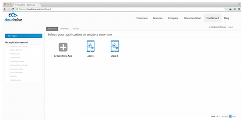

{{{
  "title": "Getting Started With CloudMine - Blueprint",
  "date": "12-04-2014",
  "author": "David Shacochis",
  "attachments": [],
  "contentIsHTML": false
}}}

### Partner Profile
[CloudMine](https://cloudmineinc.com/) - Blend public cloud with private data to accelerate the next generation

### Customer Support:
* Lumensupport@cloudmine.me

* Lumen Cloud Account Alias: CMNE
  All support requests can be sent to Lumensupport@cloudmine.me. Please include as much detail as possible regarding your issue and list pertinent contact information so that our team may address your question quickly.

### Description
CloudMine has integrated their technology with the Lumen Cloud platform. The purpose of this KB article is to help the reader take advantage of this integration to achieve rapid time-to-value for this Mobile Backend solution.

### Audience
Lumen Cloud Users

### Impact
After reading this article, the user should feel comfortable getting started using the partner technology on Lumen Cloud.

### Prerequisite
* Access to the Lumen Cloud platform as an authorized user.

### Detailed Steps
Follow these step by step instructions to get started with a single-server CloudMine deployment.
1. Locate the Blueprint in the Blueprint Library.
   * Login to the Control Portal. From the Nav Menu on the left, click **Orchestration > Blueprints Library**.
   * Search for “CloudMine” in the keyword search on the right side of the page.
   * Click the “CloudMine Single Server” Blueprint.

2. Choose the Blueprint.
   * Click the `deploy blueprint` button.

3. Configure the Blueprint.
   Ensure the following options are configured.
   * Password/Confirm Password (This is the root password for the server. Keep this in a secure place).
   * Set DNS to “Manually Specify” and use “8.8.8.8” (or any other public DNS server of your choice).
   * Optionally set the server name prefix.
   * Read and accept the CloudMine [terms of service](https://cloudmine.me/eula/centurylink).
   * The default values are fine for every other option.

4. Review and Confirm the Blueprint.
   * Click `next: step 2`.
   * Verify your configuration details.

5. Deploy the Blueprint.
   * Once verified, click the `deploy blueprint` button.
   * You will see the deployment details along with an email stating the Blueprint is queued for execution.
   * This will kick off the Blueprint deploy process and load a page to allow you to track the progress of the deployment. Generally, it will take 15 to 20 minutes to configure all of the components.

6. Monitor the Activity Queue.
   * Monitor the Deployment Queue to view the progress of the Blueprint.
   * To monitor progress, click **Queue** from the Nav Menu on the left.

7. Get Busy!
   * Once the Blueprint completes successfully, you will receive an email stating that the Blueprint build is complete. Please do not use the application until you have received this email notification.
   * Once the process has completed ­ you will need to determine the public IP address for the newly deployed host. If you navigate to the “Servers” panel and look under “recent activity” you should see a status about “Mapping a Public IP”.
   * **Note** this public IP, it will be required in future steps.
   * Before navigating to the web interface, you will need to run a script on the server to let the server know what public IP address it was assigned. To do this, ssh into the public IP address as root, using the password set in Step 3.
   

   * Once in the server, you will need to run a script in root’s home directory like so:
   

   * After a couple seconds, the script should complete. You are now ready to use CloudMine!

8. Access the CloudMine Interface.
   * The CloudMine web interface is accessible on port `8080` of the server’s public IP address, e.g., http://123.45.67.89:8080).
   * Go ahead and navigate to the dashboard now.
   * Create An Account - Once you’ve loaded the web interface, go ahead and click the orange “Sign up for a new account” button and enter a name, email and password. Your email address will be the account name for future logins. Once you create the account, you will automatically be logged in.
   

   * Create An App -&nbsp;After logging into the dashboard for the first time, create a new app from the top of the screen. Simply give your app a name and click on “Create Application”. There’s no need to pick a mobile platform ‐ the app will be accessible from all platforms ‐ REST, iOS, Android, JavaScript, and others.
   

### Pricing
The costs listed above in Steps 1 and 2 are for the Lumen Cloud infrastructure only. There are no CloudMine license costs or additional fees bundled in. After deploying this Blueprint, the user can secure entitlements to the CloudMine technology by using the following steps:
* Contact CloudMine via telephone: (855) 662-7722.
* Contact Cloudmine via the [contact page](https://cloudmine.me/contact/) on their website.

### Frequently Asked Questions
**Where do I obtain my CloudMine License?**
* Contact CloudMine via telephone: (855) 662-7722.
* Contact Cloudmine via the [contact page](https://cloudmine.me/contact/) on their website.

**Who should I contact for support?**
* For issues related to deploying the CloudMine& Blueprint on Lumen Cloud, please contact [CloudMine Support](mailto:Lumensupport@cloudmine.me).

* For issues related to cloud infrastructure (VMs, network, etc.), please open a ticket using the Lumen Cloud [Support Process](https://t3n.zendesk.com/entries/23610702-How-do-I-report-a-support-issue).
