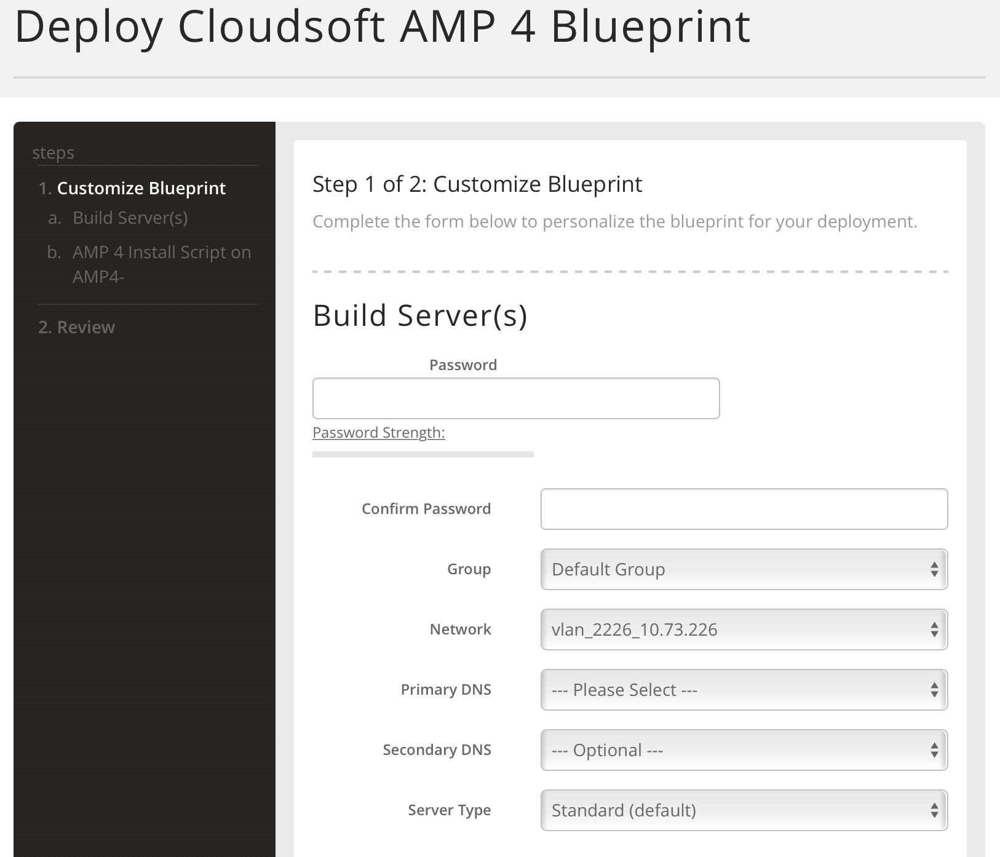
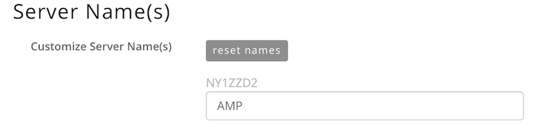
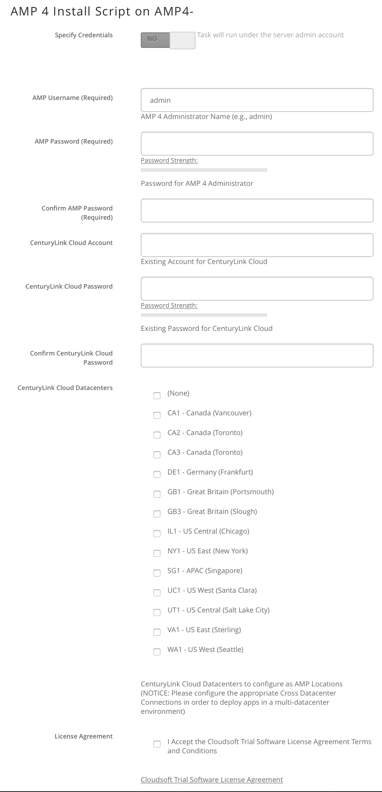
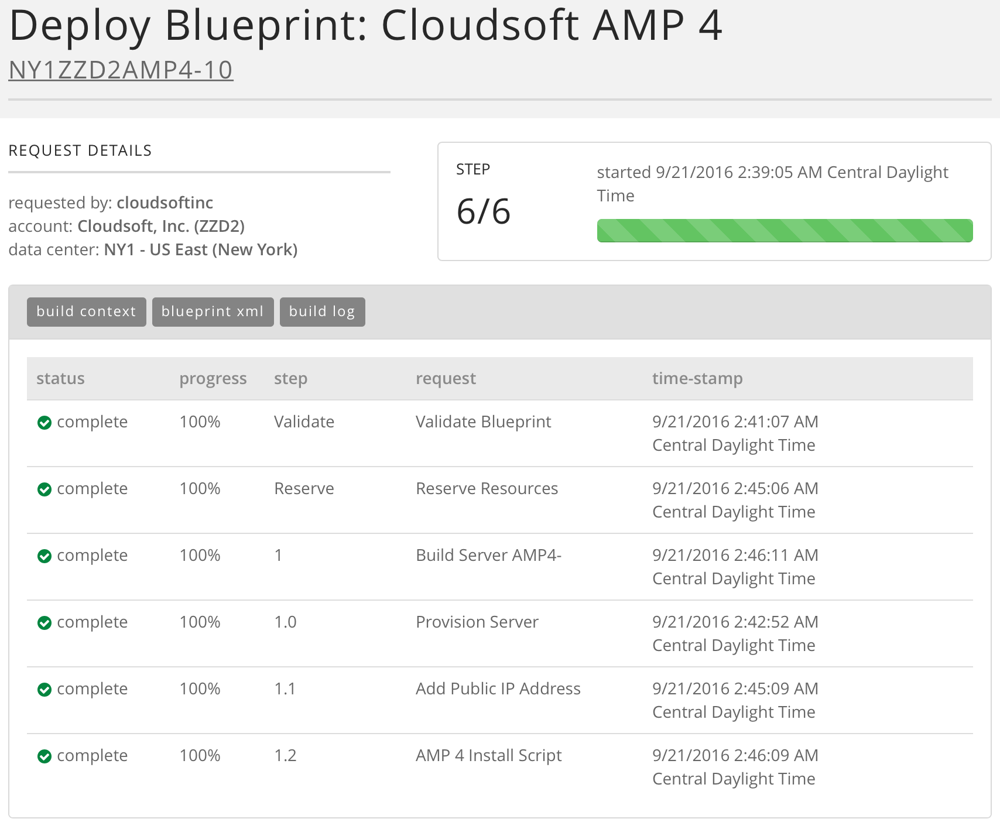

{{{
  "title": "Installing Cloudsoft AMP 4 server",
  "date": "09/21/2016",
  "author": "Cloudsoft Corp.",
  "attachments": [],
  "contentIsHTML": false
}}}

### Technology Profile
Cloudsoft Application Management Platform (AMP) v4 is software which streamlines the development and operation of applications. AMP v4 orchestrates services, platforms, and infrastructures to ensure they directly meet the needs of applications, dynamically and in real time. This results in more reliable operations, productive development and greater agility for IT to respond to their business needs.

### Description
AMP v4 is built on the open-source project [Apache Brooklyn](https://brooklyn.apache.org), with Cloudsoft's commercial support and additional enterprise features.

For more information, please visit http://www.cloudsoft.io/products/.

### Audience
CenturyLink Cloud Users.
If you are ready to get started, but are not yet a CenturyLink Cloud customer, no problem. Get started with [CenturyLink Cloud for free](https://www.ctl.io/free-trial/). Try our most popular products, or [MarketPlace Partners](https://www.ctl.io/marketplace/program/) offerings, allowing you to create a combination of products that best fits your business needs.

### Impact
After reading this article, the user will be able to install and use Cloudsoft AMP v4 in the CenturyLink Cloud platform.

### Prerequisites
* Access to the CenturyLink Cloud platform as an authorized user.

### Postrequisite
If you are deploying from "CenturyLink Blueprints Library" all the prerequisites are configured. There is no need to perform any tasks.

### Deploying the "Cloudsoft AMP 4" Blueprint

#### Steps to Deploy Blueprint
1. Locate the Cloudsoft AMP 4 Blueprint.
  * Login to the Control Portal. From the Nav Menu on the left, click **Orchestration > Blueprints Library**
  * Search for "AMP" in the keyword search on the right side of the page and filter for "Monitoring" Solution
  * Locate the "Cloudsoft AMP 4" Blueprint

2. Choose and Deploy the Blueprint.
  * Click the "Cloudsoft AMP 4" Blueprint, then in the following page click `Deploy Blueprint`.

3. Deploy Cloudsoft AMP 4 Blueprint section.
  * Specify password
  * Confirm password
  * Select Primary DNS (e.g., "Manually Specify")
  * Optionally update Network, Secondary DNS, and Server Type.

4. Specify the Server Name(s) section

5. AMP 4 Install Script on AMP4- section.
  * Specify AMP Username (e.g., admin)
  * Specify AMP Password
  * Specify CenturyLink Cloud account
  * Specify CenturyLink Cloud password
  * Select one or multiple CenturyLink Cloud data centers to configure as
     AMP locations, or "(None)" if none are needed
  * Accept the Cloudsoft Trial Software License Agreement Terms and Conditions

6. Review and Confirm the Blueprint.
  * Click `next: step 2`.
  * Verify your configuration details.

7. Deploy the Blueprint.
  * Once verified, click the `deploy blueprint` button. You will see the deployment details along with an email stating the Blueprint is queued for execution.
  * This will kick off the blueprint deploy process and load a page to allow you to track the progress of the deployment.

8. Monitor the Activity Queue.
  * Monitor the Deployment Queue to view the progress of the Blueprint.
  * To monitor progress, click **Queue** from the Nav Menu on the left.
  * Once the Blueprint completes successfully, you will receive an email stating that the blueprint build is complete. Please do not use the application until you have received this email notification.

### Access your AMP 4 server
After your Blueprint deploys successfully, please follow these instructions to access your server:

1. Click on the link that brings you to the VM that hosts AMP 4 and grab the public IP address of that VM. Refresh the page if you cannot see the link, or just browse to the VM in the Control Portal.

2. Browse to http://PublicIpAddress:8080 and use the credentials specified at "AMP 4 Install Script on AMP4-" section.

3. Start deploying AMP blueprints to the CenturyLink Cloud Data centers specified above.

### Pricing
The costs associated with this Blueprint deployment are for the CenturyLink Cloud infrastructure only.

### About Cloudsoft
CenturyLink Cloud works with [Cloudsoft](http://www.cloudsoft.io) to provide agility and reliability throughout the application lifecycle.

### Frequently Asked Questions

#### Who should I contact for support?
* For issues related to deploying the Cloudsoft AMP 4 Blueprint on CenturyLink Cloud, Licensing or Accessing the deployed software, please visit the [Cloudsoft Support website](https://support.cloudsoft.io/).
* For issues related to cloud infrastructure (VMs, network, etc), or if you experience a problem deploying the Blueprint or Script Package, please open a CenturyLink Cloud Support ticket by emailing [help@ctl.io](mailto:help@ctl.io) or [through the CenturyLink Cloud Support website](https://t3n.zendesk.com/tickets/new).
