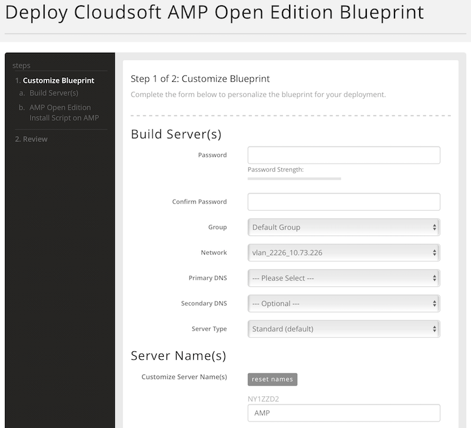
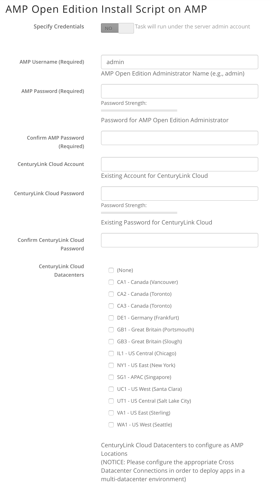
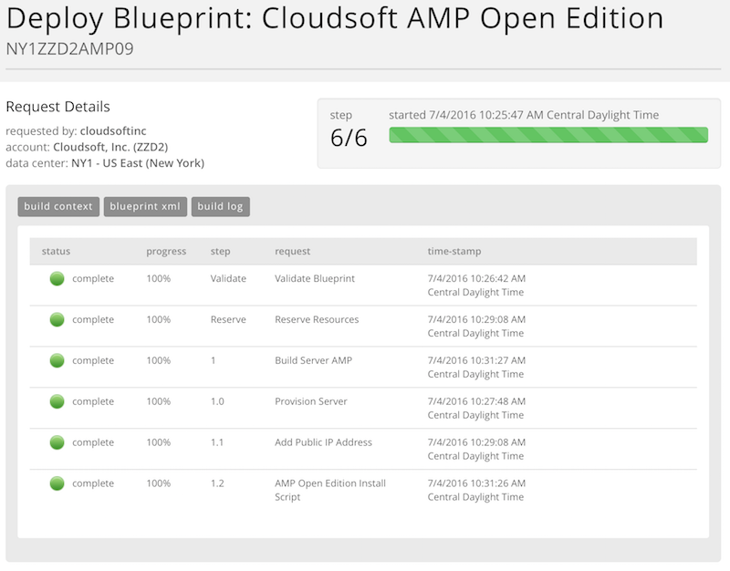

{{{
  "title": "Installing Cloudsoft AMP Open Edition server",
  "date": "07/04/2016",
  "author": "Cloudsoft Corp.",
  "attachments": [],
  "contentIsHTML": false
}}}

### Technology Profile
Cloudsoft Application Management Platform (AMP) Open Edition is software which streamlines the development and operation of applications. AMP Open Edition orchestrates services, platforms and infrastructures to ensure they directly meet the needs of applications, dynamically and in real time. This results in more reliable operations, productive development and greater agility for IT to respond to their business needs.

### Description
AMP Open Edition is built on the open-source project [Apache Brooklyn](https://brooklyn.apache.org), with Cloudsoft's commercial support and additional enterprise features.

For more information, please visit http://www.cloudsoft.io/products/.

### Audience
CenturyLink Cloud Users

### Impact
After reading this article, the user will be able to install and use Cloudsoft AMP Open Edition in the CenturyLink Cloud platform.

### Prerequisites
- Access to the CenturyLink Cloud platform as an authorized user.

### Postrequisite
If you are deploying from "CenturyLink Blueprints Library" all the prerequisites are configured. There is no need to perform any tasks.

### Deploying the "Cloudsoft AMP Open Edition" Blueprint

#### Steps to Deploy Blueprint
1. **Locate the Cloudsoft AMP Open Edition Blueprint**
  1. Starting from the CenturyLink Control Panel, navigate to the Blueprints Library.
  2. Search for "AMP" in the keyword search on the right side of the page and filter for "Monitoring" Solution
  3. Locate the "Cloudsoft AMP Open Edition" Blueprint

2. **Choose and Deploy the Blueprint.**
  Click the "Cloudsoft AMP Open Edition" Blueprint.

3. **Deploy Cloudsoft AMP Open Edition Blueprint section**
  1. Specify password
  2. Confirm password
  3. Select Primary DNS
  4. Optionally update Network, Secondary DNS, and Server Type.

  4. **Specify the Server Name(s) section**

  5. **AMP Open Edition Install Script on AMP section**
    1. Specify AMP Username (e.g., admin)
    2. Specify AMP Password
    3. Specify CenturyLink Cloud account
    4. Specify CenturyLink Cloud password
    5. Select one or multiple CenturyLink Cloud datacenters to configure as
       AMP locations, or "(None)" if none are needed

4. **Review and Confirm the Blueprint**
  1. Click "next: step 2"
  2. Verify your configuration details.

5. **Deploy the Blueprint**
  1. Once verified, click on the "deploy blueprint" button. You will see the deployment details along with an email stating the Blueprint is queued for execution.
  2. This will kick off the blueprint deploy process and load a page to allow you to track the progress of the deployment.

6. **Monitor the Activity Queue**
  1. Monitor the Deployment Queue to view the progress of the blueprint.
  2. You can access the queue at any time by clicking the Queue link under the Blueprints menu on the main navigation drop-down.
  3. Once the blueprint completes successfully, you will receive an email stating that the blueprint build is complete. Please do not use the application until you have received this email notification.

### Access your AMP Open Edition server
After your Blueprint deploys successfully, please follow these instructions to access your server:

1. Click on the link that brings you to the VM that hosts AMP Open Edition and grab the public IP address of that VM. Refresh the page if you cannot see the link, or just browse to the VM in the Control Portal.

2. Browse to http://PublicIpAddress:8080 and use the credentials specified at "AMP Open Edition Install Script on AMP" section.
3. Start deploying AMP blueprints to the CenturyLink Cloud Datacenters specified above.

### Pricing
The costs associated with this Blueprint deployment are for the CenturyLink Cloud infrastructure only.

### About Cloudsoft
CenturyLink Cloud works with [Cloudsoft](http://www.cloudsoft.io) to provide agility and reliability throughout the application lifecycle.

### Frequently Asked Questions

#### Who should I contact for support?
* For issues related to deploying the Cloudsoft AMP Open Edition Blueprint on CenturyLink Cloud, Licensing or Accessing the deployed software, please visit the [Cloudsoft Support website](https://support.cloudsoft.io/)
* For issues related to cloud infrastructure (VMs, network, etc), or if you experience a problem deploying the Blueprint or Script Package, please open a CenturyLink Cloud Support ticket by emailing [noc@ctl.io](mailto:noc@ctl.io) or [through the CenturyLink Cloud Support website](https://t3n.zendesk.com/tickets/new).
