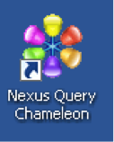

{{{
  "title": "Getting Started with Coffing Data Warehousing Nexus Chameleon - Blueprint",
  "date": "09-30-2015",
  "author": "Bob Stolzberg",
  "attachments": [],
  "contentIsHTML": false
}}}

### Partner Profile
Coffing Data Warehousing - Providing users the ability to analyze, visualize, compare, compress and move data between many disparate data warehousing systems [Coffing Data Warehousing](http://www.coffingdw.com).

#### Contact Coffing Data Warehousing
##### Customer Sales and Support:
* Support Email - [helpdesk@coffingdw.com](mailto:helpdesk@coffingdw.com)
* Support Telephone - (855)333-3537 option 3
* Sales Email - [sales@coffingdw.com](mailto:sales@coffingdw.com)
* Sales Telephone - (855) 333-3537 option 1

### Description
Coffing Data Warehousing is happy to be providing its amazing service on the Century Link Cloud platform. The purpose of this KB article is to help you get up and running quickly with Coffing’s Nexus Chameleon data warehousing solution.

Coffing Data Warehousing, founded by Tom Coffing, has been providing data warehousing products, education and services since 1993. Tom and his teams have written over 50 books on data warehousing and have taught 1,000s of classes on every major data warehouse vendor. The Nexus Chameleon combines these years of experience to provide users the ability to analyze, visualize, compare, compress and move data between many disparate data warehousing systems. Coffing’s latest achievement allows users to join data between SQL Server, Oracle, and Teradata via a simple point and click interface.

The Nexus Chameleon helps Lumen Cloud customers by unifying their data warehousing environment under one software solution. Multiple tools for multiple systems are no longer needed and this solution is not available to everyone as part of the Lumen Cloud Blueprint Engine. CoffingDW solutions have helped provide the largest data warehouses in the world increased cost savings, productivity, and efficiency.

### Solution Overview
Nexus is a world-class business intelligence tool that provides serious insight into every major database system in your enterprise. It was designed to unite your enterprise and was designed for the most powerful and popular data sources including Redshift, Hadoop, Oracle, SQL Server, Teradata, Asterdata, Netezza, DB2, Kognitio, Vertica, Greenplum, Sybase ASE, ParAccel, and Excel.

The amazing Super Join Builder's drag and drop interface allows users to create queries with the click of a mouse and could be the easiest, fastest and most efficient way to do a cross-system join between Teradata, SQL Server and Oracle ever created! The Super Join Builder also creates advanced analytic functions, group by rollup, and group by grouping sets in seconds. It allows companies to load their ERwin model and displays relationships visually so that everyone has the knowledge of the enterprise's data model at their fingertips. Nexus even allows users to create their own custom joins so even the most novice SQL developer looks like an expert!

The new Garden of Analysis will perform deep analytics on any data set using local cpu and disk, saving these valuable resources on the main system. It will even stream data between Oracle, SQL Server and Teradata and then convert the DDL from one system to the other. The process of manually converting DDL, building ETL scripts and then moving this data could take weeks of work by expensive consultants. Nexus can do this in seconds with only a few clicks!

### Offer
Coffing Data Warehousing is providing Lumen users a *free* trial license as part of this Blueprint. Please contact [helpdesk@coffingdw.com](mailto:helpdesk@coffingdw.com) to secure your free fully-functional trial license of the Nexus Chameleon.

### Audience
Lumen Cloud Users, Database Administrators, Big Data enthusiasts

### Impact
After reading this article, you should feel comfortable getting started using the Nexus Chameleon on the Lumen Cloud.

After executing the steps in this Getting Started document, you will have a functioning version of Nexus Chameleon running on Window Server upon which you can use to start developing data warehousing solutions.

### Prerequisite
Nexus requires .NET 3.5 SP1.

### How-To Video
The video below shows you a quick overview of the Super Join Builder: [Nexus in 120 Seconds](https://www.youtube.com/watch?v=N5GSxBEySFc)

### Deploy CoffingDW Nexus Chameleon Blueprint
Please follow these step by step instructions to install Nexus Chameleon.

1. Open the Blueprint Library.
   * Login to the Control Portal. From the Nav Menu on the left, click **Orchestration > Blueprints Library**.

2. Search for the Blueprint.
   * To search for the Nexus Chameleon Blueprint, type “Nexus” or “Nexus Chameleon” under “Refine Results” in the right panel and click the `Go` button.

3. Choose the Blueprint.
   * Click on the Blueprint titled “Nexus Chameleon”.

4. Deploy the Blueprint.
   * Click the `deploy blueprint` button to begin configuring your Nexus Chameleon installation.

5. Configure the Blueprint.
   * On the first page, “Customize Blueprint”, ensure the following options are configured.
   * Specify Credentials: Switch the “Specify Credentials” button to “Yes” and enter the user and password you want to use to run the Blueprint.
   * When you are finished click the `next` button.

6. Review and Confirm the Blueprint.
   * You will come to a confirmation view of what your Blueprint looks like.
   * Verify your configuration details.
   * Then click the `deploy blueprint` button.

7. Monitor the Activity Queue.
   * After clicking Deploy Blueprint, the job will be submitted into a queue and you will be taken to a monitoring page where you can see the progress of each step the Blueprint goes through.
   * To monitor progress, click **Queue** from the Nav Menu on the left.

8. Jump In!
   * Once the Blueprint completes successfully, you will receive an email stating that the Blueprint build is complete.
   * Please do not use the application until you have received this email notification.

### Access and use Nexus Chameleon
Follow these steps to access and use the Nexus Chameleon software,

1. Access the VM.
   * Connect via Remote Desktop to the target VM.
   * You will see a Nexus Icon on the desktop. Double-click it to launch Nexus.
   * Nexus is installed, but it is not licensed. Please contact [helpdesk@coffingdw.com](mailto:helpdesk@coffingdw.com) to receive your free Lumen trial license.
   

### Pricing
The costs associated with this Blueprint deployment are for the Lumen Cloud infrastructure only. There are no Coffing Data Warehousing Nexus license costs or additional fees bundled in.   

Please contact [helpdesk@coffingdw.com](mailto:helpdesk@coffingdw.com) to secure your *free*, fully-functional trial license of the Nexus Chameleon.

After deploying this Blueprint, to obtain a yearly license please contact [sales@coffingdw.com](mailto:sales@coffingdw.com) to learn about licensing and pricing for the Nexus Chameleon.

### Frequently Asked Questions

#### Where do I get my Nexus Chameleon trial License?
Please contact [helpdesk@coffingdw.com](mailto:helpdesk@coffingdw.com) for a trial license. To learn about license and pricing for a yearly license, please contact [sales@coffingdw.com](mailto:sales@coffingdw.com) with your requirements and we’ll be happy to assist.

#### Who should I contact for support?
* For issues directly related to the Nexus Chameleon, please email [helpdesk@coffingdw.com](mailto:helpdesk@coffingdw.com). Email usually provides the quickest response, however, you may also call 1-855-333-3537 Option 3 to speak with technical support.
* For issues related to cloud infrastructure (VM’s, network, etc.), or if you experience a problem deploying the Blueprint, please open a Lumen Cloud Support ticket by emailing [help@ctl.io](mailto:help@ctl.io) or [through the support website](https://t3n.zendesk.com/tickets/new).

#### How do I license Nexus on Window Server?
* Nexus uses a floating license concept for licensing multiple users on Windows Server. A user, typically an administrator, will license Nexus first and create the licensing database in a folder which all server users have access to. Subsequent users will reference this database when they license Nexus. For more information on this process, please refer to [this document](http://www.coffingdw.com/data/nexus/docs/windows_server_licensing.pdf).

#### How do I connect to my first data source?
Please review [this document](http://www.coffingdw.com/data/nexus/docs/connecting_to_a_datasource.pdf) for information on how to connect to a data source in Nexus.

#### Where can I find a list of third-party drivers and applications which Nexus uses?
[This document](http://www.coffingdw.com/data/nexus/docs/nexus_third_party_driver_and_application_list.pdf ) will provide you with information on third-party drivers which you may use with Nexus. Please note that this is not comprehensive. If you need help connecting to a particular system, please email [helpdesk@coffingdw.com](mailto:helpdesk@coffingdw.com).

#### Could you provide a demo of the Nexus Chameleon for our company?
Yes!  Please contact [sales@coffingdw.com](mailto:sales@coffingdw.com) so we can schedule that for you.
