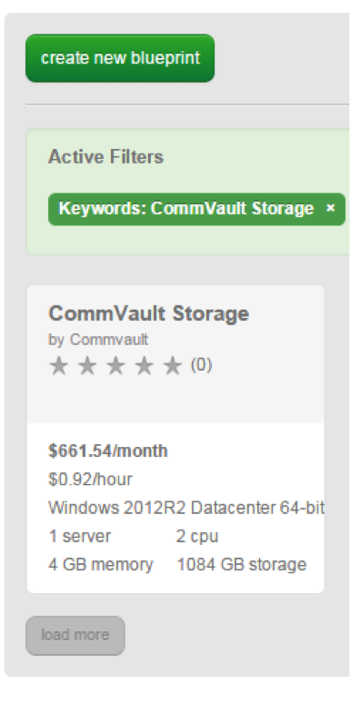

{{{
  "title": "Getting started with Commvault Storage Blueprint",
  "date": "08-31-2015",
  "author": "Bob Stolzberg",
  "attachments": [],
  "contentIsHTML": false
}}}

### Partner Profile
Commvault - "Protect, Access, Comply, Share"

[http://www.Commvault.com](http://www.Commvault.com)

#### Contact Commvault   
##### Commvault Support:
* 24x7 Web Support - [https://www.Commvault.com/](https://www.Commvault.com/)
* Email Support - [support@commvault.com](mailto:support@commvault.com)
* Phone Support - Call (877) 780-3077

### Description
Commvault Systems has integrated their technology with the Lumen Cloud platform. The purpose of this KB article is to help the reader take advantage of this integration to achieve rapid time-to-value for this Data Management solution.

Technology from Commvault Systems helps Lumen Cloud customers address the business challenge of data protection and data growth by implementing Commvault's Simpana data management solution - now available as part of the Lumen Cloud Blueprint Engine.

### Solution Overview
CommVault's holistic approach to cloud management allows you to manage your virtual infrastructure seamlessly across multiple hypervisors and cloud platforms — and to automate and streamline operations over the entire VM lifecycle, from provisioning to protection to decommissioning.

The CommVault Simpana Blueprints offer different ways to manage data in, from and to the Lumen Cloud as well as integrate with multiple remote data centers and cloud platforms.

The 'All in One' Blueprint includes a Windows 2012 Server image with the Simpana components to build out a new CommCell and/or attache to an existing Commcell. The image has the CommmServe and Media Agent software component ready to be configured as needed for your desired use case.

### Offer
Commvault is making their technology available for Lumen Cloud Users to deploy to their account. Installation of the Commvault Server and All In One Blueprints includes a license good for one month (depending on the actual date of deployment). In order to purchase a license or entitlement, please contact [Contact Commvault sales](http://www.commvault.com/contact-us).

### Audience
Lumen Cloud Users and Commvault Simpana customers

### Impact
After reading this article, the user should feel comfortable getting started using the Commvault technology on Lumen Cloud.

After executing the steps in this Getting Started document, the users will have a functioning Commvault Simpana data management platform upon which they can start developing data management solutions.

### Prerequisite
* Access to the Lumen Cloud platform as an authorized user
* Commvault software license

### Postrequisite
After the Blueprint completes, you will need to RDP to the server, login to the Commvault GUI and perform the follows tasks under Library and Drive configuration, and perform the following tasks:
* Change your default admin password to something secure.
* [Install the Commvault Media Agent](http://documentation.commvault.com/commvault/v10/article?p=deployment.html) on this server.
* [Configure the Commvault libraries](http://documentation.commvault.com/commvault/v10/article?p=features/library_drive_config/library_drive_configuration_getting_started.html).
* [Create a schedule policy](http://documentation.commvault.com/commvault/v10/article?p=features/schedule_policy/getting_started.htm).
* [Create a deduplication policy](http://documentation.commvault.com/commvault/v10/article?p=features/deduplication/t_creating_a_global_deduplication_policy.htm).
* If you want to access Commvault server over the internet, please perform the following tasks once you receive an email confirming you Blueprint completed successfully.
   * To connect to your Commvault server via the Internet, Add a [Public IP](../../Network/CenturyLink Cloud/how-to-add-public-ip-to-virtual-machine.md) to your server through the Control Portal. Alternatively, you can [setup a VPN using OpenVPN](../../Network/CenturyLink Cloud/how-to-configure-client-vpn.md) or similar technology.
   * [Allow incoming traffic](../../Network/CenturyLink Cloud/how-to-add-public-ip-to-virtual-machine.md) for desired ports by clicking on the Servers Public IP through the Control Portal.
   * Add a Public IP to your VM and open Firewall Ports for TCP protocol.
   * Browse to the new VM and click on the Add Public IP button.
   * When the firewall rule dialog openDs, Add two (2x) single-port boxes: configure one for TCP on port TB.
   * Click the "Add Public IP address button". When the Add Public IP task completes you should be able to connect to your new Commvault file server from your Commvault client via the public IP.

### Commvault Blueprints
* Install Commvault Storage on Windows - Deploys Commvault Storage on Windows 2012 server.
* Install Commvault AIO - Deploys Commvault Backup and Recovery All In One on Windows.

### Steps to deploy Commvault Blueprints
1. Locate the Commvault Blueprints.
   * Login to the Control Portal. From the Nav Menu on the left, click **Orchestration > Blueprints Library**.
   * Search for “Commvault” in the keyword search on the right side of the page.
   * Locate the "Commvault" Blueprint for the platform you want to deploy on.

   

2. Choose and Deploy the Blueprint.
   * Click on the “Commvault” Blueprint you want to deploy.
   * Click `deploy blueprint` button.

3. Configure the Blueprint.
   Complete the information below:
   * Server Administrator Password
   * Server Group
   * Network VLAN
   * Primary DNS - you can use the default of enter 8.8.8.8
   * Secondary DNS - you can use the default of enter 8.8.8.8
   * Server Type
   * Service Level - Premium
   * Customize the server name, the default is Commvault

   

4. Review and Confirm the Blueprint.
   * Click `next: step 2`.
   * Verify your configuration details.

5. Deploy the Blueprint.
   * Once verified, click the `deploy blueprint` button. You will see the deployment details along with an email stating the Blueprint is queued for execution.
   * This will kick off the Blueprint deploy process and load a page to allow you to track the progress of the deployment.

6. Monitor the Activity Queue.
   * Monitor the Deployment Queue to view the progress of the Blueprint.
   * To monitor progress, click **Queue** from the Nav Menu on the left.
   * Once the Blueprint completes successfully, you will receive an email stating that the Blueprint build is complete. Please do not use the application until you have received this email notification.

### Access Commvault File Server
After your Blueprint deploys successfully, please follow these instructions to access your Commvault Server solution.
* Check email to obtain Commvault Server information and click on the link to load the server in the Control Portal.
* Connect to the Commvault Server by using Remote Desktop and logging in as Administrator.
* Find and run “Simpana Administrative Console” from search in windows 2012.
* Login to the Commserve GUI with the usernamein `admin` and password `admin`.
* Configure your Commvault solution appropriately. See the Post-Requisite section for more details.

### Pricing
The costs associated with this Blueprint deployment are for the Lumen Cloud infrastructure only. There are no Commvault license costs or additional fees bundled in. Licensing and Pricing for Simpana need to be aligned with software contract. Please contact CommVault Sales for information: [Contact Commvault sales](http://www.commvault.com/contact-us).

### Frequently Asked Questions

#### Where do I obtain my Commvault Licenses?
This is a Bring You Own License model (BYOL). [Contact Commvault sales](http://www.commvault.com/contact-us) for license and pricing information. You may obtain a 30 day trail license when you run the blueprint.

#### Who should I contact for support?
* For issues related to deploying the Commvault solution on Lumen Cloud via the Blueprint, accessing or using the deployed software, [please contact Commvault support](mailto:support@commvault.com) or by calling (877) 780-3077.
* For issues related to cloud infrastructure (VMs, network, etc.), or if you experience a problem deploying the Blueprint, please open a Lumen Cloud Support ticket by emailing [help@ctl.io](mailto:help@ctl.io) or [through the support website](https://t3n.zendesk.com/tickets/new).
