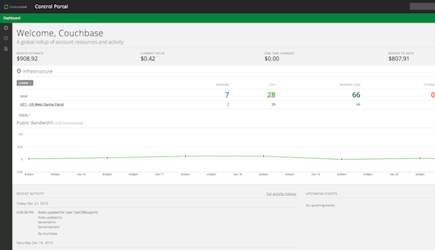
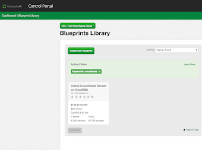
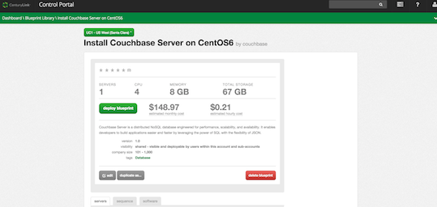
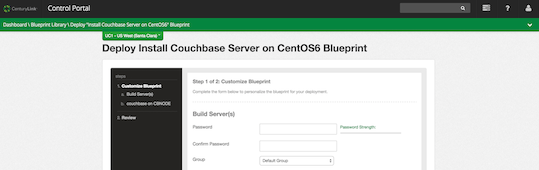
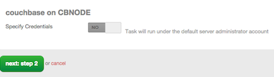
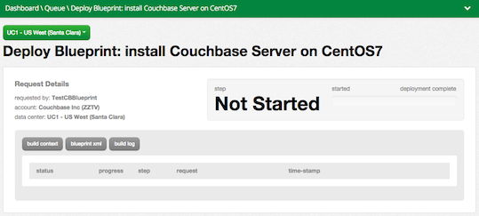

{{{
  "title": "Getting Started with Couchbase",
  "date": "1-4-2016",
  "author": "Couchbase Corporation",
  "attachments": [],
  "contentIsHTML": false
}}}

### Technology Profile

Couchbase Server is the world's **most complete, scalable, and highest performing NoSQL database**. We engineered the product to meet the most demanding enterprise and big data requirements for distributed database performance and scalability.

### Description

Couchbase Server provides highly elastic, available, scalable & real-time big data management system with consistently high performance, flexible global deployment topologies and a set of native SDKs to ease development & deployment of modern applications.   

Couchbase Server comes with a shared nothing, fully scale-out, memory-centric architecture, designed to take full advantage of the speed of memory rather than disk, which all translates into a blazingly fast performance. Couchbase Server is the only NoSQL database that integrates a native caching tier and a document-oriented database, eliminating the need to install and manage a separate cache service.   

Couchbase is also the only big data database that offers a native integrated NoSQL mobile solution [Couchbase Mobile](http://www.couchbase.com/nosql-databases/couchbase-mobile?gclid=COfC4_rG7skCFUaCfgodaEIEnA), including pre-built data synchronization (Couchbase Sync Gateway) and an embedded database (Couchbase Lite), enabling fast and easy development of mobile apps with online/offline data access.

For more information, please visit [couchbase.com](http://www.couchbase.com).

### Audience
- CenturyLink Cloud Users.   
- Developers wishing to migrate from Relational Databases to a NoSQL Document Database.   

### Impact
After reading this article, users should  be able to start a server running Couchbase Server, create a Couchbase Server cluster, connect to that server using an IP address and start accessing Couchbase Server cluster in their application.

### Prerequisite
- Access to the CenturyLink Cloud platform as an authorized user.
- An Couchbase Server Enterprise license from Couchbase Inc. See Enterprise Subscription [License Agreement](http://www.couchbase.com/agreement/subscription) for details.

### Postrequisite
After you successfully install a Blueprint, you will receive a notification email. If you want to access your application from a computer that is outside of the CenturyLink Cloud network, you need to perform the following steps:

  1. [Add a Public IP](../../Network/how-to-add-public-ip-to-virtual-machine.md) to your server through the CenturyLink Control Portal.
  2. Click on the Servers Public IP through Control Portal and configure the ports. The default port for Couchbase Server is 8091. For the additional available network ports, refer to the Couchbase Server [documentation](http://developer.couchbase.com/documentation/server/4.1/install/install-ports.html).

### Deploying the Couchbase Server Blueprint

#### Steps to Deploy Blueprint
1. **Locate the Couchbase Server Blueprint**

   1. Log into the CenturyLink Control Portal.   
   2. Click on **sign in**. The dashboard containing CenturyLink servers will open, where you can select servers and the Blueprints library.      
   
   3. To find the Couchbase blueprint, select the green Dashboard area on the top and then select **Blueprints Library**.   

   4. In the panel "Blueprints Library", if needed use the keyword search on the right to select among multiple blueprints. In our case, choose from the available displayed blueprint thumbnails.   
                 
2. **Choose the Blueprint**    
  Click on **Install Couchbase Server on CentOS6**.     
3. **Deploy the Blueprint**      
   In the panel "Install Couchbase Server on CentOS6", click **deploy blueprint**.    
    
4. **Customize the Blueprint**   
Use the panel "Deploy install Couchbase Server on CentOS6 Blueprint" customize your blueprint.      
    

    *  **Build Server(s)** by entering or choosing the following:
		* Password: *password*
        * Confirm the same password: *password*
        * Group: **default**.
        * Network: *network ID*
        * Primary DNS: **Manually Specify**
        * Secondary DNS: **Manually Specify**
        * Server Type: **Standard (default)**.
        * Service Level: choose between **Premium** or **Standard**.
    *  **Server Name(s)**. Enter a name, such as **CBNODE**.
    *  **Specify Credentials**. To run the task under the default administrative account, leave **NO** for credentials.      
      
Click on **next step**.
5. **Review the Blueprint**             
    1. Verify the information:            
    2. If your information is correct, click on the  button **deploy blueprint**.   

6. **Deploy the Blueprint**    
   In the panel "Deploy Blueprint: install Couchbase Server on CentOS6" you will see the deployment details.     
     

7. **Monitor the Activity Queue**          
    1. Monitor the Deployment Queue to view the progress of the Blueprint deployment.
    2. Access the queue at any time by clicking the Queue link under the Blueprints menu on the main navigation drop-down.
    3. Once the Blueprint completes successfully, you will receive an email confirming that the Blueprint build is complete. Do not use the application until you have received this email notification.

### Pricing
The costs associated with this Blueprint deployment are for the CenturyLink Cloud infrastructure only.  There are no  license costs or additional fees bundled in. You will need a valid [Enterprise Edition license](http://www.couchbase.com/agreement/subscription) from Couchbase Inc.

### Frequently Asked Questions

#### Who should I contact for support?
* For issues related to the Couchbase Server Blueprint on CenturyLink Cloud or Licensing, please visit [Couchbase  Support website](http://support.couchbase.com/home).
* For issues related to cloud infrastructure (VM's, network, and so on) or if you experience a problem deploying the Blueprint or Script Package, open a CenturyLink Cloud Support ticket by emailing [noc@ctl.io](mailto:noc@ctl.io) or [through the CenturyLink Cloud Support website](https://t3n.zendesk.com/tickets/new).
