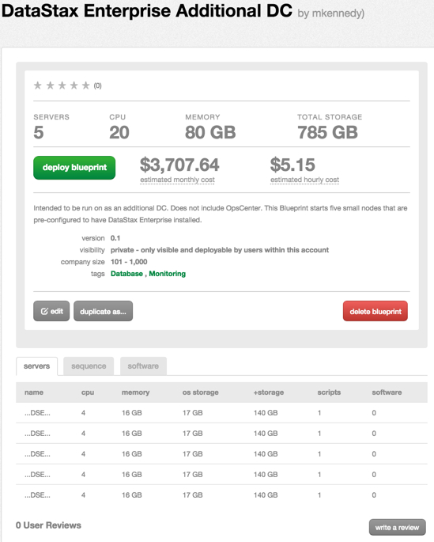
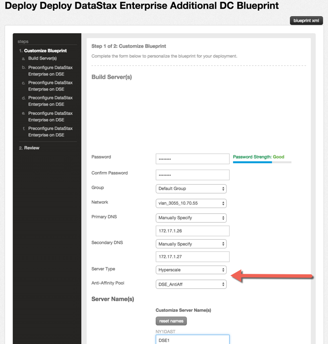
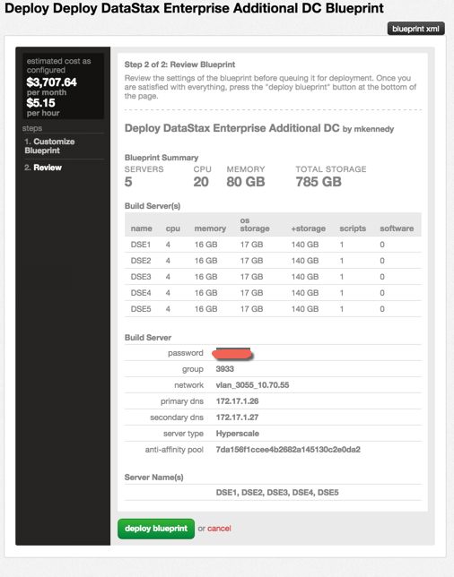

{{{
  "title": "Getting Started with DataStax - Blueprint",
  "date": "1-9-2014",
  "author": "Bob Stolzberg",
  "attachments": [],
  "contentIsHTML": false
}}}

### Overview

DataStax has integrated their technology with the CenturyLink Cloud platform.  The purpose of this KB article is to help CenturyLink Cloud users understand how to successfully deploy the DataStax technology in their CenturyLink Cloud account through automated Blueprints.

DataStax makes an enterprise offering that will deploy a Cassandra cluster to enable customers to perform big data analysis.  DataStax and CenturyLink have collaborated to integrate their technologies by developing Blueprints.  The DataStax Blueprints make it easy to get up and running quickly with a pre-configured and tuned starter cluster managed by the DataStax OpsCenter tool.

Data Stax has 3 Blueprints available:

1. **DataStax Enterprise Starter Cluster Blueprint**

  Will deploy DataStax OpsCenter, which will be used to install and manage the DSE database itself, and also to add additional nodes to the cluster once they have been created in the CenturyLink cloud with the DataStax Enterprise Node Blueprint.
2. **DataStax Enterprise Additional Node Blueprint**

  Will deploy 1 DataStax Enterprise Node on CenturyLink Hyperscale server.  This node can be added to an existing cluster.
3. **DataStax Enterprise Additional DC Blueprint**

  Intended to be run on as an additional DC and does not include OpsCenter. This Blueprint will deploy high performance Hyperscale nodes and anti-affinity pools to create a five-node cluster equipped with locally attached solid state flash storage (SSD). This ensures efficient cluster operations by providing extremely low-latency response times for random reads while supplying ample sequential write performance for compaction and flush operations.

### Partner Profile

DataStax - “Fast, Scalable Distributed Database Technology”

DataStax, the leading distributed database management system, delivers Apache Cassandra to the world’s most innovative enterprises. Datastax is built to be agile, always-on, and predictably scalable to any size.

http://www.datastax.com/

####Customer Support

[DataStax Blueprint Support](https://academy.datastax.com/demos/getting-started-datastax-enterprise-centurylink-cloud)

[DataStax Support Website](https://support.datastax.com/home)

24x7 Email - support@datastax.com

###Audience

CenturyLink Cloud Users

### Steps

Follow these step by step instructions to get started with DataStax Blueprint deployments.  DataStax has numerous Blueprints available.  The example below illustrates how to deploy the 'DataStax Enterprise Additional DC' Blueprint.

1. Locate the Blueprint in the Blueprint Library.

  Starting from the CenturyLink Control Panel, navigate to the Blueprints Library. Search for “DataStax” in the keyword search on the right side of the page. Click the desired blueprint.

2. Choose the DataStax Blueprint. Click on the "Deploy Blueprint" button.

  

3. Configure the Blueprint.

  Complete the information/fields required by the Blueprint wizard.

  

  On the first page, “Customize Blueprint”, ensure the following options are configured.
Password/Confirm Password (This is the root password for the servers. Keep this in a secure place).

  Optionally set the server name prefix by adding numbers after each server name

  **IMPORTANT: For the “Server Type” choose Hyperscale and set the Anti-Affinity Pool to the one created earlier.**

4. Review and Confirm the Blueprint.

5. Once verified, click on the ‘deploy blueprint’ button. You will see the deployment details along with an email stating the Blueprint is queued for execution. This will kick off the blueprint deploy process and load a queue page to allow you to track the progress of the deployment. You can access the queue at any time by clicking the Queue link under the Blueprints menu on the main navigation drop-down.
6. Once the blueprint completes successfully, you will receive an email stating that the blueprint build is complete. Please do not use the application until you have received this email notification.

  IMPORTANT:  In order for OpsCenter to deploy DataStax Enterprise, download credentials will need to be obtained from http://www.datastax.com/download/register

   For more information on how to get started using the DataStax software on CenturyLink, view the [DataStax documentation](https://academy.datastax.com/demos/getting-started-datastax-enterprise-centurylink-cloud).

### Pricing

The costs listed above in steps are for the CenturyLink Cloud infrastructure only.  There are no DataStax license costs or additional fees bundled in.

### Frequently Asked Questions

**Where do I obtain my DataStax License?**

Existing CenturyLink Cloud customers can contact their Account Representative
Sales Email -  sales@datastax.com
Data Stax Support Website

**Who should I contact for support?**

For issues related to deploying the DataStax Blueprint on CenturyLink Cloud, please contact  support@datastax.com
For issues related to cloud infrastructure (VM’s, network, etc), please open a ticket using the [CenturyLink Cloud Support Process](../../Support/how-do-i-report-a-support-issue.md).
