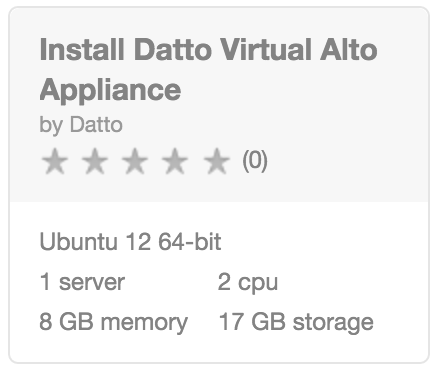

{{{
  "title": "Getting Started with datto Alto - Blueprint",
  "date": "12-18-2015",
  "author": "<a href='https://twitter.com/KeithResar'>@KeithResar</a>",
  "attachments": [],
  "contentIsHTML": false
}}}

### Overview

After reading this article, the reader should feel comfortable deploying the datto Virtual Alto to protect server
data residing on CenturyLink Cloud.

### Partner Profile

datto Alto – “Protecting business data no matter where it lives”

http://www.datto.com/

##### Customer Support

|Sales Contact   	| Support Contact	|
|:-	|	:-	|
|Brian Buckman bbuckman@datto.com (312) 638-2742   	| 24x7 Customer Support  [www.datto.com/support](http://www.datto.com/support) (877) 455-6015	|

### Description

Datto has integrated their technology with the CenturyLink Cloud platform. The purpose of this knowledge base article is to help the reader 
take advantage of this integration to achieve rapid time-to-value for this data protection solution.

Technology from Datto helps CenturyLink Cloud customers address the business challenge of data protection and eliminates downtime by 
virtualizing systems instantly and is now available as part of the CenturyLink Cloud Blueprint Engine.

Customers can protect Windows and Linux operating systems and replicate data every 5 minutes to 60 minutes within the CenturyLink Cloud. 
Additionally, data can be replicated to the Datto cloud where customers can store data for long-term retention or failover and instantly virtualize.

### Audience

CenturyLink Cloud Users

### Impact

After reading this article, the user should feel comfortable getting started using datto technology on CenturyLink Cloud.

After executing the steps in this Getting Started document, the users will have a functioning Virtual Alto upon which they 
can start protecting data and virtualizing systems.

### Deploying datto Virtual Alto

1. **Locate the Blueprint in the Blueprint Library**

  Starting from the CenturyLink Control Panel, navigate to the Blueprints Library. Search for "datto Alto" in the keyword search on the right side of the page.

  

2. **Click the Deploy Blueprint button.**

3. **Set Optional Parameters**

  Password/Confirm Password (This is the root password for the server. Keep this in a secure place).  

  Set DNS to “Manually Specify” and use “8.8.8.8” (or any other public DNS server of your choice).

  Optionally set the server name prefix.

  The default values are fine for every other option.

4. **Review and Confirm the Blueprint**

5. **Deploy the Blueprint**

  Once verified, click on the `deploy blueprint` button. You will see the deployment details stating the Blueprint is queued for execution.

  This will kick off the Blueprint deploy process and load a page where you can track the deployment progress. Deployment will typically complete within five minutes.

7. **Deployment Complete**

  Once the Blueprint has finished execution you will receive an email confirming the newly deployed assets.  If you do not receive an email like the one shown below your cluster may have had a deployment error - review the *Blueprint Build Log* to for error messages.

  

8. **Access Alto**

  * Access the device's web UI by entering the IP address into your browser
  * Power on VM and apply registration code
  * Attach provisioned storage disks and reboot
  * Begin Registration upon reboot

### Pricing

The costs listed above in the above steps are for the infrastructure only.

After deploying this Blueprint, you may secure entitlements to the technology by emailing your datto
Account Executive or if you don’t have one, Brian Buckman at bbuckman@datto.com.

### Frequently Asked Questions

**Where do I get my datto registration code?**

Email your Datto Account Manager bbuckman@datto.com

**Who should I contact for support?**

* For issues related to cloud infrastructure, please open a ticket using the [CenturyLink Cloud Support Process](../../Support/how-do-i-report-a-support-issue.md).
* For issues related to deploying the Alto Blueprints and application operation on CenturyLink Cloud, please contact bbuckman@datto.com or follow your existing datto support process if known.

