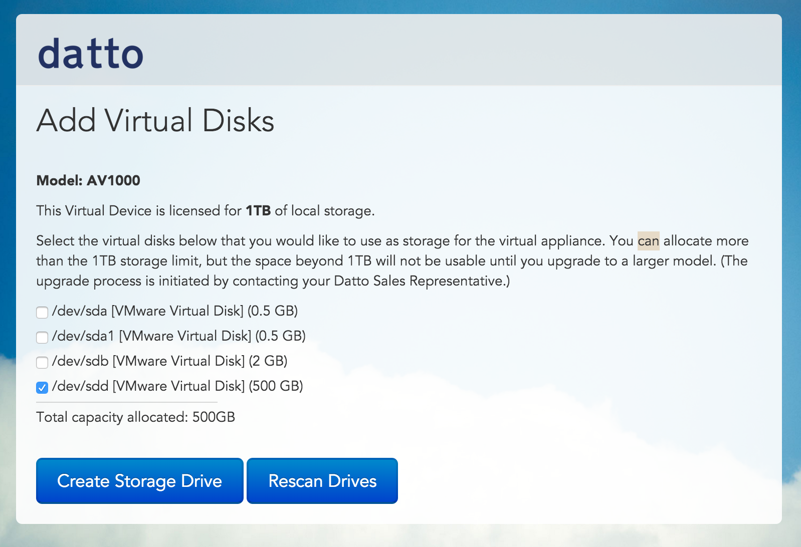

{{{
  "title": "Getting Started with Datto ALTO - Blueprint",
  "date": "12-18-2015",
  "author": "<a href='https://twitter.com/KeithResar'>@KeithResar</a>",
  "attachments": [],
  "contentIsHTML": false
}}}

### Overview
After reading this article, the reader should feel comfortable deploying the Datto Virtual ALTO to protect server data residing on Lumen Cloud.

### Partner Profile

Datto ALTO – “Protecting business data no matter where it lives”

http://www.datto.com/

##### Customer Support

|Sales Contact | Support Contact|
|:-	|	:-	|
|Datto Channel Manager Brian Buckman bbuckman@datto.com (312) 638-2742 pricing will come from your authorized MSP | 24x7 Customer Support  [www.datto.com/support](http://www.datto.com/support) (877) 455-6015	|

### Description
Datto has integrated their technology with the Lumen Cloud platform. The purpose of this Knowledge Base article is to help the reader take advantage of this integration to achieve rapid time-to-value for this data protection solution.

Technology from Datto helps Lumen Cloud customers address the business challenge of data protection and eliminates downtime by virtualizing systems instantly and is now available as part of the Lumen Cloud Blueprint Engine.

Customers can protect Windows and Linux operating systems and replicate data every 5 minutes to 60 minutes within the Lumen Cloud. Additionally, data can be replicated to the Datto cloud where customers can store data for long-term retention or failover and instantly virtualize.

### Audience
Lumen Cloud Users

### Impact
After reading this article, the user should feel comfortable getting started using Datto technology on Lumen Cloud.

After executing the steps in this Getting Started document, the users will have a functioning Virtual ALTO upon which they can start protecting data and virtualizing systems.

### Deploying Datto Virtual ALTO
1. Locate the Blueprint in the Blueprint Library.
   * Login to the Control Portal. From the Nav Menu on the left, click **Orchestration > Blueprints Library**.
   * Search for "Datto ALTO" in the keyword search on the right side of the page.
   * (Pricing includes IaaS resources only. See end of article for licensing details.)

2. Click the `deploy blueprint` button.

3. Set Optional Parameters.
   * Password/Confirm Password (This is the root password for the server. Keep this in a secure place).  
   * Set DNS to “Manually Specify” and use “8.8.8.8” (or any other public DNS server of your choice).
   * Optionally set the server name prefix.
   * The default values are fine for every other option.

4. Review and Confirm the Blueprint.

5. Deploy the Blueprint.
   * Once verified, click the `deploy blueprint` button.
   * You will see the deployment details stating the Blueprint is queued for execution.
   * This will kick off the Blueprint deploy process and load a page where you can track the deployment progress. Deployment will typically complete within five minutes.

6. Add Additional Storage.
   * The Blueprint delivers your server with no data storage configured. Login to [Control Portal](https://control.ctl.io) and add **raw disks** for your server.

7. Access ALTO
   * **Note** if accessing via a public IP address some of these steps may refresh and direct you towards the private IP causing timeouts.
   * Access the device's web UI by entering the IP address into your browser.
   * Apply registration code. If you have not yet received a registration code please email bbuckman@datto.com.

  

   * Select disks added in Step (7) and click *Create Storage Drive*.

    

   * Configure appliance access details and set owner contact information the click *Register Appliance*.

    

### Pricing
The costs listed in the above steps are for the infrastructure only. After deploying this Blueprint, you may secure entitlements to the technology by emailing your Datto Account Executive.

### Frequently Asked Questions
**Where do I get my Datto registration code?**
* Email your Datto Channel Manager at bbuckman@datto.com. Datto pricing will come from your authorized MSP.

**Who should I contact for support?**
* For issues related to cloud infrastructure, please open a ticket using the [Lumen Cloud Support Process](../../Support/how-do-i-report-a-support-issue.md).
* For issues related to deploying the ALTO Blueprints and application operation on Lumen Cloud, follow your existing Datto support process.
