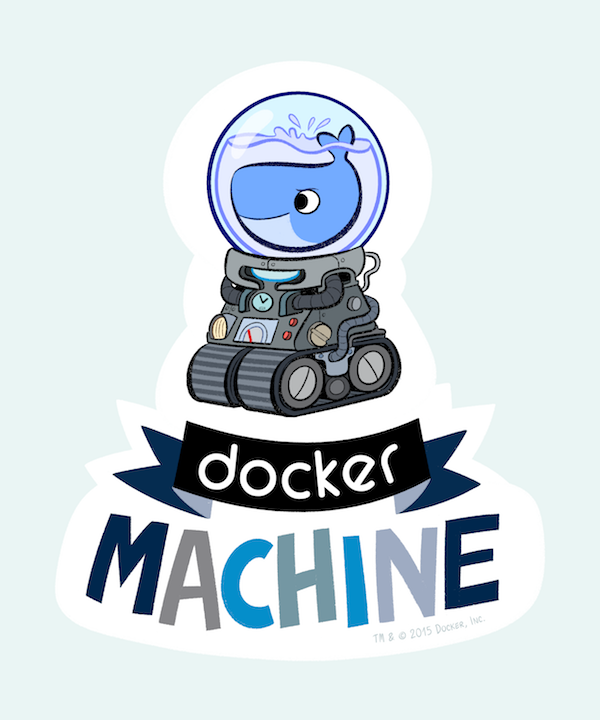

{{{
  "title": "Getting started with docker-machine",
  "date": "12-10-2015",
  "author": "albert.choi@ctl.io",
  "attachments": [],
  "contentIsHTML": false
}}}

### Overview
After reading this article, the user should be able to provision docker-machine instances on Lumen Cloud.  

### Description


[Docker Machine](https://www.docker.com/docker-machine) - "automated docker provisioning"

The CLC driver enables the user to provision docker hosts via the docker-machine CLI.

repo: [https://github.com/CenturyLinkCloud/docker-machine-driver-clc](https://github.com/CenturyLinkCloud/docker-machine-driver-clc)

### Audience
Docker users interested in deploying machines on Lumen Cloud.

### Steps
1. Install Docker Machine.
   * [https://docs.docker.com/machine/install-machine/](https://docs.docker.com/machine/install-machine/)
   * or the [Docker toolbox](https://www.docker.com/docker-toolbox)

2. Download the CLC Driver.
   * See [installation](https://github.com/CenturyLinkCloud/docker-machine-driver-clc/#installation) options.
   * Recommended: download a pre-built binary from
	[releases](https://github.com/CenturyLinkCloud/docker-machine-driver-clc/releases)

3. Install the binary into your shell path.
   * (strip the architecture extension)

 	 ```
  	$ mv docker-machine-driver-clc.linux-amd64 $(dirname $(which docker-machine))/docker-machine-driver-clc
  	$ chmod +x $(dirname $(which docker-machine))/docker-machine-driver-clc
	 ```

4. Set Credentials.
   * The plugin expects CLC credentials set either as env vars:

	 `CLC_USERNAME`, `CLC_PASSWORD`, `CLC_ALIAS`

  	or as cmdline flags

	 `--clc-account-username`, `--clc-account-password`, `--clc-account-alias`

5. Test.
   * explore available options.

	 `docker-machine create --driver clc --help`

6. Create an instance.

	 `docker-machine --debug create -d clc firstmachine`

### Machine options

#### Public/Private
By default, a public IP is allocated on your docker-machine instance, controlled by the `--clc-server-private` flag. SSH is required for docker-machine to install the docker engine software packages. This means that if public IPs are not available or you don't want the tls-secured machine publicly accessible, you'll need to be connected via [VPN Access](../../Network/Lumen Cloud/how-to-configure-client-vpn.md).

### Troubleshooting
* Driver missing in path, ensure downloaded binary is in your shell path.

```
$ docker-machine create --driver clc --help
Driver "clc" not found. Do you have the plugin binary accessible in your PATH?

$ which docker-machine-driver-clc
$ echo $PATH
...
```
