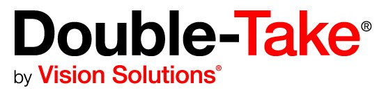
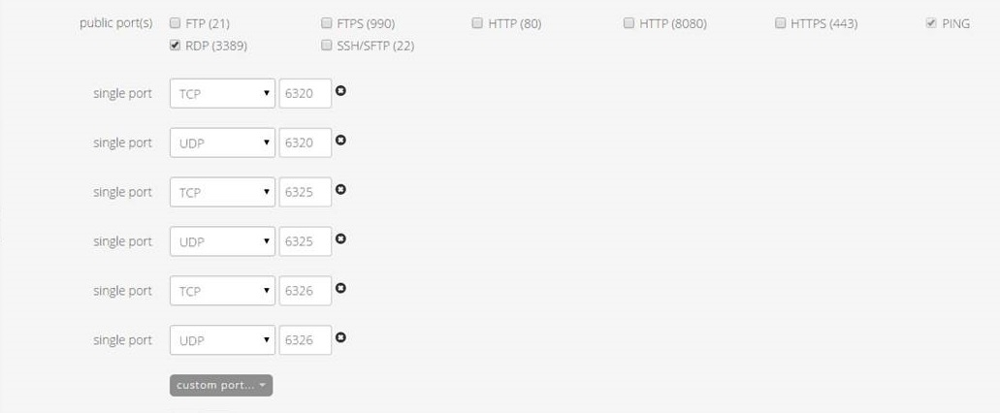

{{{
"title": "Getting Started with Double Take - Blueprint",
"date": "5-18-2015",
"author": "Shaun Sellers and Bob Stolzberg",
"attachments": [],
"contentIsHTML": false
}}}

###Partner Profile
- Vision Solutions – Migrate, Protect & Recover... Anywhere
- [www.visionsolutions.com](http://www.visionsolutions.com)

Customer Support:
- 24x7 Email Support - support@visionsolutions.com
- 24x7 Telephone Support - U.S. and Canada: (800) 775-8674 International: +1 (317) 598-2066

Sales Support:
- [CenturyLinkInfo@visionsolutions.com](mailto:CenturyLinkInfo@visionsolutions.com?subject=CenturyLink%20Sales%20Help)

### Description
Vision Solutions®  has integrated their technology with the CenturyLink Cloud platform.  The purpose of this KB article is to help the reader take advantage of this integration to achieve rapid time-to-value for this data mobility solution.

Vision Solutions is the premier provider of cloud protection and recovery, high availability, disaster recovery and migration solutions for Windows, Linux and cloud computing.

Technology from Vision Solutions helps CenturyLink Cloud customers address the business challenge of adopting cloud-based disaster recovery strategies and perform near-zero downtime migrations without risk across platforms on any combination of physical, virtual or cloud serversBy implementing Vision Solutions' Double-Take - now available as part of the CenturyLink Cloud Blueprint Engine.

### Solution Overview
Vision Solutions’ Double-Take® is installed typically on two servers; the source server which is likely running outside of the CenturyLink Cloud and the target server running within the CenturyLink Cloud. Double-Take precisely duplicates the application’s native write processes with real-time transaction awareness that never requires a quiesce, including replication of file system meta-data like permissions, attributes, compression and encryption settings.  When using Double-Take, the target server is available as a warm standby for temporary DR or you may choose to permanently migrate into the the CenturyLink Cloud upon cut-over.

### Offer
Vision Solutions is making their technology available for CenturyLink Cloud Users to deploy to their account.  The Vision Solutions Blueprints require a license key.  In order to  **evaluate or purchase** a license for entitlement, please email [CenturyLinkInfo@visionsolutions.com](mailto:CenturyLinkInfo@visionsolutions.com?subject=CenturyLink%20Sales%20Help).

### Audience
CenturyLink Cloud Users

### Impact
After reading this article, the user should feel comfortable getting started using the partner technology on CenturyLink Cloud.

After executing the steps in this Getting Started document, the users will have a functioning VM with Double-Take installed upon which they can start creating jobs for High Availability, Disaster Recovery or Migration scenarios.

### Prerequisite
- Access to the CenturyLink Cloud platform as an authorized user.
- Identify a Network VLAN you want the Vision Solutions servers to reside on.
- Possess a Double-Take license key

### Postrequisite
- If you want to access your VM with Double-Take over the internet, please perform the following tasks once you receive an email confirming you Blueprint completed successfully:

1. If you need to connect to your server via the Internet, Add a [Public IP](../../Network/how-to-add-public-ip-to-virtual-machine.md) to your server through Control Portal. Alternatively, you can [setup a VPN using OpenVPN](../../Network/how-to-configure-client-vpn.md) or similar technology.

2. [Allow incoming traffic](../../Network/how-to-add-public-ip-to-virtual-machine.md) for desired ports by clicking on the Servers Public IP through Control Portal.  Add the required Double-Take ports from the list or screen shot below or as documented in the [Users' Guide](http://download.doubletake.com/_download/Documentation/DocumentationLibrary.htm) for the respective platform.
  - Open the following Public Ports by selecting the checkboxes:  RDP (3389) and PING
  - Open the following 6x custom ports using these protocols by clicking on the Custom Port dropdown
    * 6320 TCP and UDP (Note: This is 2 unique rules)
    * 6325 TCP and UDP (Note: This is 2 unique rules)
    * 6326 TCP and UDP (Note: This is 2 unique rules)

  

### Install Double-Take Blueprint

1. Starting from the CenturyLink Control Panel, navigate to the Blueprints Library.
2. Search for “Double-Take” in the keyword search on the right side of the page.
3. Locate the "Install Double-Take on {Operating System}" Blueprint for your environment.
4. Choose and Deploy the Blueprint. Click the “Install Double-Take on {Operating System}” Blueprint.

3. Configure the Blueprint using the standard information for the server.  You will also need to enter the Double-Take License Key provided to you by Vision Solutions.

4. Review and Confirm the Blueprint.
1. Click “next: step 2”
2. Verify your configuration details.

5. Deploy the Blueprint.
1. Once verified, click on the ‘deploy blueprint’ button. You will see the deployment details along with an email stating the Blueprint is queued for execution.
2. This will kick off the blueprint deploy process and load a page to allow you to track the progress of the deployment.

6. Monitor the Activity Queue.
* Monitor the Deployment Queue to view the progress of the blueprint.
* You can access the queue at any time by clicking the Queue link under the Blueprints menu on the main navigation drop-down.
* Once the blueprint completes successfully, you will receive an email stating that the blueprint build is complete. Please do not use the Vision Solutions Server until you have received this email notification.

### Accessing your Vision Solutions appliance
Double-Take is managed using the Double-Take Console which runs on a Windows instance with network access to both the Double-Take source and target servers.  The Double-Take console is installed as part of deploying the Double-Take for Windows Blueprint.  For OS level access, you can connect to Windows using RDP and Linux using SSH. 

### Pricing
The costs associated with this Blueprint deployment are for the CenturyLink Cloud infrastructure only.  There are no Vision Solutions or Double Take license costs or additional fees bundled in. There are multiple  Double-Take licensee options designed to meet your specific solutinos and SLA needs. Please contact CenturyLinkInfo@visionsolutions.com for your appropriate licensing assistance.

### Frequently Asked Questions

#### Where do I obtain my Vision Solutions License or entitlements?
Existing CenturyLink Enterprise Customers can contact their Account Representative for help obtaining a Vision Solutions license, or contact Vision Solutions directly:
- Contact Vision Solutions Sales via Email: [CenturyLinkInfo@visionsolutions.com](mailto:CenturyLinkInfo@visionsolutions.com?subject=CenturyLink%20Sales%20Help).

#### Who should I contact for support?
* For issues related to deploying the Blueprint, licensing, Accessing or using the Vision Solutions application, please contact the [Vision Solutions Customer Care Team](http://www.visionsolutions.com/services-support/support/contact-customercare )
* For issues related to cloud infrastructure (VM’s, network, etc), or is you experience a problem deploying the Blueprint, please open a CenturyLink Cloud Support ticket by emailing noc@ctl.io or [through the support website](https://t3n.zendesk.com/tickets/new)