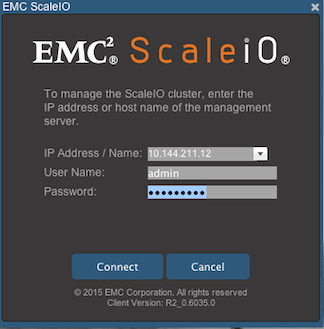
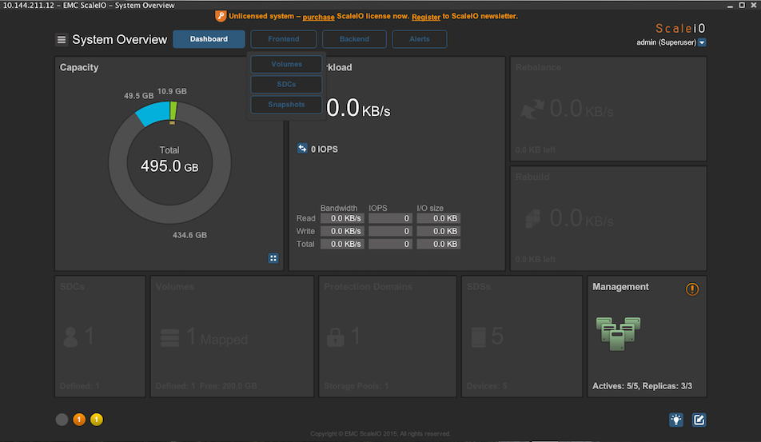
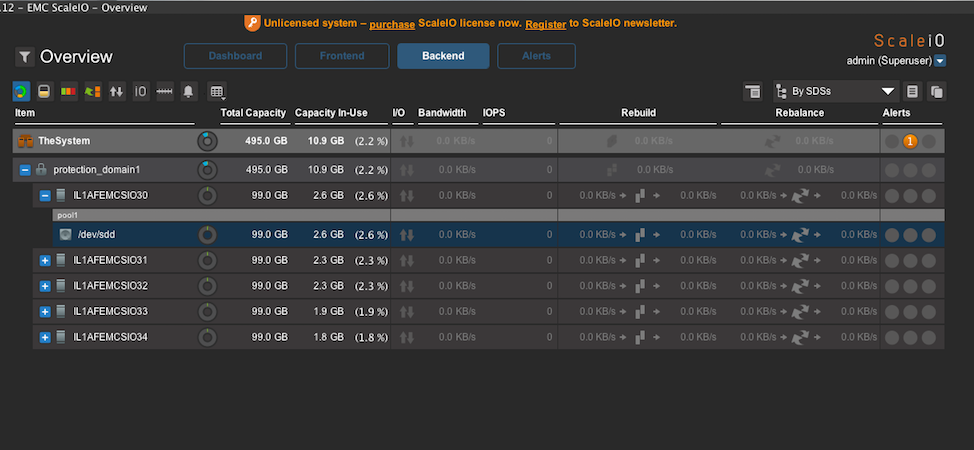
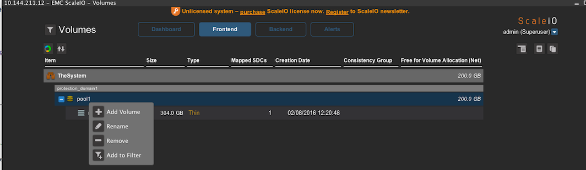

{{{
  "title": "Getting Started with EMC ScaleIO",
  "date": "08-10-2016",
  "author": "Albert Choi",
  "attachments": [],
  "contentIsHTML": false
}}}

### Technology Profile

[EMC ScaleIO](http://www.emc.com/storage/scaleio/index.htm) offers a
software-defined, clustered, block storage appliance. Since it pools
commodity, readily available and/or existing infrastructure, it allows
you to realize a scalable and performant storage solution entirely via
software.

### Description

ScaleIO offers a software only solution for storage applications
including shared block devices as well as higher level applications
such as container storage.

### Impact

This article provides instructions for installing a ScaleIO cluster,
configuring a volume, and exposing the volume to a client.

### Audience

Architects, DevOps, Storage admins

### Prerequisites

Required Compute:

* min: 5 nodes, 5 cores, ~20GB memory, ~500GB disk

### Postrequisites

* Java Runtime
* [VPN Access](../../Network/CenturyLink Cloud/how-to-configure-client-vpn.md) is required in order to administer the cluster via the GUI tool.

### Cluster Configuration

The nodes in the cluster run the following components of interest:
(see also [ScaleIO Architecture][arch])

- 1: SDS, MDM (primary), gateway
- 2: SDS, MDM (secondary)
- 3: SDS, MDM (tertiary)
- 4: SDS, TieBreaker
- 5: SDS, TieBreaker
- N: SDS

### Deploying a EMC ScaleIO cluster

1. Load the [EMC ScaleIO cluster][runner-cluster-permalink] Runner job.

2. Select a data center and specify a server group name your cluster will provision into.

3. Configure your server buildout with name, cpu, and memory.

4. Determine the number of servers for your cluster. A minimum of 5 servers are required.
   If the number of servers is greater than 5, additional nodes will configure as SDS components,
   contributing to the total storage pool.

5. Specify the size of the attached storage per node. Each node in the cluster will have this
   amount. Consequently, sufficient storage resources should be available.

6. Admin password is required and will be set on the MDM nodes.

7. Optionally provide a license key. The default configuration provides an unlicensed evaluation copy.

8. Optionally provide an ssh key to install on all nodes.

On completion, the Runner job will emit the IP address of the master MDM node. You'll want to jot this down
and use it for administrating the cluster.

### Administration

The management [GUI][gui] is available for download [here][gui].

The cluster may also be administered via the `scli` command-line tool (installed on the MDM nodes)
or the REST gateway. Both of which are outside the scope of this article.

### Create a Volume

- From the dashboard, click on "Frontend" and then "Volumes".

- Under "protection_domain1", right-click on "pool1" and then select "Add Volume".

- Specify a name and size, click "OK".

- Right-click on your new volume and select "Map Volumes" to connect it to client nodes.

### Connecting Clients

In order to have clients access your volumes, additional software in the form of kernel module must be installed.
Once the kernel module is installed, the client must be registered into the cluster.

To install on Linux systems, a separate [SDC installer][runner-client-permalink] is available for clients.

The SDC installer will require the IP address of the primary MDM node as well as the admin password.

### Performance

For optimal performance, consider using cloud or Bare Metal server types for the SDS nodes. To do so,
pre-allocate these machines in a server group of your choice. Then point the cluster installer at the group.

### Licensing

The costs associated with this installer are for the Lumen Cloud
infrastructure only. EMC ScaleIO is free to use for evaluation
purposes. An EMC ScaleIO license is required for normal operation and
available for purchase from [EMC directly][scaleio-store].

### Frequently Asked Questions

#### Who should I contact for support?

* For issues related to using EMC ScaleIO, licensing or
  troubleshooting the cluster, please visit
  [EMC Support][scaleio-support].

* For issues related to cloud infrastructure (VMs, network, etc.), or
  if you experience a problem deploying the installer, please open a Lumen Cloud Support ticket by emailing
  [help@ctl.io](mailto:help@ctl.io) or
  [through the Lumen Cloud Support website](https://t3n.zendesk.com/tickets/new).

[runner-cluster-permalink]: https://runner.ctl.io/product/bd967fd2-1fb5-4d8c-8dca-43a753624bcd-emc-scaleio-cluster
[runner-client-permalink]: https://runner.ctl.io/product/bd967fd2-1fb5-4d8c-8dca-43a753624bcd-emc-scaleio-client
[scaleio-store]: https://store.emc.com/us/Product-Family/EMC-ScaleIO-Products/EMC-ScaleIO/p/EMC-ScaleIO-Elastic-Storage
[scaleio-support]: https://support.emc.com/search/?text=scaleio

[product]: http://www.emc.com/storage/scaleio/index.htm
[eula]: https://installers.useast.os.ctl.io/emc/EULA.txt
[gui]: https://installers.useast.os.ctl.io/emc/gui/java.zip
[arch]: https://www.emc.com/collateral/white-papers/h14344-emc-scaleio-basic-architecture.pdf
