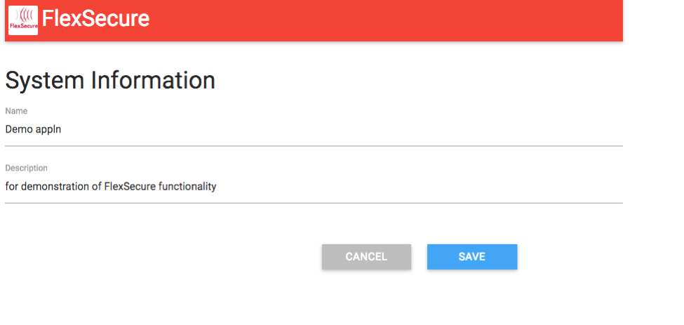
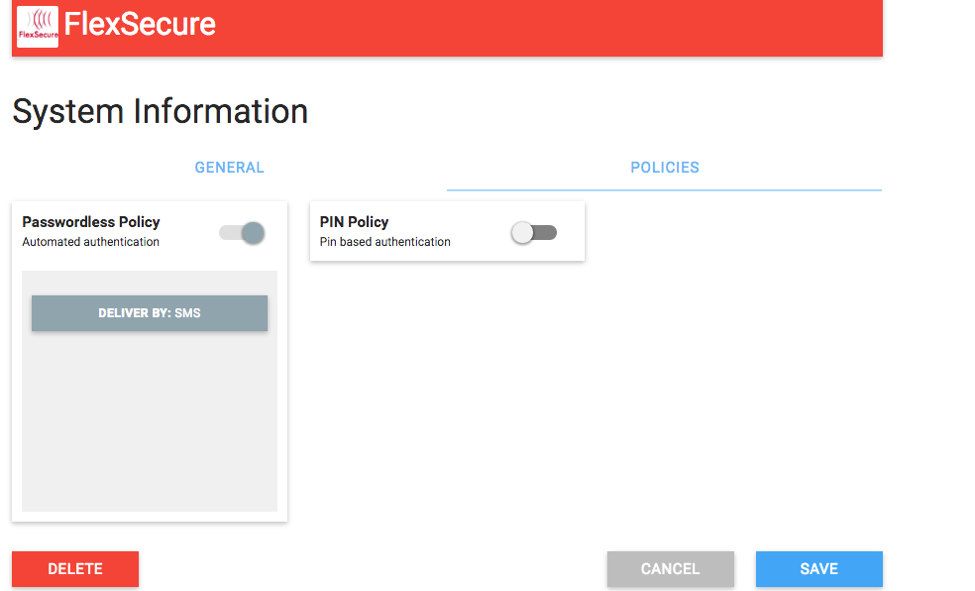
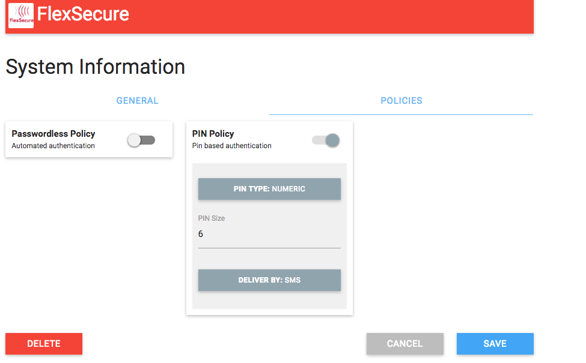
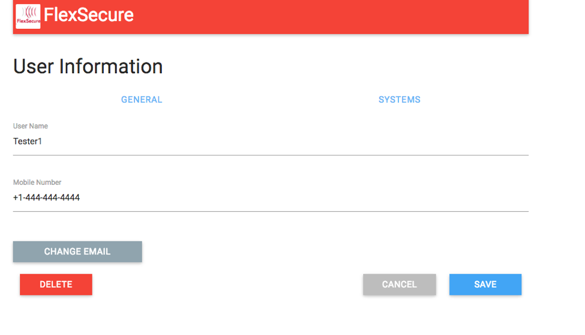
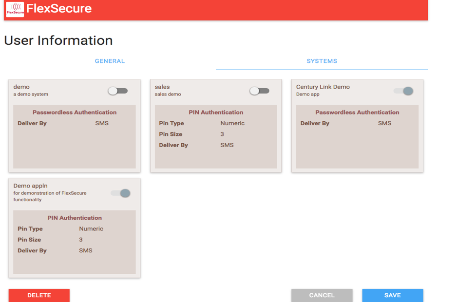

{{{
  "title": "Getting Started with FlexSecure",
  "date": "7-11-2016",
  "author": "Sid Prasanna",
  "attachments": [],
  "contentIsHTML": false
}}}

### Technology Profile

[FlexSecure](//www.flexsecure.co/) has integrated their technology on the CenturyLink Cloud platform. 
FlexSecure is a context-based Authentication-as-a-Service API platform, providing passwordless and pin-based authentication. This platform enables organizations of all sizes to choose, or mix and match, appropriate user authentication methods to protect and secure their data sources on their Cloud/Mobile/IT infrastructure.

By adding multi-layered authentication options that may require user interaction before granting access, organizations have the ability to add significant levels of security to protect their data from hackers and prevent unauthorized access.

FlexSecure Passwordless authentication:

* No need to remember passwords.

* Quick and easy integration into applications.

* Authenticate users once and add additional contexts such as pin-based security authentication.

* Easy user adoption, since the passwordless authentication link is delivered by SMS.


### Description

FlexSecure solves a unifying problem -- the need to dynamically secure access to resources and data based on the user and their level of authorized access. Many solutions exist for granting access in a static way, but no single solution exists that can adjust the security authentication requirements in real-time, based on dynamic factors in the security equation.

FlexSecure sees access as a dynamic problem that needs a dynamic solution. Our technology enables companies to provide strong and flexible authentication for access to more sensitive resources and data, while relaxing the requirements for access to less sensitive content. This allows users to get more work done, without interruption, while giving the highest level of security when necessary.

The FlexSecure technology is implemented through a secure API that allows for easy integration into your existing applications, websites, and enterprise systems.

### Audience

CenturyLink Cloud Users, Application Developers, Enterprises

### Pre-Requisite

Please confirm that you are a CenturyLink Cloud customer and register for an account, at the following link:

[FlexSecure Registration Form](//docs.google.com/forms/d/1W6tpMVM5PiW50_QJwmlwSQUX-5ch4dPNTiKDzYkJQf4/viewform?c=0&w=1)

### Post-Requisite

The purpose of this KB article is to help the reader take advantage of this integration to achieve rapid time-to-value for this Cyber Security solution.

Once the account has been created, the customer will be able to create systems and users, as well as assign existing policies. Users can be anyone or any device that needs to be authenticated. Systems are anything that users want to access -- like applications, cloud infrastructure, etc.

### Steps to Configure the System 

It is suggested that systems be entered first, followed by the users.
After gaining access, the account administrator should follow the steps below to configure the system:

1. Set up the systems and their policies.

    
	  
	  

2. Set up the users.

    

3. Set up the systems that a user can access.

    

**To add passwordless authentication**

1. Change the login process to accept an email address.

2. Configure the system policy to be passwordless.

3. Once the email has been entered, make the following API call on the back-end:

    `POST https://api.flexsecure.co/v2/user/authenticate`

    This will start the authentication process.

4. Since we configured the user to use passwordless authentication, once the API call is made you will receive an SMS text message on your phone that contains the link to click and proceed with the passwordless authentication.

5. Once you click the link, the following API call is triggered so that the system you are trying to access can complete the authorization process.

    `POST https://api.flexsecure.co/v2/system/authenticate/user`

	  For passwordless-based calls:

  	```
	  POST https://api.flexsecure.co/v2/system/authenticate/user
      {
         “email”:”<user email>”,
         “system”:”<system name>”“,
         “passwordless”:”<link sent to registered cellphone>”
      }
    ```

**To add pin-based authentication**

1. Change the login process to accept an email address.

2. Configure the system policy to be pin-based.

3. Once the email has been entered, make the following API call on the back-end:

    `POST https://api.flexsecure.co/v2/user/authenticate`

    This will start the authentication process.

4. Since we configured a user to use pin-based security, once the API call is made you will receive an SMS text message on your phone that contains the pin number.

5. Login with the pin number received on the phone. The application needs to accept the pin number inside the login process.

6. Once you submit the pin, the following API call is triggered so that the system you are trying to access can complete the authorization process.

    `POST https://api.flexsecure.co/v2/system/authenticate/user`

  	For pin-based calls:

	  ```
    POST https://api.flexsecure.co/v2/system/authenticate/user
      {
	       “email”:”<user email>”,
	       “system”:”<system name>”“,
	       “pin”:”<pin sent to registered cellphone>”
      }
    ```

**API Headers**

The FlexSecure system uses JSON-formatted data payloads for communicating with the service. The API call requires two header variables.

Content-Type: application/json
apikey=<assigned key>.  
The <assigned key> is generated as part of the sign up process.

For passwordless-based calls:

	  ```
	  POST https://api.flexsecure.co/v2/system/authenticate/user
      {
         “email”:”<user email>”,
         “system”:”<system name>”“,
         “passwordless”:”<link sent to registered cellphone>”
      }
    ```

For pin-based calls:

    ```
	  POST https://api.flexsecure.co/v2/system/authenticate/user
      {
	       “email”:”<user email>”,
	       “system”:”<system name>”“,
	       “pin”:”<pin sent to registered cellphone>”
      }
    ```

### Who Should I Contact for Support?

* For issues related to the FlexSecure Blueprint on CenturyLink Cloud or Licensing, please visit [www.flexsecure.co](//www.flexsecure.co/)

* Customer Support -- please use the email address: [support@flexsecure.co](mailto:support@flexsecure.co) for all support needs.

* For issues related to cloud infrastructure (VM's, network, and so on) or if you experience a problem deploying the Blueprint or Script Package, open a CenturyLink Cloud Support ticket by emailing [noc@ctl.io](mailto:noc@ctl.io) or [through the CenturyLink Cloud Support website](//t3n.zendesk.com/tickets/new).

### Offer and Pricing

FlexSecure offers CenturyLink customers:

**Enterprise Version**

High-volume security appliance

**Cloud Version**

Pay as you go – monthly subscription

Please contact us for pricing: [sales@flexsecure.co](mailto:sales@flexsecure.co)
