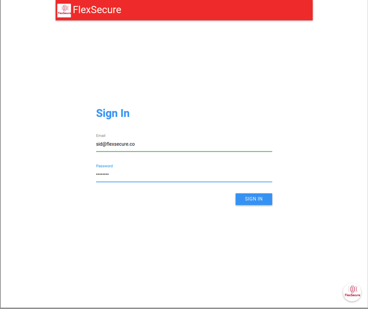
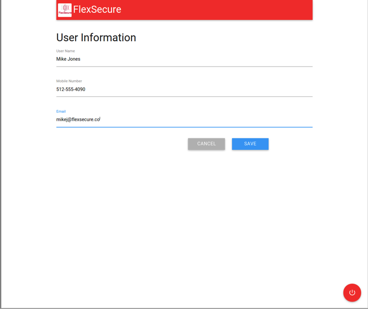

{{{
  "title": "Getting Started with FlexSecure - Service",
  "date": "11-30-2015",
  "author": "Bob Stolzberg",
  "attachments": [],
  "contentIsHTML": false
}}}

### Partner Profile
FlexSecure - A "context-based" Security-as-a-Service Platform
[http://www.flexsecure.co](http://www.flexsecure.co)

#### Contact FlexSecure
##### Customer Sales and Support:
Sales & Support Email - [admin@flexsecure.co](mailto:admin@flexsecure.co)

### Description
FlexSecure has integrated their technology with the CenturyLink Cloud platform.  The purpose of this KB article is to help the reader take advantage of this integration to achieve rapid time-to-value for this Cyber Security solution.

FlexSecure is a Context-based Security-as-a-Service API Platform. This platform enables organizations of all sizes to choose, or mix and match appropriate user Authentication  methods, to protect and secure their data sources on their Cloud/Mobile/IT infrastructure.

By adding multi-layered Authentication options that may require user interaction before granting access, organizations have the ability to add significant levels of security to protect their data from hackers, and prevent unauthorized access.

Technology from FlexSecure helps CenturyLink Cloud customers address the business challenge of secure connectivity by implementing a Context-based User and Device authentication Platform.

### Solution Overview
FlexSecure solves a unifying problem:  the need to dynamically secure access to resources and data, based on who the person is and what they are trying to access.

Many solutions exist for granting access in a static way, but no single solution exists that can adjust the security authentication requirements in near real-time, based on dynamic factors in the security equation.

FlexSecure sees access as a dynamic problem that needs a dynamic solution.  Our technology enables companies to provide stronger authentication for access to more sensitive resources and data, while relaxing the requirements for access to less sensitive content.  This allows users to get more work done, without interruption, while giving the highest level of security necessary when needed.

The FlexSecure technology is implemented through a secure API that allows for easy connection to your existing enterprise systems or security initiatives.

### Audience
CenturyLink Cloud Users, Security Engineers, Enterprise CSO's and Application Developers

### Impact
After reading this article, the user should feel comfortable getting started using the partner technology on CenturyLink Cloud.

### Offer
FlexSecure has provided CenturyLink customers a 25% discount on services.  To take advantage of this offer, please confirm that you are a CenturyLink customer and send an email to [admin@flexsecure.co](mailto:admin@flexsecure.co).

### Prerequisite
Please confirm that you are a CenturyLink customer and register for an account, at the following link:
[FlexSecure Registration Form](https://docs.google.com/forms/d/1W6tpMVM5PiW50_QJwmlwSQUX-5ch4dPNTiKDzYkJQf4/viewform?usp=send_form)

### Steps to configure the systems
Once the account has been created, the customer will be able to create systems, and users, as well as assign existing policies.  Users are anyone or any device that needs to be authenticated.  Systems are anything that users want to access.

It is suggested that systems be entered first, followed by the users.

After gaining access, below are the steps for the acct. admin. to configure the system:
* set up systems
* set up users
* set up systems that a user can access

The system is now ready for use in an application!

#### Steps to add pin-based authentication
A typical use case, if a developer needs to add a pin-based authentication, follow the steps below:
* Change login process to accept an email address.
* On the backend, once the email has been entered, need to run the following API command: /user/authenticate.
* This will start the authentication Process.
* Since we configured a user to use pin-based security, once the api call is made, the user will receive a sms text message on their mobile phone, with the pin number.
* The application needs to accept the pin no. inside the login process.

Once the user submits the pin, the api call: /system/authenticate is triggered, so that the system they are trying to access, can complete the authorization process.

This is how easy it is to implement FlexSecure!

#### JSON Information
The Flexsecure system uses JSON formatted data payloads for communicating with the service.  The call requires two headers.  

  * First is the Content-Type: application/json
  * The second is apikey=<assigned key>
  * The <assigned key> is generated as part of the sign up process.

* `https://api.flexsecure.co/v1/authenticate/user`

`{
“email”:”<user email>”,
“system”:”<system name>”
}`

* `https://api.flexsecure.co/v1/authorize/user`

`{
“email”:”<user email>”,
“system”:”<system name>”“,
“pin”:”<pin sent to registered cellphone>”
}`

#### FlexSecure Process
* App calls `https://api.flexsecure.co/v1/authenticate/user` with the appropriate data in the JSON payload.  
* App checks the return status of the call - if it is FAIL, an error message and reset.  If the return value is SUCCESS, request the pin number from the user.   
* Request the input of the pin the end user receives on their cell phone.  
* Call `https://api.flexsecure.co/v1/authorize/user` with all the data from the authenticate call, plus the pin from the end user.  
* Check the return value. If the return value is FAIL, exit out and reset, If it is SUCCESS,  allow the user to continue.

### Screen Shots showing How To Configure
* User Account Access

* Add System

* Add User

### Pricing
#### Private Enterprise version of FlexSecure that is deployed via a virtual appliance
*  Upto 250K Authentications, base price of $750 per month (with email delivery of pins); plus, an addl fee of 0.02 cents per pin delivered by SMS
*  Upto 100K Authentications, base price of $500 per month (with email delivery of pins); plus, an addl fee of 0.02 cents per pin delivered by SMS
* There is an additional cost to add other authentication contexts such as Time, Location, Voice, Biometrics, etc.

#### Cloud version
Pay as you go – monthly subscription of $3 per user per month; plus, addl fee of 0.05 cents per pin delivered by SMS

### Frequently Asked Questions

#### Who should I contact for support?
* For issues related to FlexSecure on CenturyLink Cloud, please contact [admin@flexsecure.co](mailto:admin@flexsecure.co).
* For issues related to cloud infrastructure (VMs, network, etc.), or if you experience a problem deploying the Blueprint, please open a CenturyLink Cloud Support ticket by emailing [noc@ctl.io](mailto:noc@ctl.io) or [through the support website](https://t3n.zendesk.com/tickets/new) .
