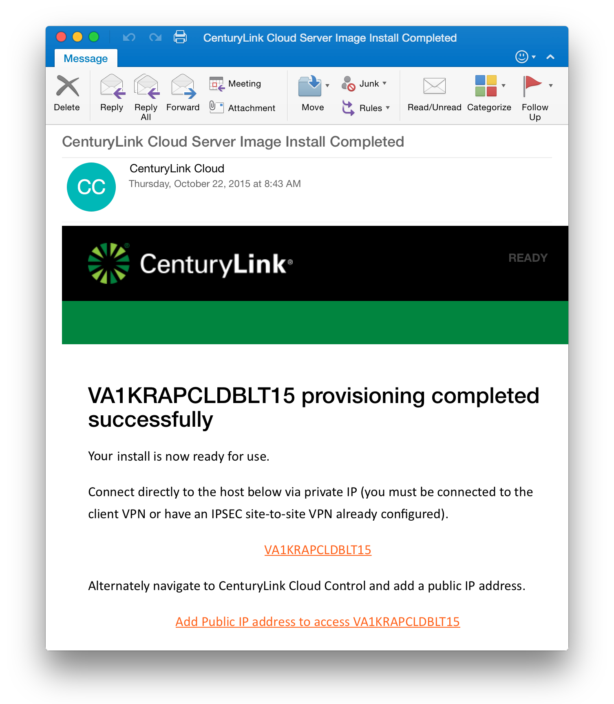

{{{
  "title": "Getting Started with FortyCloud - Appliance",
  "date": "11-20-2015",
  "author": "<a href='https://twitter.com/KeithResar'>@KeithResar</a>",
  "attachments": [],
  "contentIsHTML": false
}}}

### Technology Profile


FortyCloud is a unique security solution for cloud infrastructure deployments that is delivered as a service. FortyCloud makes your public cloud private by building a secure and dynamic perimeter around your cloud infrastructure resources.

http://www.fortycloud.com

##### Customer Support
| Sales Contact  | Support Contact  |
|:- |:- |
| sales@fortycloud.com  | lumen@fortycloud.com  |

### Description
FortyCloud provides a comprehensive security solution for IaaS using Software Defined Networking (SDN) and Software Defined Security (SDS) technologies. All important IT security elements, like AAA, encryption and firewall, are packaged together in the FortyCloud solution and are delivered in SaaS model. Using an Intuitive UI, the FortyCloud solution allows even non-security experts to easily configure fine-grained security policies that are then enforced using the different FortyCloud network entities.

Benefits:
* **Enhanced manageability** – System Administrators are now able to control and monitor their secure cloud network in real time.
* **Cost efficiency** – With only a small addition to the monthly cloud budget, FortyCloud significantly upgrades security and usability of companies' cloud deployments.
* **Ease of use** – All security configurations are performed using policies; even the most complicated security tasks can be performed within a few mouse clicks.
* **Business agility** – Security is no longer a barrier to growth; with FortyCloud, security scales according to business requirements.
* **Operational efficiency** - All networking and access related security tasks are automated.

For more information visit: www.fortycloud.com.

### Audience
Lumen Cloud Users

### Prerequisites
* Access to the Lumen Cloud platform as an authorized user.
* control.ctl.io account with password authentication (two factor authentication not yet supported).

### Steps to Deploy a New Appliance
1. Locate the Blueprint in the Blueprint Library.
   * Login to the Control Portal. From the Nav Menu on the left, click **Orchestration > Blueprints Library**.
   * Search for "FortyCloud Appliance" in the keyword search on the right side of the page.

2. Click the `deploy blueprint` button.

3. Set Required parameters.
   * **Control User Password** - The password associated with your control.ctl.io login.

4. Set Optional Parameters.
   * Password/Confirm Password (This is the root password for the server. Keep this in a secure place).  
   * Set DNS to “Manually Specify” and use “8.8.8.8” (or any other public DNS server of your choice).
   * Optionally set the server name prefix.
   * The default values are fine for every other option.

5. Review and Confirm the Blueprint.

6. Deploy the Blueprint.
   * Once verified, click  the `deploy blueprint` button.
   * You will see the deployment details stating the Blueprint is queued for execution.

7. **Deployment Complete**
   * Once the Blueprint has finished execution you will receive a number of emails.
   * The first will indicate the server has been deployed and the second will come a few minutes later once the appliance has been fully activated.
   * If you do not receive an email like the one shown below you may have had a deployment error - review the *Blueprint Build Log* to for error messages.

  <div style="float:left;width:45%;margin-left:1em;">
    *Email #1: Appliance deploy started*
    
  </div>
  <div style="float:right;width:45%;margin-right:1em;">
    *Email #2: Appliance deploy complete*
    
  </div>
  <br style="clear:both;">

   * Wait for the second email indicating your appliance is ready for use before attempting to access the resource.

8. Enabling Access to Your Appliance.
   Your appliance will be automatically configured with a public IP address accessible from the following ports:
   * HTTPS (443)
   * SSH (22)
   * 500/UDP, 1701/UDP, 4500/UDP

9. Install a New Gateway.
   * In order to proceed with the following steps you will need an active FortyCloud account. 
    You can request a new account free of charge on the FortyCloud website: http://campaign.fortycloud.com/30-day-free-trial/
   * Login to the FortyCloud Web Admin Console to retrieve a new Gateway registration token.
   * Press on the “Setup a new Gateway” icon.
	 
   * **Setup a New Gateway** Wizard opens. Make Sure **Lumen Cloud** is selected and copy the *FortyCloud Account Registration Token* (the blue highlighted text).
	
  * SSH to your server using your password (ssh root@[Public IP]) once prompted enter your password, once you are logged in the following screen will be prompted.
	
  * Type the following command inside your SSH console
    ```
	  > sudo fccli register –t <Paste “FortyCloud Account Registration Token”>
	  ```
10. You should see the following.
	
   * Within a few minutes your new FortyCloud Gateway will appear on the Web Admin Console dashboard (as seen below).
	

11. You can now proceed with the Gateway configuration. 'How to' tutorials are available via the Support Center link located on the top right corner.

### Pricing
The costs listed above in the above steps are for the infrastructure only.

After deploying this Blueprint, you may secure entitlements to the technology using the following steps:
* Email: sales@fortycloud.com
* Visit our pricing plan page: http://fortycloud.com/pricing/ and take advantage of FortyCloud's 30-day free trial offer

### Frequently Asked Questions
**Where do I obtain my license?**
In order to create a new license visit our new account request page: http://campaign.fortycloud.com/30-day-free-trial/

**Who should I contact for support?**
* For issues related to deploying CloudBolt email lumen@fortycloud.com.
* For issues related to cloud infrastructure, please open a ticket using the [Lumen Cloud Support Process](../../Support/how-do-i-report-a-support-issue.md).
