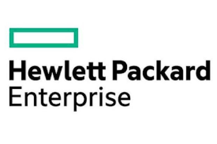

{{{
  "title": "Getting Started with Hewlett Packard Enterprise LoadRunner - Blueprint",
  "date": "01-15-2016",
  "author": "<a href='https://twitter.com/KeithResar'>@KeithResar</a>",
  "attachments": [],
  "contentIsHTML": false
}}}

### Partner Profile

Hewlett Packard Enterprise – Load testing software that gives you an accurate picture of end-to-end system performance to identify and resolve issues
before applications go-live. [Click here for more information](http://www8.hp.com/us/en/software-solutions/loadrunner-load-testing/).

##### Customer Support
| Sales Contact | Support Contact	|
|:-	|	:-	|
| [HPE Sales](https://saas.hpe.com/buy/loadrunner?utm_source=hp.com&utm_medium=referral&utm_term=lr&utm_content=buy_flow&utm_campaign=hp.com_redirects) | [HPE Customer Support](http://community.hpe.com/t5/LoadRunner-Performance-Center/tkb-p/lr_pc_tkb) |

### Description
HPE has integrated their technology with the CenturyLink Cloud platform. The purpose of this KB article is to help the reader take advantage of this integration to achieve rapid time-to-value for the HPE LoadRunner, the market leader for load and performance testing solution.

LoadRunner is a single load testing tool for mobile, web, and legacy applications to provide an accurate view of end-to-end system performance so that you can identify and fix any issues before go-live. LoadRunner is extremely flexible and generates real life loads that help you identify performance problems and deliver higher quality applications as early as possible during the development process. It allows you to generate real-life loads, identify, and diagnose problems and deploy with confidence.

Technology from HPE helps CenturyLink Cloud customers address the business challenge of capacity and performance management by implementing HP Load Runner solution - now available as part of the CenturyLink Cloud Blueprint Engine.

### Solution Overview
HPE LoadRunner software is the industry-standard software for performance engineering. With an intuitive record and playback mechanism, including the patented TruClient technology, HP LoadRunner captures and produces real business processes that users would perform in production, at massive scale.

During a test, LoadRunner captures end-user response times for business processes and transactions to determine whether the application can meet the required service-level agreements, and correlates this information against application infrastructure metrics to provide a complete picture of the potential bottlenecks in your system. LoadRunner provides an automated solution to validate that your application is built for better performance and reliability.

LoadRunner helps you:
* Test a broad range of applications, including the latest Web and Mobile technologies, ERP/CRM applications, and many legacy systems.
* Run high-scale tests using minimal hardware across physical, virtual and public Cloud infrastructure.
* Identify end-to end performance bottlenecks using advanced monitoring and analysis tools to ensure that new or changed applications meet the performance requirements of your business.

### Offer
HPE has provided a Blueprint that enables customers to deploy HPE LoadRunner in a Bring Your Own license model. For more information, please visit the LoadRunner support website.

### Audience
CenturyLink Cloud Users, Developers, Application Owners, Operations

### Impact
After reading this article, the user should feel comfortable getting started using the partner technology on CenturyLink Cloud.

After executing the steps in this Getting Started document, the users will have a functioning HPE LoadRunner, the market leader for load and performance testing solution upon which they can start testing real business processes that users would perform in production, at massive scale using the LoadRunner software as their single load testing tool.

### Detailed Steps to deploy HPE LoadRunner Blueprint
1. Locate the Blueprint in the Blueprint Library.
   * Login to the Control Portal. From the Nav Menu on the left, click **Orchestration > Blueprints Library**.
   * Search for "LoadRunner" in the keyword search on the right side of the page.

2. Click the `deploy blueprint` button.

3. Set Optional Parameters.
   * Password/Confirm Password (This is the root password for the server. Keep this in a secure place).
   * Set DNS to “Manually Specify” and use “8.8.8.8” (or any other public DNS server of your choice).
   * Optionally set the server name prefix.
   * The default values are fine for every other option.

4. Review and Confirm the Blueprint.

5. Deploy the Blueprint
   * Once verified, click on the `deploy blueprint` button.
   * You will see the deployment details stating the Blueprint is queued for execution.
   * This will kick off the Blueprint deploy process and load a page where you can track the deployment progress. Deployment will typically complete within five minutes.

6. Enable public access (optional).
   * Servers are built using private IPs only with access with client or IPSEC VPN. For access from the Internet at large add a public IP to your master server.

   <a href="../../Network/CenturyLink Cloud/how-to-add-public-ip-to-virtual-machine.md">
     
     Adding a public IP to your virtual machine
   </a>

### Pricing
The costs listed in the above steps are for the infrastructure only. There are no HPE LoadRunner license costs included.

### Frequently Asked Questions
**Where do I get my HPE LoadRunner license?**
[Click to purchase HPE LoadRunner Licenses](https://saas.hpe.com/buy/loadrunner?utm_source=hp.com&utm_medium=referral&utm_term=lr&utm_content=buy_flow&utm_campaign=hp.com_redirects).

**Who should I contact for support?**
* For issues related to cloud infrastructure, please open a ticket using the [CenturyLink Cloud Support Process](../../Support/how-do-i-report-a-support-issue.md).
* For issues related to deploying the HPE LoadRunner Blueprints and application operation on CenturyLink Cloud, contact [HPE Customer Support](http://community.hpe.com/t5/LoadRunner-Performance-Center/tkb-p/lr_pc_tkb).
