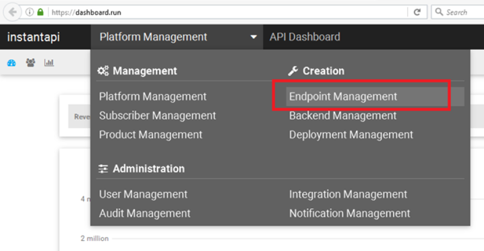
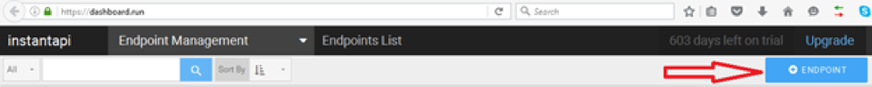
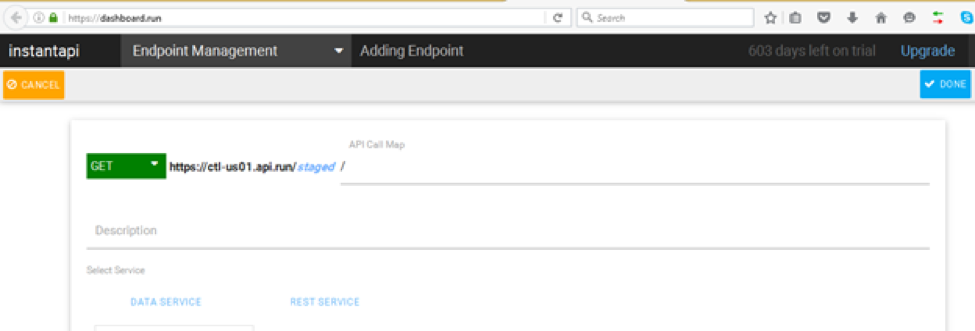
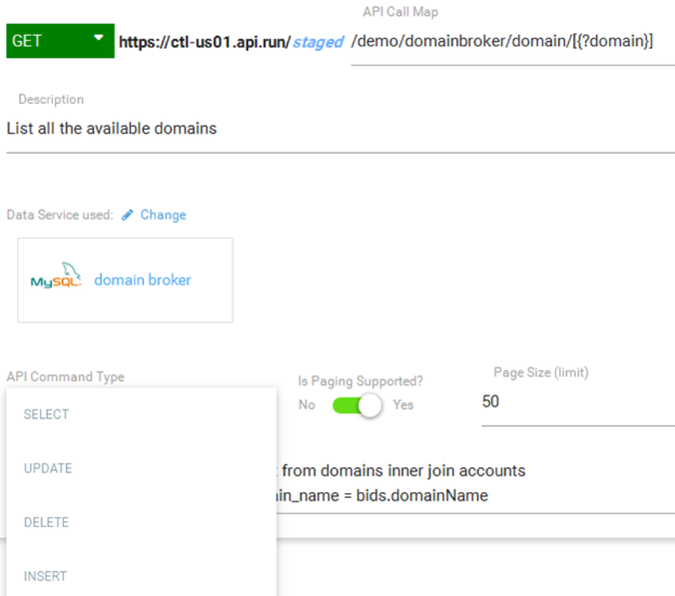
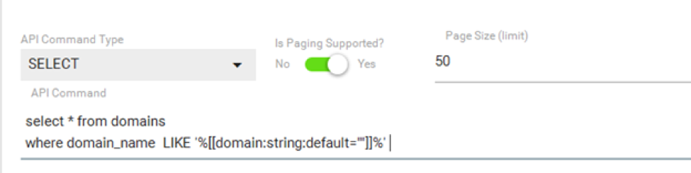
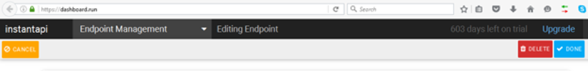
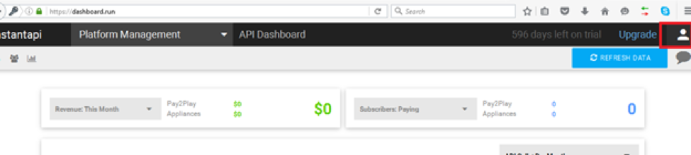
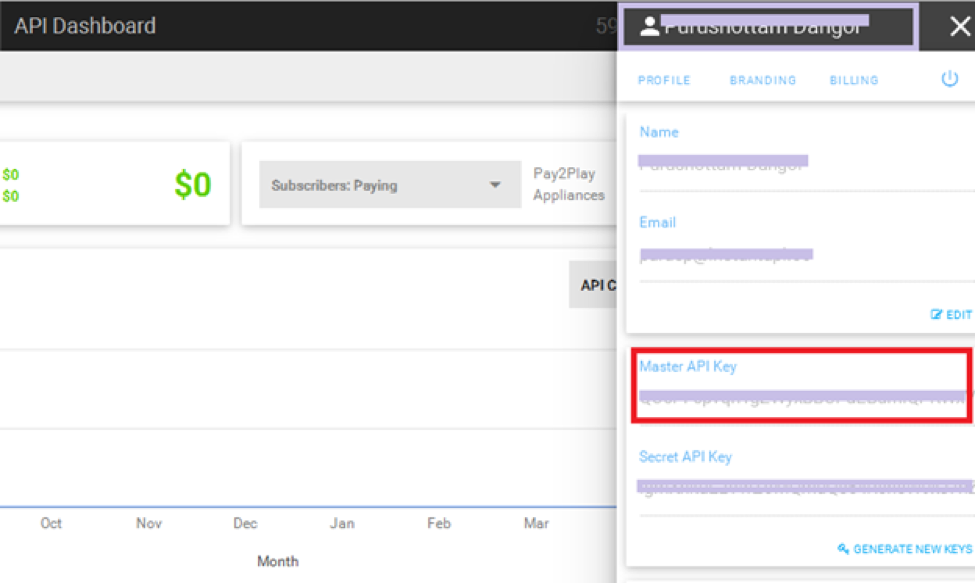
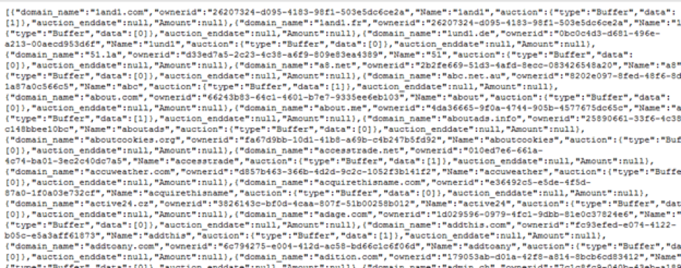
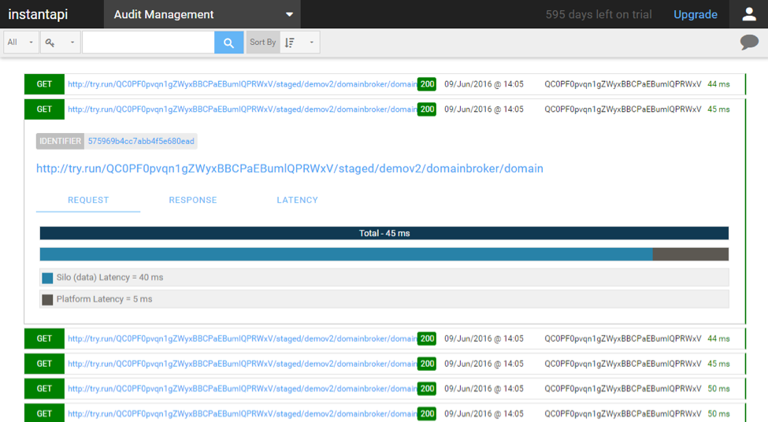

{{{
"title": "Getting Started with Instant API",
"date": "06-20-16",
"author": "Scott Ling",
"attachments": [],
"contentIsHTML": false
}}}

### Technology Profile

[InstantAPI](http://www.instantapi.co/) solves the issues of complexity and time to market in the creation, hosting, management and support of enterprise grade APIs.

**Key features include**:

* Endpoint Management - Easily create REST based API endpoints from existing data, service, or code.  

* Version Control - All APIs hosted on the InstantAPI Platform include support for robust version control. Not only can you deploy new versions and work on a staged test version of an API, you can also sunset an API or decommission it completely, all within seconds.

* API Management - Full API management support covering API subscriber and subscriber key management, API limiting and throttling, subscriber product plans, and Monetization.

* All APIs hosted on InstantAPI come with 24x7 monitoring and support, and enterprise grade security.

### Description

The purpose of this KB article is introduce the InstantAPI Platform and show how easy it is to create an enterprise grade API from existing data or services. A tasks that traditionally takes a skilled team of developers months can now be done in a fraction of the time and cost.

Not only can you create and host your API with ease, InstantAPI also provides the tools to manage and support your API and its users. Enabling you to operate your API as a Service for others to use.

### Audience

**Current CenturyLink Cloud Customers**

If you are ready to get started, but are not yet a CenturyLink Cloud customer, no problem. Get started with [CenturyLink Cloud for free](//www.ctl.io/free-trial/). Try our most popular products, or [MarketPlace Partners](//www.ctl.io/marketplace/program/) offerings, allowing you to create a combination of products that best fits your business needs.

### Steps to Creating your first InstantAPI Endpoint

Creating a new API using InstantAPI Platform is easy and straightforward.  In this step-by-step guide, we will show you how to create API calls using the following steps:

1. To create the first API call open your browser and go-to [https://dashboard.run/](https://dashboard.run/).

2. Click on the menu and select **Endpoint Management** in the **Creation** section.

3. Once you are in Endpoint Management, click on the + **ENDPOINT** button in the top right corner to add an API call.

4. You can now start creating the first API call for the domainBroker Demo API.

As you can see in the screen below, you can select different types of API call methods: GET, POST, PUT, PATCH, DELETE.

The API endpoint you are about to create is made up of 3 separate parts. The HTTP VERB/METHOD which can be GET, POST, PUT, DELETE or PATCH. The next part is the domain of endpoint, if you are on a Pay2Play account this will be set to the provider you selected when registering your company. In this example, it is one of our shared Pay2Play endpoints for CenturyLink USA. You can upgrade your account to support your own domain.

Also note that the **/staged/** part of endpoint is a special version that is used to test an endpoint before it is deployed into production. The final and most important part of an endpoint is the URI/URL of the API call.

InstantAPI has its own markup that enables you to create almost any format of endpoint.
For example in the following endpoint: /partner/{id}/orders/{?status}

We can clearly see that `**id**` is a passed value in the API URL and `**status**` is the query string value. We can make a query string optional by surrounding it with a square brackets like this **[{?status}]**. We can have as many passed querystring and url parameters as we want, and the order of querystring parameters does not matter.
However, for this guide we will be using the GET method. By default GET should already be selected.

Under API Call Map, we can add a friendly URL based on our needs. For this API call use the following URL: demo/domainbroker/domain/[{?domain}]

We can add the URL with a query string or without it. The API call we are creating is with a query string. This means that we can pass the parameter as a URL. For example: ?domain=google

Add a brief description, then select the sample domainBroker MySQL database which is pre-configured on all new InstantAPI accounts.

Once selected as the backend for the API call you will see a combo-box with different SQL based command primitives. Since we are using a pre-configured Data Silo that is accessing a MySQL database we now have to provide the base type of the database call. We do this to add an extra layer of SQL Injection protection.

Once the API command type is selected, put in the following API command: **select * from domains where domain_name LIKE ‘%[[domain:string:default=””]]%’**

InstantAPI was designed to make it easy for existing database users to pull out data via an API using the knowledge they already have in the case of a SQL database you only need to know how to query, GET/PUT/UPDATE and DELETE data in SQL, and also know what an API endpoint is to create a fully functional enterprise API call.

This API command will list all available domains from the domains table and as an optional parameter we will filter the result by passing in the optional **[{?domain}]** as defined in the API endpoint previously.

We can also limit the results by enabling the paging support and entering the page size number.

Once the configuration is done we can save the settings by clicking on **DONE** as shown in the screen below.

Your first API endpoint has now been deployed to a staged (non-production) version and is available for testing.

### How to test the created API call in a browser

Now that we have an endpoint saved and deployed to a staged testing area, we can test it in a web browser as it is a GET based API call. To do this you first need your API key from the platform. Only the Master API Key for the API platform can be used to make Staged API calls.

To get your Master API Key click on the right corner **ACCOUNT PROFILE** icon. After clicking on user icon, it will look like this:

Copy the Master API key from the panel as shown below:

Once done, you can paste the following URL into your browser version section. (our recommended browser is Chrome)

**..URL..with apikey before the /staged/ **

In the above example we have put the API key before the version being tested for readability. The API key can also be added to the URL as a query string parameter as follows:

https://ctl-us02.api.run/v2/demov2/domainbroker/domain?apikey=************

Or it can be added to the HTTP Header of the call (normally done via code).

If you added paged support you can also add query string parameters for limit (amount of items to return) and skip (used to get results after the first <skip value> items) these are used commonly for paging purposes.

Copy your Master API Key and replace the value for apikey shown above and pasted into your browser. Once done you should see a result as a JSON response based on your API call as shown below:

### Audit Management

One of the key features in InstantAPI is Audit Management from which we can monitor all calls made. Select the Audit Management from the InstantAPI Platform as shown below:

This concludes our quick start step-by-step guide on creating your very first API call using InstantAPI platform.

### Offer and Pricing

**Offer**

With the launch of our Version 3, we are providing a special offer called 1 BILLION CALLS. The offer gives the user 1 billion API calls per month and all [CenturyLink Cloud](//www.ctl.io/cloud-platform/) customers receive an additional **20%** discount of all services.

**Pricing**

Visit our [Pricing page](http://www.instantapi.co/pricing) for the latest pricing, offers, and Frequently Asked Questions.

For further questions or concerns, please [email us](mailto:sales@instantapi.co).

### Who Should I Contact for Support?

For issues related to cloud infrastructure (VM's, network, and so on) or if you experience a problem deploying the Blueprint or Script Package, open a CenturyLink Cloud Support ticket by emailing [noc@ctl.io](mailto:noc@ctl.io) or through the CenturyLink Cloud Support website.

For InstantAPI support related questions, please send an email to:
[support@instantapi.co](mailto:support@instantapi.co)
