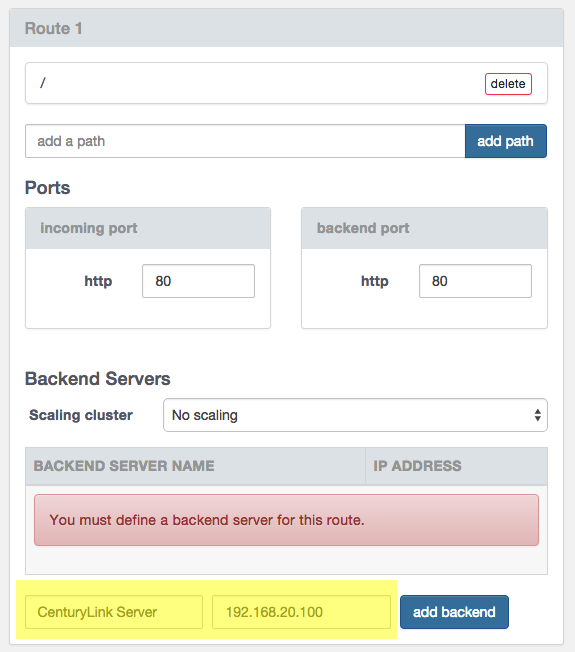

{{{
"title": "Getting Started with Lagrange Systems CloudMaestro Blueprint",
"date": "8-31-2015",
"author": "Bob Stolzberg",
"attachments": [],
"contentIsHTML": false
}}}

### Partner Profile
CloudMaestro by Lagrange Systems - Performance and availability, no matter what.

CloudMaestro by Lagrange Systems is an Application Delivery Controller (ADC) and management solution built for maximizing performance and availability, while optimizing costs, across all cloud providers. With CloudMaestro, you can proactively, and infinitely, scale your infrastructure out and in, achieve blazing fast performance for all your users, secure your web presence and orchestrate across single or multiple cloud providers. Because CloudMaestro is built with true cloud characteristics for your web service using technology designed through more than a decade’s research in high-performance parallel and distributed computing, it’s never been easier to deploy, simpler to manage, and as affordable to work with cloud infrastructure for companies of all sizes. Founded in 2012, Lagrange Systems is privately held and headquartered in the San Francisco Bay Area, California.

[http://www.lagrangesystems.com](http://www.lagrangesystems.com)

#### Contact Lagrage Systems
##### Lagrange Support
Email Support – [support@lagrangesystems.com](mailto:support@lagrangesystems.com)
Telephone Support - (303) 900-3560
Sales and Marketing – [info@lagrangesystems.com](mailto:info@lagrangesystems.com)

### Description
Lagrange Systems has integrated their technology CloudMaestro with the CenturyLink Cloud platform.  The purpose of this KB article is to help the reader take advantage of this integration to achieve rapid time-to-value for this Management and Monitoring solution.

### Solution Overview
CloudMaestro is an Application Delivery Controller delivered as Software-as-a-Service for exceptional performance and availability in cloud infrastructure. Built with true cloud characteristics for your web service, using technology designed through more than a decade’s research in high performance parallel and distributed computing, it’s never been easier to deploy, simpler to manage and as affordable to work with cloud infrastructure for companies of all sizes.

Deploying the CloudMaestro Agent on your existing server in the CenturyLink cloud enables CloudMaestro to monitor, alert, replace and scale your application in response to traffic or unforeseen downtime.

Technology from Lagrange Systems helps CenturyLink Cloud customers address the business challenge of high availability and performance by implementing their SaaS solution - now available as part of the CenturyLink Cloud Blueprint Engine.

### Audience
CenturyLink Cloud Users, IT Professionals

### Impact
After reading this article, the user should feel comfortable getting started using the partner technology on CenturyLink Cloud.

After executing the steps in this Getting Started document, the users will have their a server ready to report monitoring information to CloudMaestro, enabling monitoring, scaling, and failure replacement functionality.

### Pre-requisite 
- Have an existing account set up in CloudMaestro
- Retrieve your Status Key from the CloudMaestro Account Settings.  You will need this key in order to deploy the Blueprint

### Postrequisite
Enabling scaling and server replacement in CloudMaestro will be available after executing the steps in this document.  Implementation of scaling and server replacement is out of the scope of this document. Please contact Lagrange Systems for more information.

- For CloudMaestro to access your server over the internet, please perform the following tasks once you receive an email confirming your Blueprint completed successfully:

1. If one is not already present, add a [Public IP](../../Network/how-to-add-public-ip-to-virtual-machine.md) to your server through Control Portal. Alternatively, you can [setup a VPN using OpenVPN](../../Network/how-to-configure-client-vpn.md) or similar technology.

2. [Allow incoming traffic](../../Network/how-to-add-public-ip-to-virtual-machine.md) for desired ports by clicking on the Servers Public IP through Control Portal.

1. Add a Public IP to your VM and open Firewall Ports for port 80
1. Browse to the new VM and click on the Add Public IP button
2. When the firewall rule dialog opens, Add two (2x) single-port boxes: configure one for TCP on port 80
3. Click the "Add Public IP address button".  When the Add Public IP task completes you should be able to connect to your new Lagrange file server.

### Detailed Steps to deploy the Lagrange CloudMaestro Blueprint
Follow these step by step instructions to deploy the CloudMaestro Agent on your server.

1.	Locate the Blueprint in the Blueprint Library. 
  1. Starting from the CenturyLink Control Panel, navigate to the Blueprints Library.
  2. Search for “CloudMaestro” in the keyword search on the right side of the Blueprints Library page as shown in the image below.
  3. Locate and click the Lagrange Systems "Install CloudMaestro by Lagrange Systems" Blueprint.

2.	Deploy the Blueprint: Click on the "Deploy Blueprint" button.
3.	Configure the Blueprint.  Complete the information/fields required by the Blueprint wizard.
  1. Your CloudMaestro Status Key – Enter the Status Key from the CloudMaestro Account Settings

4.	Review and Confirm the Blueprint. 
  1. Verify your configuration details.

5.	Deploy the Blueprint. 
  1. Once verified, click on the ‘deploy blueprint’ button. You will see the deployment details along with an email stating the Blueprint is queued for execution.

6.	Monitor the Activity Queue. 
  * Monitor the Deployment Queue to view the progress of the blueprint.
  * You can access the queue at any time by clicking the Queue link under the Blueprints menu on the main navigation drop-down.
7.	Get Busy! 
  * Once the blueprint completes successfully, you will receive an email stating that the blueprint build is complete. Please do not use the application until you have received this email notification. 

### Access your Lagrange CloudMaestro Server
After your Blueprint deploys successfully, please follow these instructions to access your CloudMaestro Server solution:
1. Check email to obtain CloudMaestro Server information and click on the link to load the server in Control Portal
2. Connect to the CloudMaestro console to register your new server.
  1. Click "Edit" on Application for the new server. 

    

  2. Click "Routes and Backends" to navigate to the routes.

    

  3. Define the new server as a Backend Server and click "add backend".

    

  4. Click Save for the Application.

### Pricing
The costs listed above in Steps 1 and 2 are for the infrastructure only. Use of the CloudMaestro Agent Blueprint is included in the cost of the CloudMaestro license.  After deploying this Blueprint, the user can secure a license entitlements to the technology by contacting [info@lagrangesystems.com](mailto:info@lagrangesystems.com)

### Frequently Asked Questions
Where do I get my CloudMaestro License?
Existing CenturyLink Enterprise Customers can contact their Account Representative for help obtaining a CloudMaestro license, or contact Lagrange Systems directly:
  * Contact Lagrange Systems Support via telephone: (303) 900-3560
  * Contact Lagrange Systems via their [website](http://www.lagrangesystems.com)
  * Contact Sales by emailing [info@lagrangesystems.com](mailto:info@lagrangesystems.com)

#### Who should I contact for support? 
* For issues related to deploying the Lagrange solution on CenturyLink Cloud via the Blueprint, Accessing or using the deployed software, [please contact Lagrange Systems via their [website](http://www.lagrangesystems.com) or by calling (303) 900-3560
* For issues related to cloud infrastructure (VM’s, network, etc), or is you experience a problem deploying the Blueprint, please open a CenturyLink Cloud Support ticket by emailing [noc@ctl.io](mailto:noc@ctl.io) or [through the support website](https://t3n.zendesk.com/tickets/new) 

