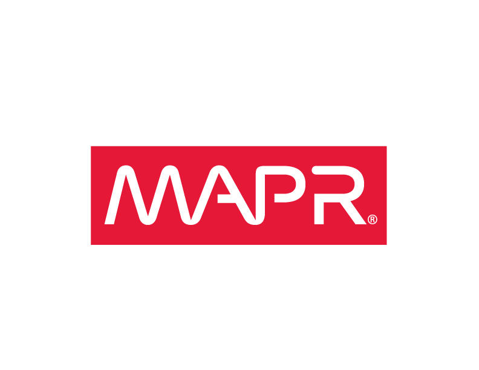
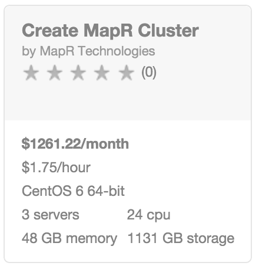
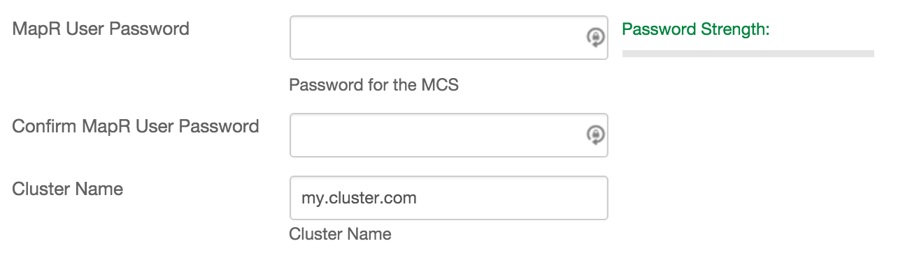
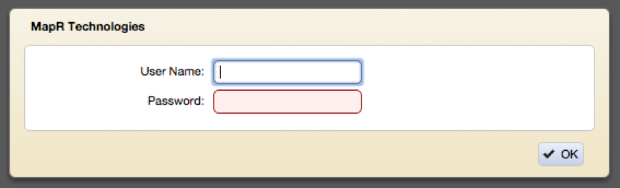
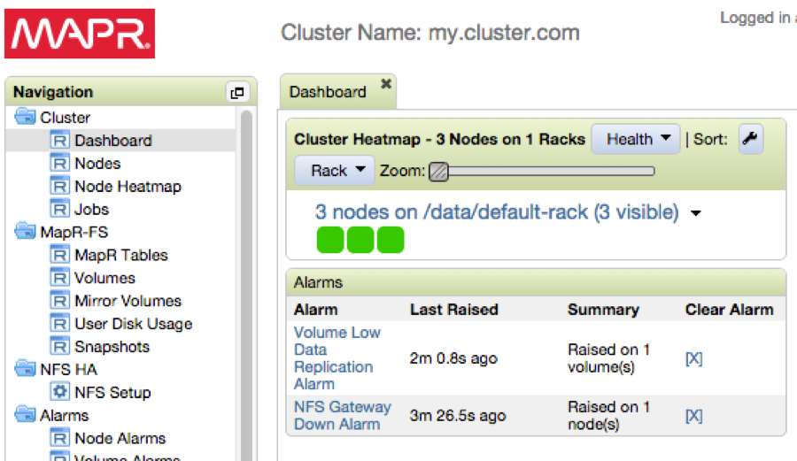

{{{
  "title": "Getting Started with MapR - Blueprint",
  "date": "01-26-2016",
  "author": "<a href='https://twitter.com/KeithResar'>@KeithResar</a>",
  "attachments": [],
  "contentIsHTML": false
}}}

### Overview

After reading this article, the reader should feel comfortable deploying MapR Apache Hadoop on CenturyLink Cloud.

### Partner Profile

https://www.mapr.com/

##### Customer Support

|Sales Contact   	| Support Contact	|
|:-	|	:-	|
|[Contact us](http://info.mapr.com/ContactUs.html) 855.669.6277   	| support@mapr.com [Support overview](https://www.mapr.com/support/overview) 1.855.669.6277, Option 2 |

### Description

MapR Inc. has integrated their Hadoop Platform with the CenturyLink Cloud platform.  The purpose of this KB article is to help the reader take advantage of this integration to achieve rapid time-to-value for this Hadoop distribution.

The MapR Converged Data Platform integrates the power of Hadoop and Spark with global event streaming, real-time database capabilities, and enterprise storage for developing and running innovative data applications.

The MapR Platform is powered by the industry’s fastest, most reliable, secure, and open data infrastructure that dramatically lowers TCO and enables global real-time data applications.- now available as part of the CenturyLink Cloud Blueprint Engine.

### Audience

* CenturyLink Cloud Users
* Hadoop Administrators
* Hadoop Users
* Developers interested in Hadoop

### Impact

After reading this article, the user should feel comfortable getting started using the partner technology on CenturyLink Cloud.

After executing the steps in this Getting Started document, the users will have a functioning Hadoop instance upon which they can start developing solutions.

The MapR Converged Data Platform integrates Hadoop and Spark, real-time database capabilities, and global event streaming with big data enterprise storage, for developing and running innovative data applications. The MapR Platform is powered by the industry’s fastest, most reliable, secure, and open data infrastructure that dramatically lowers TCO and enables global real-time data applications.

### Deploying MapR Cluster Blueprint

1. **Locate the Blueprint in the Blueprint Library**
   * Starting from the CenturyLink Control Portal, navigate to the Blueprints Library. Search for "MapR" in the keyword search on the right side of the page.

  

2. Click the `deploy blueprint` button.

3. Set Required parameters.

  
  * **MapR User Password** - The password you will use to log on to the MapR Control System, the Installer, or the MapR Linux user.
  * **Cluster Name** - The name of the cluster used for filesystem names and NFS published volumes.

5. Set Optional Parameters.
   * Password/Confirm Password (This is the root password for the server. Keep this in a secure place).
   * Set DNS to “Manually Specify” and use “8.8.8.8” (or any other public DNS server of your choice).
   * Optionally set the server name prefix.
   * The default values are fine for every other option.

6. **Review and Confirm the Blueprint**

7. Deploy the Blueprint.
   * Once verified, click on the `deploy blueprint` button. You will see the deployment details stating the Blueprint is queued for execution.
   * This will kick off the Blueprint deploy process and load a page where you can track the deployment progress. Deployment will typically complete within five minutes.

8. Enable public access. (optional)
   * Servers are built using private IPs only with access with client or IPSEC VPN. For access from the Internet at large add a public IP to your master server. This service will require access to 8443/TCP and 9443/TCP.

  <a href="../../Network/how-to-add-public-ip-to-virtual-machine.md">
    
    Adding a public IP to your virtual machine
  </a>

9. Access MapR Cluster Service.
   * Navigate to `https://<ipaddress>:8443`.
    

   * View the MCS dashboard.
    

### Pricing

The costs listed in the above steps are for the infrastructure only.

The default installation will install MapR Community Edition. You can upgrade to the Enterprise Edition through the MCS or by contacting MapR.
[View a feature comparison between the editions](https://www.mapr.com/products/mapr-distribution-editions).

### Frequently Asked Questions

**Who should I contact for support?**

* For issues related to cloud infrastructure, please open a ticket using the [CenturyLink Cloud Support Process](../../Support/how-do-i-report-a-support-issue.md).
* For issues related to deploying the MapR Blueprints and application operation on CenturyLink Cloud,
  [contact MapR Support](https://www.mapr.com/support/overview).
