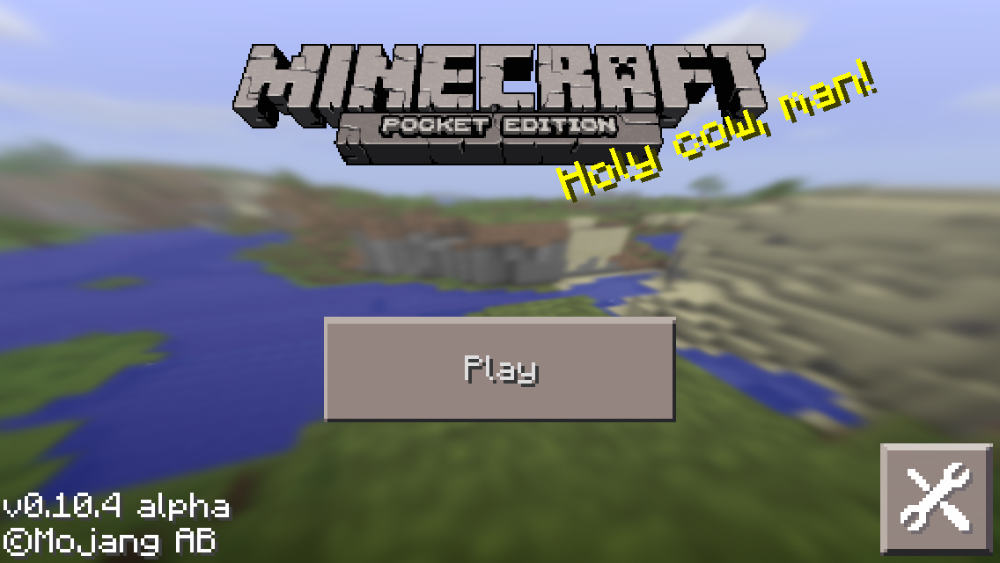
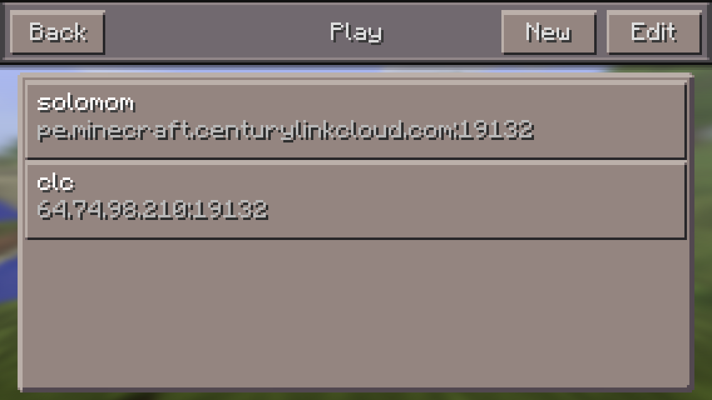
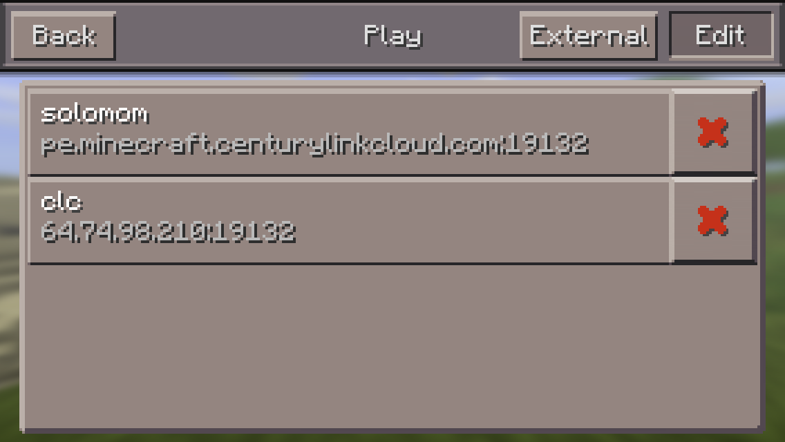
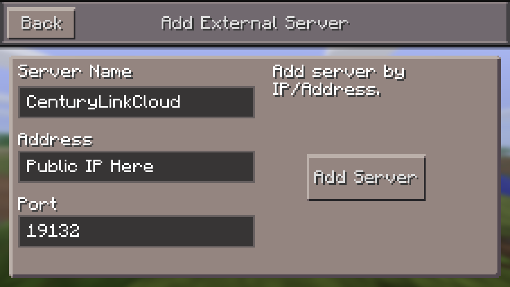
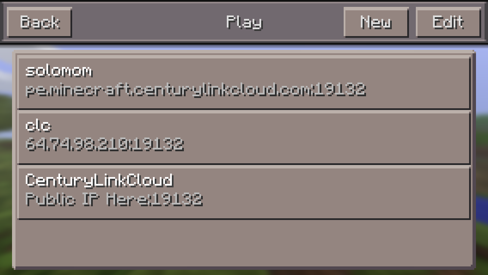
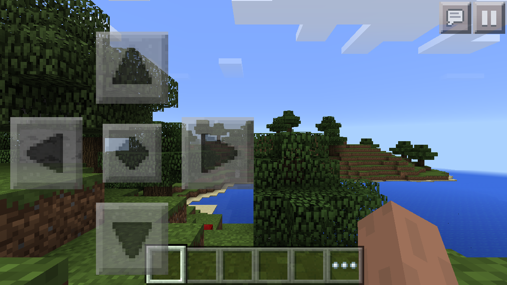

{{{
  "title": "Getting started with Minecraft PE Server Blueprint",
  "date": "05-18-2015",
  "author": "Bob Stolzberg",
  "attachments": [],
  "contentIsHTML": false
}}}

### Technology Profile
Mojang is a Microsoft owned game developer studio based in Stockholm, Sweden. They develop a game called Minecraft.

Minecraft is a sandbox construction game where you can build anything you can imagine. Minecraft is a game about breaking and placing blocks. In "Survival Mode", people built structures to protect against nocturnal monsters, but also offers "Creative Mode" allowing players to work together to create wonderful, imaginative things.

For more information, please visit the [Minecraft](http://www.Minecraft.com) website.

### Description
Lumen has created a Blueprint that makes it extremely easy to spin up your own dedicated Minecraft PE (Pocket Edition) Server in minutes and play from iOS clients like iPad and iPhone. This Blueprint will automatically download, install and configure Minecraft PE Server 1.4.1 on to a new Linux server.

Advantages of running Minecraft PE Server in Lumen Cloud:
* Fast provisioning - get a Minecraft server running within minutes - No long term server commitment - pay as you go each month.
* On-demand Scalability - Add more CPU, Disk or Memory resources on the fly as your worlds grow.
* Save money - Run your Minecraft PE server only when you use it. You can host a server just in the evenings or weekends with your friends and not have to pay to run it 24/7 unless you chose to. You can use the Lumen Cloud mobile app to start and stop your Minecraft server any time, any where.
* Fast Bandwidth - Your Minecraft server has a 2GB inbound network throughput ensuring low latency game play.
* Easy backups - You can easily save your worlds anytime you choose.
* Customizable - Customize your Minecraft server by installing any mods you want!
* No advanced technical experience required - Don't worry about setting up the VM and software dependencies, we did that for you. Just run the Blueprint, add a public IP with firewall rules and start playing in minutes.
* Parental Control - Control where your family plays and who they play with by having ownership of the server.
* Secure - Lumen Cloud includes network security and allows you to block users from connecting to your server at a network level in addition to game whitelists.

### Audience
Lumen Cloud Users, Creepers, and Minecrafters

### Impact
After reading this article, the user should feel comfortable getting started deploying and using the Minecraft PE Server Blueprint technology on Lumen Cloud.

### Prerequisite
* Access to the Lumen Cloud platform as an authorized user.
* Confirm you are using Minecraft Personal Edition client.
  

### Install Minecraft PE Server on Linux Blueprint
1. Locate the Mojang Minecraft PE Server Blueprint.
   * Login to the Control Portal. From the Nav Menu on the left, click **Orchestration > Blueprints Library**.
   * Search for “Minecraft PE” in the keyword search on the right side of the page.
   * Locate the 'Install Minecraft PE Server on Linux' Blueprint.

2. Choose and Deploy the Blueprint.
   * Click the “Install Minecraft PE Server on Linux” Blueprint.

3. Configure the Blueprint with the following Minecraft specific information:
   * Server Name - Server Name, e.g., CLCMC
   * Server Description - Description of your server, e.g., Family Minecraft Server
   * Game Mode - Creative or Survival mode
   * minecraftpe user's password - Set a secure password for the minecraftpe user that runs the server software.
   * Finally, Click the `Next: Step 2` button at the bottom of the Blueprint.

4. Review, Confirm, and Deploy the Blueprint.
   * Verify your configuration details.
   * Once verified, click on the `deploy blueprint` button. This will kick off the Blueprint deploy process and load a page to allow you to track the progress of the deployment.

6. Monitor the Activity Queue.
   * Monitor the Deployment Queue to view the progress of the Blueprint.
   * To monitor progress, click **Queue** from the Nav Menu on the left.
   * Once the Blueprint completes successfully, you will receive an email stating that the Blueprint build is complete. Please do not use the Minecraft Server until you have received this email notification.

### Postrequisites
1. Add a Public IP to your VM and open 2x Firewall Ports: Port `19132` for TCP and UDP.
   * Browse to the new VM and click on the Add Public IP button.
   * When the firewall rule dialog opens, Add two (2x) single-port boxes: configure one for TCP on port `19132` and the other UDP on port `19132`.
   * Click the `Add Public IP address` button.
   * When the Add Public IP task completes you should be able to connect to your new server from your Minecraft PE client (iPhone or iPad) via the public IP. Please view the instructions below to learn how to access the server for gameplay from your Minecraft PE client.

2. Optional: Customize and configure your Minecraft PE Server by editing the `server.properties` file in `/home/minecraftpe`.

### Access your Minecraft PE Server
Please follow the instructions below to access the Minecraft server for gameplay or to connect to the console for administrative purposes.

#### Access the server for gameplay
After you've added a Public IP to your server and opened the proper firewall holes, follow these instructions in order to play on the server.

1. Start by adding your Lumen Minecraft PE server to your client. From the main screen, click on the `Play` button.
   

2. Click the Edit button on the top right of the screen.
   

3. Click the External button on the top right of the screen.
  

4. Configure your server information within the client:
   * Enter a Server Name in the first field.
   * Enter your public IP address in your second field.
   * Click the Add Server button once your information has been typed in.
   

5. Click on your server to start playing.
   

6. The game should connect to your server and you can begin playing immediately.
   

   * If you cannot connect, make sure you entered the Public IP address correctly and ensure the 2x firewall ports are open on the Public IP.

#### Access the server console for administrative purposes
After your Blueprint deploys successfully, please follow these instructions to access your server:

1. Check your email to obtain the servers private IP Address information, or obtain it from the Control Portal.

2. Establish a VPN connection to your data center and then SSH to your Minecraft Server's Private IP. Login as the user minecraftpe with password you set when you deployed the Blueprint. If you experience any issues logging in as the minecraftpe user, please see the FAQ below.

3. Connect to your Minecraft console by running this command as the minecraftpe user: `screen -r`

4. To disconnect from the java console: press "CTRL A + Z" (A then Z).

5. To stop (and save) the server, login to the console and type save-all then stop. For more information, please consult the Minecraft PE documentation.

### Pricing
The costs associated with this Blueprint deployment are for the Lumen Cloud infrastructure only. There are no Mojang or Microsoft license costs or additional fees bundled in.

### Frequently Asked Questions

#### What does the Blueprint do?
1. Provision a VM with 1CPU and 4GB of RAM running Ubuntu 14 Linux x64.
2. Run the 'Install Minecraft Server on Linux x64' Script Package.

#### What does the 'Install PE Minecraft Server on Linux x64' Script Package do?
1. Add a user called minecraftpe to the Linux OS. This user will run the Minecraft PE server software so the inecraft PE Server will not run as root. The minecraftpe users password will be set to the password provided during deployment.

2. Download the latest Minecraft PE software from the Mojang website to ~minecraftpe (/home/minecraftpe).

3. Append information from the user to the Minecraft PE `server.properties` configuration file.

4. Starts the Minecraft PE software as the minecraftpe user.

#### What Firewall ports are required to be opened?
* 2x firewall ports need to be open in order to play that game over the internet: Port 19132 using TCP and Port 19132 using UDP.

#### How do I start the Minecraft PE server application?
* Login via ssh as the minecraftpe user and run the command: `screen ./start.sh`

#### Why can't I login as the minecraftpe user and what should I do if that happens?
* The minecraftpe user password is set based on input from the user at time of the Blueprint deployment. If the password contains some specific special characters, the minecraftpe users password will not be set.
* If you cannot login as minecraftpe with the password set at time of Blueprint deployment, login via ssh as root and manually change the password for the minecraftpe user by running the command: `passwd minecraftpe`.

#### Who should I contact for support?
* Lumen Cloud does not support the Minecraft PE Server software. Please contact Mojang for any support around Minecraft.
* For issues related to cloud infrastructure (VM’s, network, etc.), or if you experience a problem deploying the Blueprint, please open a Lumen Cloud Support ticket: https://t3n.zendesk.com/tickets/new.
