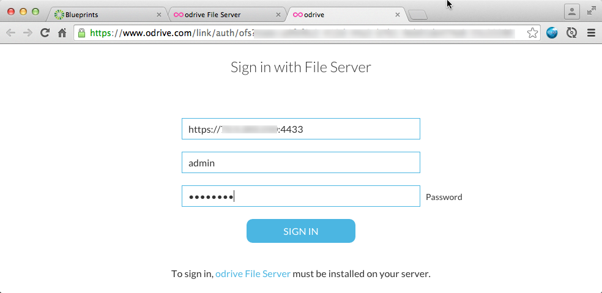

{{{
  "title": "Getting started with odrive File Server Blueprint",
  "date": "07-30-2015",
  "author": "<a href='https://www.linkedin.com/in/bstolzberg'>Bob Stolzberg</a>",
  "attachments": [],
  "contentIsHTML": false
}}}

### Partner Profile
odrive combines all storage in one place for easy access, sharing and data protection. For instance, if you use Dropbox at home and Box at work, odrive lets you combine both into one folder with one login. odrive currently supports Dropbox, Box, Google Drive, Gmail, Amazon Cloud Drive, Microsoft OneDrive, Facebook, Instagram, FTP, SFTP, and WebDAV.

Check out this [odrive video](https://vimeo.com/117538897) to learn more.

[http://www.odrive.com](http://www.odrive.com)

#### Contact odrive   
##### odrive Support:
24x7 Web Support - [https://www.odrive.com/forum/](https://www.odrive.com/forum/)

### Description
odrive has integrated their technology with the CenturyLink Cloud platform and produced several Blueprints to deploy the odrive File Server. In addition, a user can link to CenturyLink servers via SFTP protocol. The purpose of this KB article is to help the reader take advantage of this integration to achieve rapid time-to-value for this Cloud and file sharing solution.

odrive offers integrated file sync capabilities with the CenturyLink Cloud platform. This document will guide CenturyLink users how to deploy the odrive File Server in the CenturyLink Cloud and link to Century Link cloud servers via SFTP with a few easy steps.

### Solution Overview
odrive enables Century Link customers to set up either an individual private cloud or public cloud storage for groups.

odrive fully supports SFTP (SSH File Transfer Protocol) linking, giving you the "Dropbox experience" with any SSH-enabled Century Link cloud server. You will get native file browsing, offline access, full bi-directional sync, conflict handling, granular sync and unsync, multi-link capabilities, and in-line editing.

With the odrive file server (OFS), you can add a user and provision storage in seconds. Administrators have full control over user permissions and access. You will also have real-time insight into user access and data usage.

### Offer
odrive is offering SFTP linking and the odrive File Server as part of a no charge program for Linux and Windows servers within CenturyLink’s Cloud. Through this unique offer, users will have access to SFTP linking and the odrive File Server services at no additional cost. Please check with CenturyLink for any access charges that may apply to using its Cloud. Please contact ODrive directly for offer and pricing details.

All use of odrive software, documentation and services is governed by odrive’s Software License and Support Agreement or End User License Agreement (EULA) that can be reviewed at: [https://www.odrive.com/terms/](https://www.odrive.com/terms/)

### Audience
CenturyLink Cloud Users, Developers, IT Engineers, IT Administrators, File Sharing application users

### Impact
After reading this article, the user should feel comfortable getting started using odrive to link to CenturyLink Cloud either by SFTP or via the odrive File Server.

### Prerequisite
* Access to the CenturyLink Cloud platform as an authorized user.
* Install the [odrive client](https://www.odrive.com/m/) on your workstation or laptop in order to access the odrive File Server.

### Postrequisite
* If you want to access odrive file server over the internet, please perform the following tasks once you receive an email confirming you Blueprint completed successfully.

* If you need to connect to your odrive file server via the Internet, Add a [Public IP](../../Network/CenturyLink Cloud/how-to-add-public-ip-to-virtual-machine.md) to your server through the Control Portal. Alternatively, you can [setup a VPN using OpenVPN](../../Network/CenturyLink Cloud/how-to-configure-client-vpn.md) or similar technology.

* [Allow incoming traffic](../../Network/CenturyLink Cloud/how-to-add-public-ip-to-virtual-machine.md) for desired ports by clicking on the Servers Public IP through the Control Portal.

1. Add a Public IP to your VM and open Firewall ports `4433` and `4434` for TCP protocol.
1. Browse to the new VM and click on the Add Public IP button.
2. When the firewall rule dialog opens, add two (2x) single-port boxes: configure one for TCP on port `4433` and the other TCP on port `4434`.
3. Click the "Add Public IP address button". When the Add Public IP task completes you should be able to connect to your new odrive file server from your odrive client via the public IP.

### Deploy odrive Blueprints
* Install ODrive File Server on Linux - Deploys ODrive File Server on CentOS / Red Hat Linux x64 OS
* Install ODrive File Server on Windows - Deploys ODrive File Server on Windows 2008 R2 Standard x64 OS

### Install ODrive File Server Blueprint
1. Locate the ODrive File Server Blueprint.
   * Login to the Control Portal. From the Nav Menu on the left, click **Orchestration > Blueprints Library**.
   * Search for “odrive” in the keyword search on the right side of the page.
   * Locate the "odrive File Server" Blueprint for the platform you want to deploy on, Windows or Linux.

2. Choose and Deploy the Blueprint.
   * Click on the “odrive File Server” Blueprint you want to deploy.
   * Click the `deploy blueprint` button.

3. Configure the Blueprint.
   Complete the information below:
   * Server Administrator Password
   * Group
   * Network VLAN
   * Primary DNS - you can use the default of enter 8.8.8.8
   * Secondary DNS - you can use the default of enter 8.8.8.8
   * Server Type - Standard
   * Service Level - Premium
   * Customize the server name, the default is ODRIVE
   

4. Review and Confirm the Blueprint.
   * Click `next: step 2`.
   * Verify your configuration details.

5. Deploy the Blueprint.
   * Once verified, click the `deploy blueprint` button.
   * You will see the deployment details along with an email stating the Blueprint is queued for execution.
   * This will kick off the Blueprint deploy process and load a page to allow you to track the progress of the deployment.

6. Monitor the Activity Queue.
   * Monitor the Deployment Queue to view the progress of the Blueprint.
   * To monitor progress, click **Queue** from the Nav Menu on the left.
   * Once the Blueprint completes successfully, you will receive an email stating that the Blueprint build is complete. Please do not use the application until you have received this email notification.
   

### Access odrive File Server
After your Blueprint deploys successfully, please follow these instructions to access your odrive file server solution:
1. Check email to obtain odrive File Server information and click on the link to load the server in Control Portal.

2. If you want to connect your odrive file server from the internet, Click the "Add Public IP" button and open Firewall ports `4433` and `4434`.

3. Connect to the following URL to begin using your ODrive File Server: *https://YOUR_OFS_SERVER_IP:4434/* Note: Chrome users will need to ignore the "Your connection is not private" warning from an Invalid SSL certificate  and Proceed to the website.

4. Accept the odrive terms of usage.

5. Create a password for the admin user.
   

6. Setup is complete!
   * To manage or admin the odrive file server, connect via VPN and then point your web browser to the private IP URL: http://<YOUR_OFS_SERVER_IP>:4434/.
   

### Start using your odrive File Server

#### Configure your odrive File Server within the odrive client
Once your odrive File Server has been configured, you can store information on it easily by adding it to the odrive client. Follow the instructions below to add your new odrive File Server to the odrive client:

1. Download the odrive Client by visiting [http://www.odrive.com](http://www.odrive.com/) and install it.

2. After odrive is installed, from within the odrive client, click on Add Link, then File Server. It will load a web page within your browser you will need to complete in order to add your odrive File Server to your client.

3. Add the odrive File Server information:  
   * The IP address URL https://YOUR_OFS_SERVER_IP:4433/.
   * The username/password you created when you initially configured the odrive file server.
   * You will receive an error if it cannot authorize.
   

4. Access the new odrive file server by opening your odrive folder on your laptop or workstation and click on the new "File Server" folder.

5. For more information on odrive and how to enable advanced configuration, please visit the odrive Support Forum: [https://www.odrive.com/forum/](https://www.odrive.com/forum/).

### Pricing
The costs associated with this Blueprint deployment are for the CenturyLink Cloud infrastructure only. There are no odrive license costs or additional fees bundled in.

### Frequently Asked Questions

#### Where do I obtain my odrive Licenses?
odrive is free. Sign up at: [http://odrive.com](http://odrive.com).

#### Who should I contact for support?
* For issues related to deploying the odrive Blueprint on CenturyLink Cloud or linking via SFTP, Licensing, Accessing or using the deployed software, please visit the odrive Support Forum: [https://www.odrive.com/forum/](https://www.odrive.com/forum/)

* For issues related to cloud infrastructure (VMs, network, etc.), or if you experience a problem deploying the Blueprint, please open a CenturyLink Cloud Support ticket by emailing [noc@ctl.io](mailto:noc@ctl.io) or [through the support website](https://t3n.zendesk.com/tickets/new).
