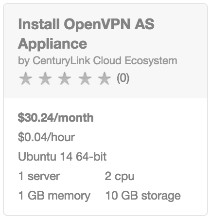
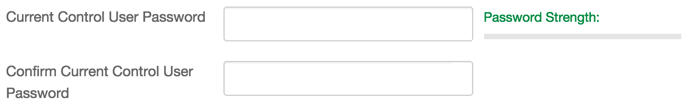

{{{
  "title": "Getting Started with OpenVPN AS - Appliance",
  "date": "10-23-2015",
  "author": "<a href='https://twitter.com/KeithResar'>@KeithResar</a>",
  "attachments": [],
  "contentIsHTML": false
}}}


### Technology Profile


https://openvpn.net/


##### Customer Support

| Sales Contact  |
|:- |
| sales@openvpn.net  |


### Description

OpenVPN Access Server is a full featured secure network tunneling VPN software solution that integrates OpenVPN server capabilities, enterprise management capabilities, simplified OpenVPN Connect UI, and OpenVPN Client software packages that accommodate Windows, MAC, Linux, Android, and iOS environments. OpenVPN Access Server supports a wide range of configurations, including secure and granular remote access to internal network and/ or private cloud network resources and applications with fine-grained access control.


### Audience

CenturyLink Cloud Users


### Prerequisites

* Access to the CenturyLink Cloud platform as an authorized user
* control.ctl.io account with password authentication (two factor authentication not yet supported)


### Steps to Deploy a New Appliance

1. **Locate the Blueprint in the Blueprint Library**

 Starting from the CenturyLink Control Panel, navigate to the Blueprints Library. Search for "OpenVPN AS Appliance" in the keyword search on the right side of the page.

  

2. **Click the Deploy Blueprint button.**

3. **Set Required parameters.**

  

  * **Control User Password** - The password associated with your control.ctl.io login

4. **Set Optional Parameters**

  Password/Confirm Password (This is the root password for the server. Keep this in a secure place).  

  Set DNS to “Manually Specify” and use “8.8.8.8” (or any other public DNS server of your choice).

  Optionally set the server name prefix.

  The default values are fine for every other option.

5. **Review and Confirm the Blueprint**

6. **Deploy the Blueprint**

  Once verified, click on the **deploy blueprint** button. You will see the deployment details stating the Blueprint is queued for execution.

7. **Deployment Complete**

  Once the Blueprint has finished execution you will receive a number of emails.  The first will indicate the server has been deployed and the second will come a few minutes later once the appliance has been fully activated.  If you do not receive an email like the one shown below you may have had a deployment error - review the *Blueprint Build Log* to for error messages.

  <div style="float:left;width:45%;margin-left:1em;">
    *Email #1: Appliance deploy started*
    
  </div>
  <div style="float:right;width:45%;margin-right:1em;">
    *Email #2: Appliance deploy complete*
    
  </div>
  <br style="clear:both;">

  Wait for the second email indicating your appliance is ready for use before attempting to access the resource.

8. **Accessing Your Appliance**

  Access your appliance and finalize configuration by opening an ssh connection to your server and loging in as the `root` user with the password credentials supplied in step (4) above.

  Note that on first login you will finalize the configuration.  For proper authentication select root as your login user or if leveraging the default openvpn user you'll need to set the credentials for that user with the `passwd openvpn` command:

  ```
  To initially login to the Admin Web UI, you must use a
  username and password that successfully authenticates you
  with the host UNIX system (you can later modify the settings
  so that RADIUS or LDAP is used for authentication instead).

  You can login to the Admin Web UI as "openvpn" or specify
  a different user account to use for this purpose.

  Do you wish to login to the Admin UI as "openvpn"?
  > Press ENTER for default [yes]: no

  > Specify the username for an existing user or for the new user account: root
  Note: This user already exists.
  ```


### Pricing

The costs listed above in the above steps are for the infrastructure only.

After deploying this Blueprint, you may secure entitlements to the technology using the following steps:

 * Email: sales@openvpn.net

Additional resources:

* [OpenVPN Appliance FAQ](https://openvpn.net/index.php/access-server/section-faq-openvpn-as/virtual-appliance.html)

### Frequently Asked Questions

**Where do I obtain my license?**

Contact sales@openvpn.net.

**Who should I contact for support?**

* For issues related to deploying OpenVPN AS email sales@openvpn.net.
* For issues related to cloud infrastructure, please open a ticket using the [CenturyLink Cloud Support Process](../../Support/how-do-i-report-a-support-issue.md).
