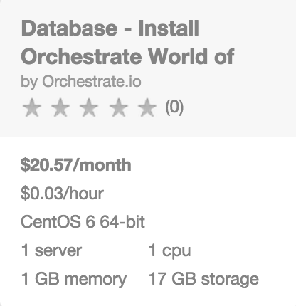
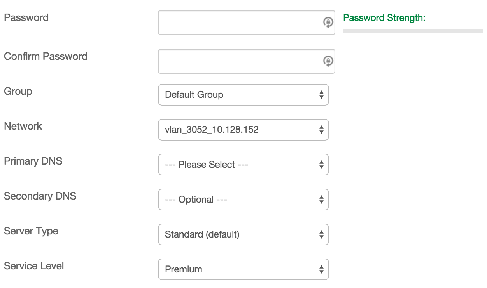
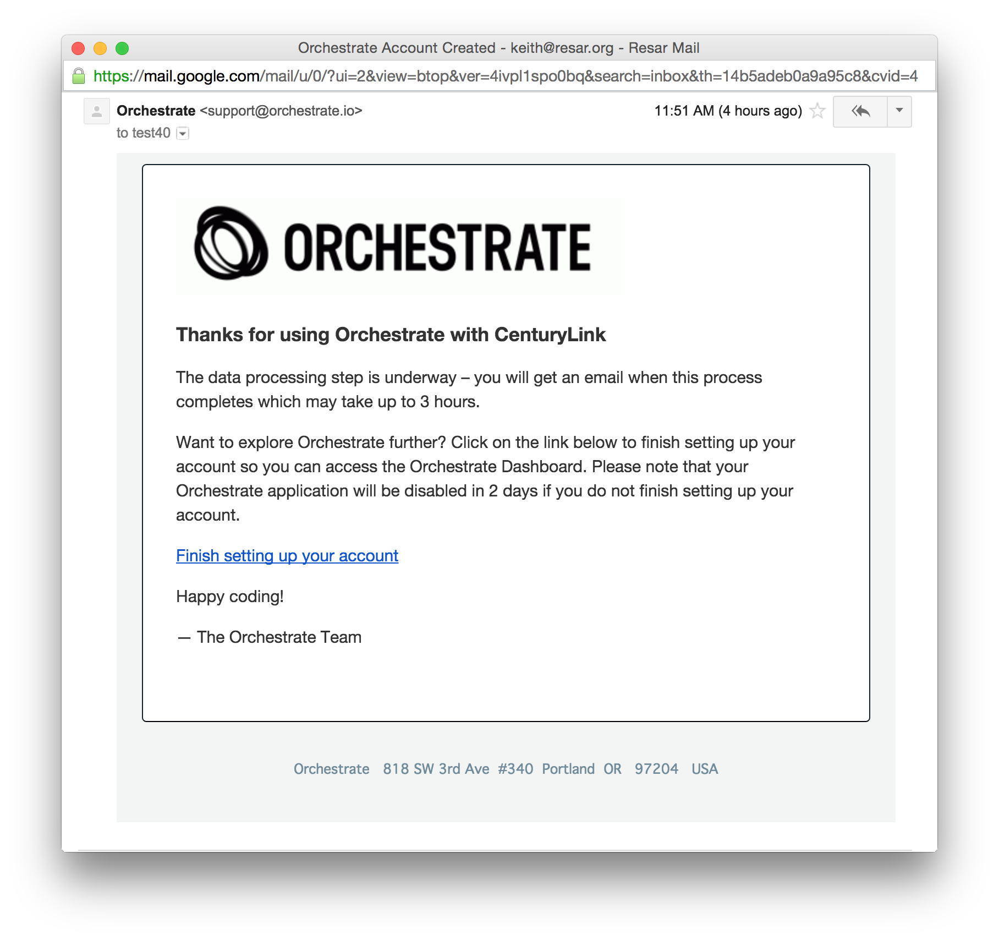
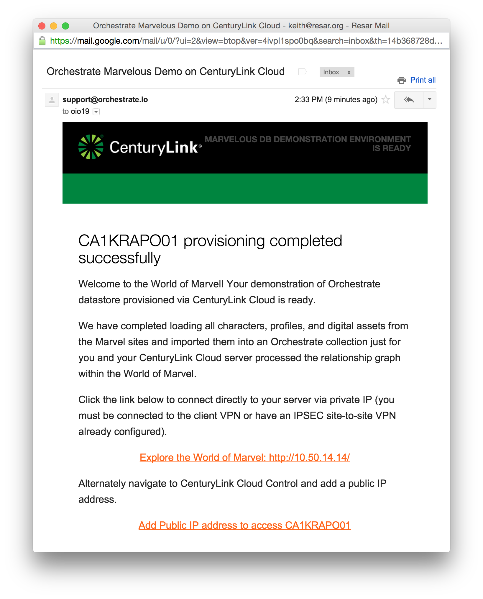
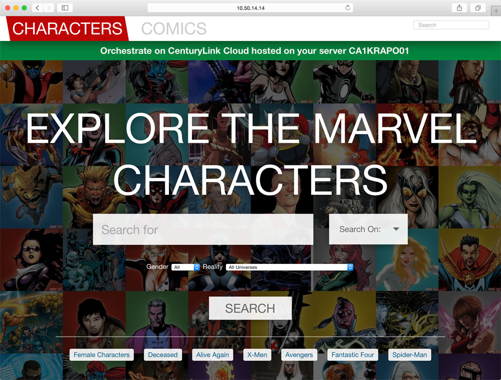
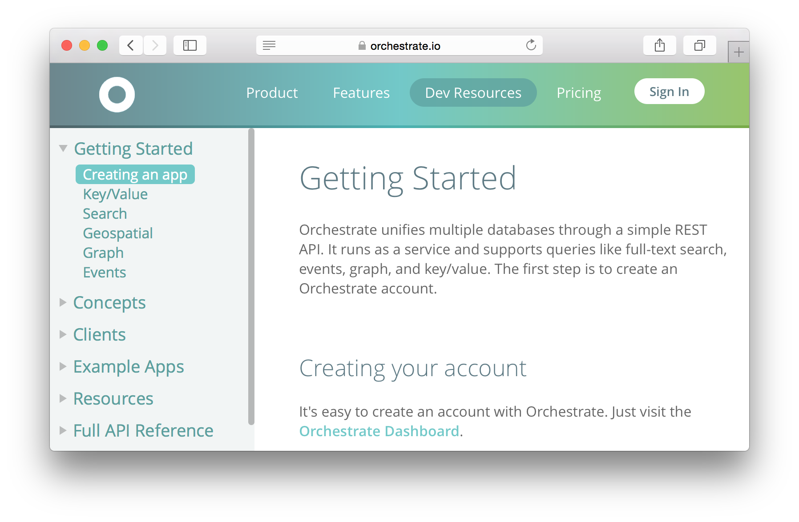

{{{
  "title": "Getting Started with Orchestrate - Blueprint",
  "date": "2-5-2014",
  "author": "Keith Resar",
  "attachments": [],
  "contentIsHTML": false
}}}

### Overview

After reading this article, the user should feel comfortable getting started using the partner technology on CenturyLink Cloud.

This article will demonstrate how to create a new Orchestrate account and deploy a demo application on CenturyLink Cloud.

### Partner Profile

Orchestrate – “A complete database service with the NoSQL queries you need”

http://www.orchestrate.io

####Customer Support

centurylinkcloud-sales@orchestrate.io

CenturyLink Cloud Account Alias: OIO

### Description

Orchestrate has integrated their technology with the CenturyLink Cloud platform.  The purpose of this KB article is to help the reader take advantage of this integration to achieve rapid time-to-value for the Orchestrate solution.

Orchestrate delivers a high performance, high availability, and massively scalable database portfolio in a REST API. Access a JSON data store with search, geospatial, time-series and graph queries without the operational burden of managing multiple databases yourself.

[Learn more about Orchestrate](https://orchestrate.io/features)

###Audience

CenturyLink Cloud Users

### Steps

1. **Locate the Blueprint in the Blueprint Library.**

  

  Click either of the items at right to access that Blueprint directly.

  Alternately, starting from the CenturyLink Control Panel, navigate to the Blueprints Library. Search for “Orchestrate” in the keyword search on the right side of the page.

2. **Click the Deploy Blueprint button.**

3. **Set Required parameters.**

4. **Set optional parameters**

  

  Password/Confirm Password (This is the root password for the server. Keep this in a secure place).

  Set DNS to “Manually Specify” and use “8.8.8.8” (or any other public DNS server of your choice).

  Optionally set the server name prefix.

  The default values are fine for every other option.
5. **Review and Confirm the Blueprint**

  Verify your configuration details.

6. **Deploy the Blueprint**

  Once verified, click on the ‘deploy blueprint’ button. You will see the deployment details stating the Blueprint is queued for execution. This will kick off the blueprint deploy process and load a page to allow you to track the progress of the deployment. Generally, it will take 15 to 20 minutes to configure all of the components.

7. **Orchestrate Account Provisioned**

  

  During the Blueprint execution your email address will be used to create a new Orchestrate account.  Open this and click to verify your email address.

  If there was an error provisioning your Orchestrate account you will receive an alternate email with details on the issue.  The most common problem is using an email address already associated with an Orchestrate account.  To mitigate this please use an alternate address for this demonstration.

8. **Demonstration Provisioning Completed**

  

  You will receive another email once the data processing and synchronization activities have completed successfully.  

  Note this may take several hours as all data is pulled from a variety of Internet sources

9. **Explore the Marvel Universe with Orchestrate and CenturyLink Cloud**

  

  Once provisioning has completed click the provided link to access your environment.  This is a demonstration of accessing Orchestrate's technology using a CenturyLink Cloud hosted service.

10. **Beyond the Demo**

  

  Orchestrate is far more than what we're able to show with this brief demonstration.  [Access Orchestrate dev resources](https://orchestrate.io/docs) and explore all that Orchestrate has to offer.  You've already got an account, so get coding!

### Pricing

The costs listed above in the above steps are for the infrastructure only.

After deploying this Blueprint, you may secure entitlements to the technology using the following steps:

* As part of the demo deploy your account has been created at the free tier.  More detail on this pricing page:  https://orchestrate.io/pricing.
* Email centurylinkcloud-sales@orchestrate.io

### FAQ

**Where do I obtain my Orchestrate license?**

See pricing detail above.

**Who should I contact for support?**

* For issues related to cloud infrastructure, please open a ticket using the [CenturyLink Cloud Support Process](../../Support/how-do-i-report-a-support-issue.md).
* For issues related to deploying the Orchestrate Blueprints and application operation on CenturyLink Cloud and you have a paid license, please contact centurylinkcloud-sales@orchestrate.io or follow your existing Orchestrate support process if known.
* For issues related to deploying the Orchestrate Blueprints and application operation on CenturyLink Cloud and you do not have a paid license, review [Orchestrate's Dev Resources](https://orchestrate.io/docs).

**How do I learn more about Orchestrate's capabilities?

Orchestrate has a massive store of documentation to help you get started and tutorials to make you successful on their [Dev Resources site](https://orchestrate.io/docs).
