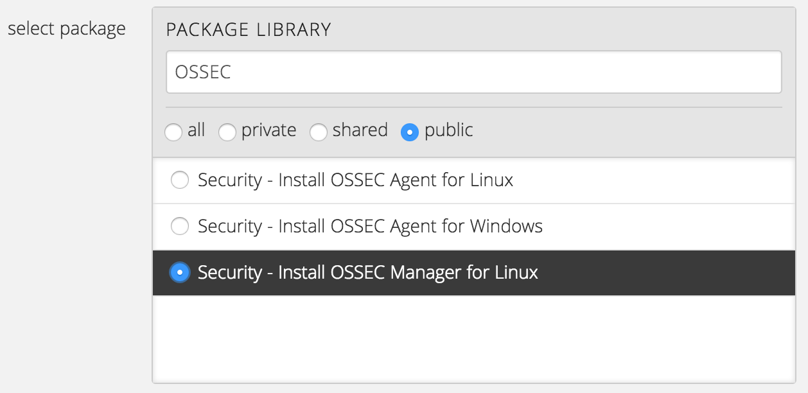
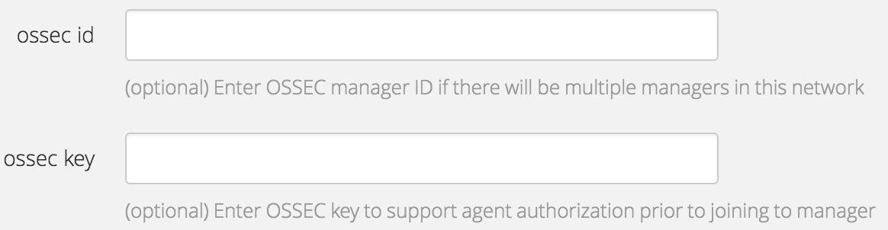
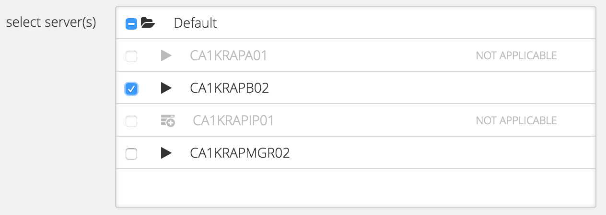
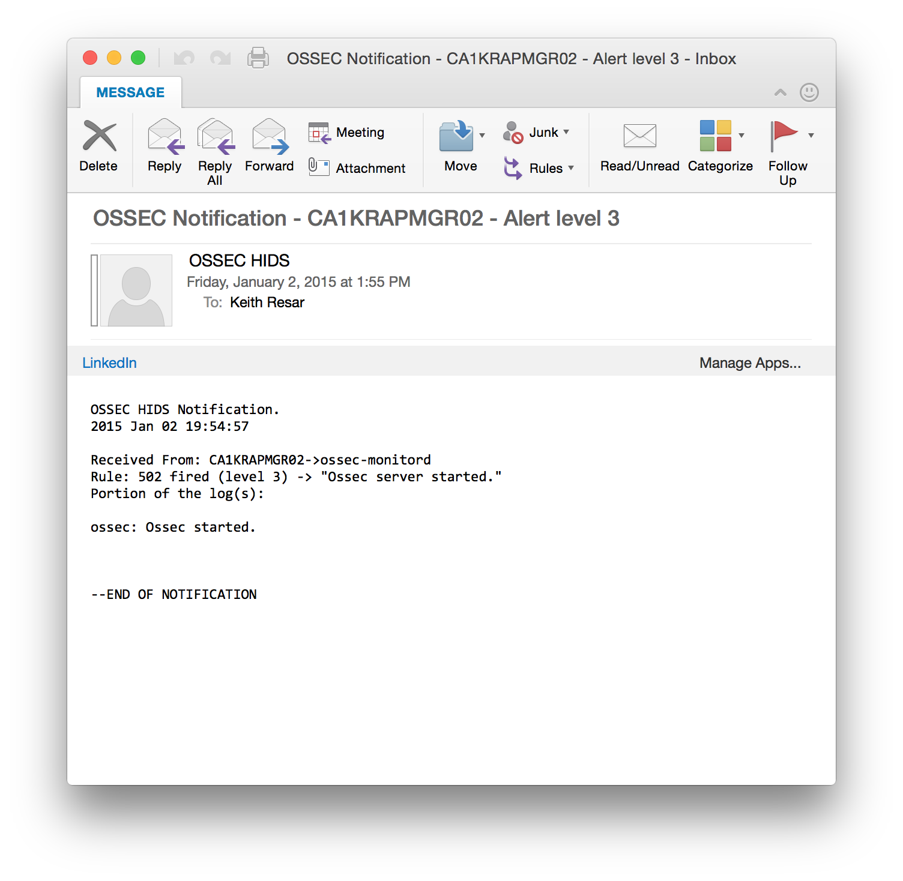
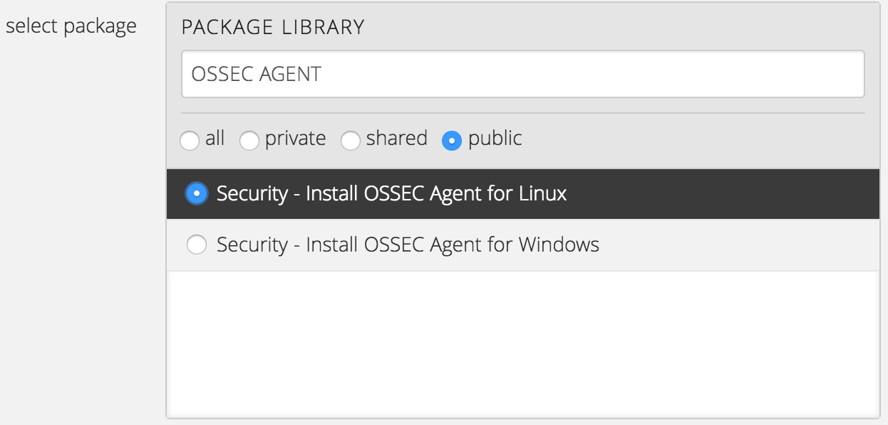
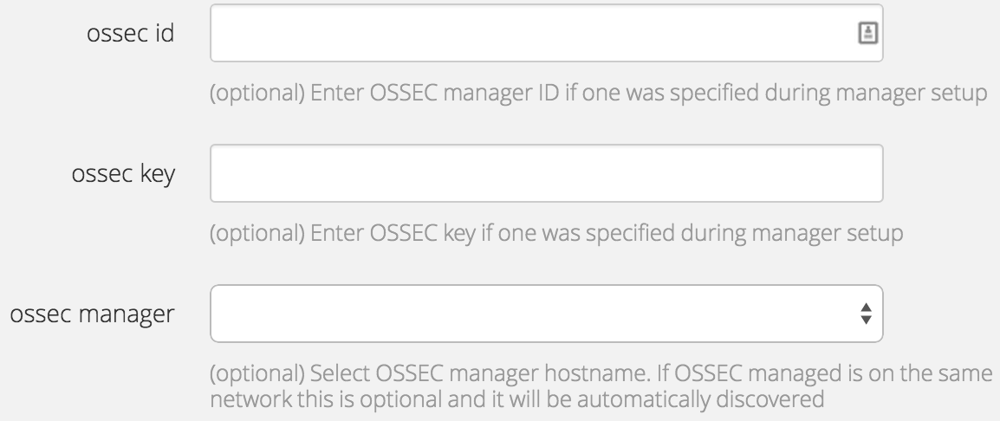

{{{
  "title": "Getting Started With OSSEC Blueprints",
  "date": "06-17-2015",
  "author": "<a href='https://twitter.com/KeithResar'>@KeithResar</a>",
  "attachments": [],
  "contentIsHTML": false
}}}

### Partner Profile
* OSSEC - Open Source SECurity
* [www.ossec.net](http://www.ossec.net/)
* Customer Support:
  * [OSSEC Comunity Site](http://www.ossec.net/?page_id=21)
  * Paid Support from Trend Micro

### Description
Lumen has integrated the OSSEC HIDS solution in to the Lumen Cloud platform to enable customers to perform self-service installation of an OSSEC manager and HIDS agents on Windows or Linux servers. The purpose of this KB article is to help the reader take advantage of this integration to achieve rapid time-to-value for this HIDS solution.

OSSEC is a free, open-source host-based intrusion detection system (HIDS). It performs log analysis, integrity checking, Windows registry monitoring, root kit detection, time-based alerting, and active response. It provides intrusion detection for most operating systems, including Linux, OpenBSD, FreeBSD, Mac OS X, Solaris and Windows. OSSEC has a centralized, cross-platform architecture allowing multiple systems to be easily monitored and managed.

As a Silver-certified member of the [Lumen Cloud Ecosystem Program](../../Ecosystem Partners/Partner Integration Resources/lumen-cloud-ecosystem-program-guide.md), the only thing which Lumen Cloud certifies is that the Partner technology deploys successfully to the Lumen Cloud. We provide complementary knowledge-base articles to get the customer started but all support is available directly from the existing OSSEC community and not Lumen.

### Audience
Lumen Cloud Users

### Impact
After reading this article, the user should feel comfortable getting started installing OSSEC managers and agents on Lumen Cloud.

### Prerequisite
* Access to the Lumen Cloud platform as an authorized user.

### Detailed Steps
Follow these step by step instructions to install OSSEC.

#### OSSEC Manager Installation on Linux
Lumen has developed a script package that installs and configures an OSSEC Manager on an existing Linux server (we recommend CentOS or RHEL). This can be installed [Using Group Tasks to Install Software and Run Scripts on Groups](../../Servers/using-group-tasks-to-install-software-and-run-scripts-on-groups.md).

1. Navigate to a group of servers, hover over the "actions" menu.
   * Choose the “execute package” option as described in the [Using Group Tasks to Install Software and Run Scripts on Groups](../../Servers/using-group-tasks-to-install-software-and-run-scripts-on-groups.md)KB.

2. Select the public package "Security - Install OSSEC Manager for Linux".
   

3. Provide required information.
   * An administrator email address is coded into the OSSEC manager configuration and is used for all alerts generated on the manager and associated agents.
   * For production use this should probably be a group alias.
   

4. Provide optional information.
   * Set "ossec id" to provide a unique cluster ID. This can be left blank in most deployments and should only be populated if there will be multiple OSSEC Managers on the local submit.
   * "ossec key" is a security string which must be known to register the agent. This can be left blank in most deployments as the OSSEC Manager can only be access from other trusted hosts.
   

5. Select a single server to install package on.
   

6. Select to execute package and watch deployment process.
   * Click the `execute package` button.

7. If all works as expected your administrator email address will get an automated startup notification from OSSEC (email is only sent if running on CentOS/RHEL).
   

#### OSSEC Agent Installation on Linux and Windows
Lumen has developed a script package that installs and configures an OSSEC Agent on an existing Linux server (we recommend CentOS or RHEL). This can be installed [Using Group Tasks to Install Software and Run Scripts on Groups](../../Servers/using-group-tasks-to-install-software-and-run-scripts-on-groups.md).

1. Enable bidirectional **1514/UDP** traffic between the manager server and the new agent. UDP is stateless so you'll need to add two rules - one for the manager as source and one for the agent as source.
   * [Connecting Data Center Networks Through Firewall Policies](https://www.ctl.io/knowledge-base/network/connecting-data-center-networks-through-firewall-policies/)

2. Navigate to a group of servers, hover over the "actions" menu.
   * Click the `execute package` option as described in [Using Group Tasks to Install Software and Run Scripts on Groups](../../Servers/using-group-tasks-to-install-software-and-run-scripts-on-groups.md).

3. Select the public package "Security - Install OSSEC Agent for Linux" or "Security - Install OSSEC Agent for Windows".
   

4. Provide optional information.
   * Set "ossec id" and "ossec key" if they were specified as part of the OSSEC manager installation.
   * Set "ossec manager" if your OSSEC Manager is located on another subnet.
   * Otherwise this may be left blank and the agent will automatically discover the manager and begin the registration process.
   

5. Select a single server to install package on.
   

6. Select to execute package and watch deployment process. If all works as expected your administrator email address will get an automated startup notification from OSSEC (email is only sent if running on CentOS/RHEL).
   * Click the `execute package` button.

### Pricing
The costs listed above in Steps 1 and 2 are for the infrastructure only. OSSEC is Open Source community owned software with no associated cost to acquire.

### Frequently Asked Questions
**Where do I get my OSSEC License?**
OSSEC is Open Source community owned software with no associated cost to acquire.

**Who should I contact for support?**
OSSEC is packaged and provided by Lumen as a courtesy to ease startup time. All support for this Open Source software is provided by the community. Please start at http://www.ossec.net/.

For issues related to cloud infrastructure, please open a ticket using the [Lumen Cloud Support Process](../../Support/how-do-i-report-a-support-issue.md).
