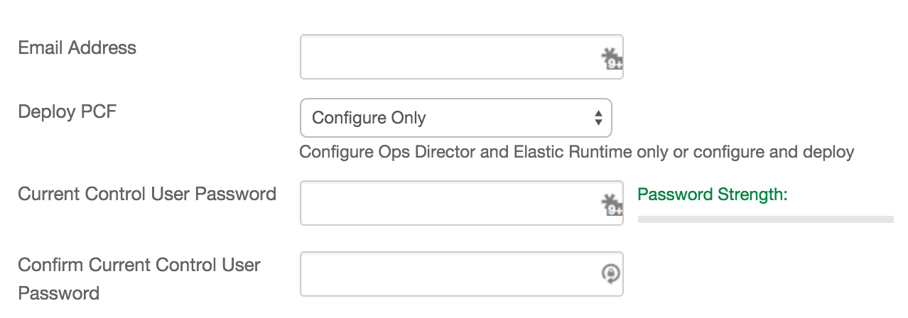

{{{
  "title": "Getting Started with Pivotal Cloud Foundry - Blueprint",
  "date": "11-5-2015",
  "author": "<a href='https://twitter.com/KeithResar'>@KeithResar</a>",
  "attachments": [],
  "contentIsHTML": false
}}}


### Overview

After reading this article, the reader should feel comfortable deploying Pivotal Cloud Foundry (PCF) on CenturyLink Cloud.

### Partner Profile


Pivotal Cloud Foundry – “Streamline application development, deployment and operations on a centrally-managed Platform as a Service for public and private cloud.”

http://pivotal.io/platform-as-a-service/pivotal-cloud-foundry

##### Customer Support

|Sales Contact   	|
|:-	|
|sales-clc@pivotal.io   	|


### Description

Pivotal has integrated their Cloud Foundry technology with the CenturyLink Cloud platform.  The purpose of this KB article is to help the reader take advantage of this integration to achieve rapid time-to-value for this Cloud Foundry solution.


Cloud Foundry® is the result of collaborative industry efforts to build an open platform for next-generation software development. Over 40 members of the Cloud Foundry Foundation now contribute to the project, including VMware, EMC and GE. Pivotal’s commercial edition builds on the open source Cloud Foundry release with advanced features.


### Audience

CenturyLink Cloud Users


### Deploying a New Cluster

You can achieve a single-button deployment of a new Cloud Foundry using CenturyLink Cloud Blueprints.  

#### Pre-flight Checklist

Pivotal Cloud Foundry is a complex piece of software.  Before installing please validate the following:

* **control.ctl.io Service Account** - For production deployments we recommend creating a dedicated control.ctl.io user account as the credentials
  are used for all IaaS changes directed by BOSH.  Deploys cannot be done using accounts with requiring two-factor authentication.
* **Dedicated Network** - Due to the size of typical PCF deploys and some IP address management concerns we require an entire VLAN be dedicated to this install.  PCF servers will reside on the top half of this class-C.
* **CPU, RAM, and Storage Resources** - A full PCF deploy requires at least 75CPU, 128GB RAM, and 1.25TB disk.  For a successful install your account resources must be sufficient to cover this.

#### Steps


1. **Create Server Groups**

  Prior to beginning the software install you must create two groups and assign a default network to them.

  * Create the group `OpenStack` and assign the network you've dedicated to PCF to this group
  * Create the group to hold your PCF environment and assign the network you've dedicated to PCF to this group

  

2. **Locate the Blueprint in the Blueprint Library**

  Starting from the CenturyLink Control Panel, navigate to the Blueprints Library. Search for "Pivotal Cloud Foundry" in the keyword search on the right side of the page.

  

3. **Click the Deploy Blueprint button.**

4. **Set Required parameters.**

  

  * **Email Address** - Email address to receive build notification and PCF access information
  * **Deploy PCF** - We will automatically configure Operations Director (which manages Micro BOSH) and Elastic Runtime.  We can stop post-configuration for you to update settings or perform the full deploy on your behalf.
  * **Current Control User Password** - Enter (and confirm) the password associated with your control.ctl.io account.

5. **Set Optional Parameters**

  Password/Confirm Password (This is the root password for the server. Keep this in a secure place).  

  Set DNS to “Manually Specify” and use “8.8.8.8” (or any other public DNS server of your choice).

  Optionally set the server name prefix.

  **Set the group to the value created in step (1).**  (Your specific group - not the OpenStack one)

  The default values are fine for every other option.

6. **Review and Confirm the Blueprint**

7. **Deploy the Blueprint**

  Once verified, click on the **deploy blueprint** button. You will see the deployment details stating the Blueprint is queued for execution.

  This will kick off the Blueprint deploy process and load a page where you can track the deployment progress. Deployment will typically complete within 50 to 75 minutes.  Take note that the Blueprint status may indicate deployment has completed but there will be a several minute delay until the cluster itself is ready for use as some backup install tasks may still be in process.

  

8. **Deployment Complete**

  Once the Blueprint has finished execution you will receive an email confirming the newly deployed assets within a few minutes.  If you do not receive an email like the one shown below you may have had a deployment error - review the *Blueprint Build Log* for error messages.

  

  Depending on how many components you've chosen to install and configure you'll receive several additional emails with configuration status updates.
  Follow the instruction in these messages to properly access your Operations Manager tool and deploy a PCF environment.

9. **Operations Manager**

  Once the status messages in the previous step indicate your environment is ready then access Pivotal Operations Manager via port 443 on your
  new server (point your web browser to **https://yourhost**).  Authenticate  with the username `admin` and using the same password you assign for
  the root account on this server.

  

10. **Validate Configuration**

  Navigate through the **Operations Director** and **Elastic Runtime** tiles to validate configuration.

  

11. **Apply Changes**

  Click the **Apply Changes** button to begin building your PCF environment.

  Before long you should see the install status screen shown below to view deploy process details.

  

  Once all PCF components have deployed you will see the following screen.

  

12. **Enable public access** (optional)

  Servers are built using private IPs only with access with client or IPSEC VPN.  For access from the Internet at large add a public IP to your master server.

  <a href="../../Network/how-to-add-public-ip-to-virtual-machine.md">
    
    Adding a public IP to your virtual machine
  </a>


### Pricing

The costs listed above in the above steps are for the infrastructure only.

After deploying this Blueprint, you may secure entitlements to the technology using the following steps:

 * Email: sales-clc@pivotal.io

### Frequently Asked Questions

**Where do I obtain my license?**

Contact your Pivotal account manager or inquire via email to [sales-clc@pivotal.io](mailto:sales-clc@pivotal.io)

**Who should I contact for support?**

* For issues related to cloud infrastructure, please open a ticket using the [CenturyLink Cloud Support Process](../../Support/how-do-i-report-a-support-issue.md).
* For issues related to interacting with an already configured PCF environement review the [Pivotal KB](http://docs.pivotal.io/pivotalcf/getstarted/pcf-docs.html)
* For issues related to deploying the Pivotal PCF Blueprints and application operation on CenturyLink Cloud and you have a paid license, please contact sales-clc@pivotal.io or follow your existing Pivotal support process if known.

**My deploy failed, what next ?**

Resolution depends on which of the three phases errored during the deploy:

* Phase I - Preflight checklist
 * Review the Blueprint build log errors and make recommended corrective actions
* Phase II - Operations Manager bootstrap
 * You should remove the Operations Manager server and redeploy the blueprint.
* Phase III - Configuration and deployment
 * Advanced users can troubleshoot the settings or use BOSH to drill into errors
 * Beginner users may want to remove and redeploy the installation.  See below FAQ about how to safely delete an installation

Advanced troubleshooting is available using the BOSH tool from your Operations Manager server.  Perform the following to easily
access this tool:

* ssh to your Operations Manager host
* change the login shell for **tempest-web** from `/bin/false` to `/bin/bash`
* Execute the following commands:

  ```
  > su tempest-web
  > cd
  > alias bosh="BUNDLE_GEMFILE=/home/tempest-web/tempest/web/bosh.Gemfile bundle exec bosh"

  .... (Execute your bosh commands)
  ```


**How do I login to PCF for the first time?**

* Operations Manager web UI - When the environment deploy completes you will receive an email with a login link.  If you've lost this know that you can
  login with the username `admin` and using the same root password you set when building the server
* Operations Manager console - ssh as root and use the root password you set when building the server.  As needed create additional accounts or enable direct
  login to the **tempest-web** account
* PCF - Navigate to the Operations Manager web UI to gain access to the credential store


**How can I safely delete my PCF install?**

The PCF environment consistents of servers and persistent elastic block storage which both must be removed to eliminate all associated infrastructure
charges.


* If you have a fully functioning PCF environment, from your Ops Manager dashboard click the **gear** icon the select **delete this installation** (picture above)
* If you never performed a deploy or you have already performed the above deletion process - you may safely delete the Ops Manager server or the entire group containing it
* If your install encountered errors please send a ticker to **noc@ctl.io** requesting removal of all **System block storage services**


**How do I use my private IP for the system domain?**

Both hosts internal to the PCF environment and anyone who interacts with the system apps (dev console or the cf command line tool) but be able to resolve the
the system domain name.  These presents challenges if some of this system access will be across NATed public IP addresses (instead of the private IPs
directly associated with the server).

Should this split DNS be required implement the following:

* Create a DNS server for use by PCF components - this will resolve the system domain to the private IP address space.  For POCs we've seen this done
  by installing BIND on the Operations Manager host and pointing all DNS resolvers to this IP
* Edit the public DNS so the FQDN resolves to the NATed public IP for the HA proxy (.128 by default)

To configure DNS as suggested above perform the following prior to selecting *Apply Changes*:

1. ssh to your Operations Manager server, and execute this script:
  ```
  # ./install_bind_wildcard.sh $domain_name
  ```

2. From the Operations Manager web console, open the **Ops Director** tile, click **Create Network**, and enter the private IP address for 
   your Operations Manager server in the DNS field

3. Following a successful deploy through *Apply Changes*, login to the CenturyLink Cloud control.ctl.io portal and locate the router.  This server's
   IP address final octet is **.128**.  Add a public IP address to this host and permit http/https traffic.  Modify your external DNS so the wildcard
   domain points at the newly created public IP.


**IP Address Space for Larger Deployments**

CenturyLink Cloud provides class-C /24 address space on each of its networks, and with the exception of a few IPs at the top and bottom end of the range 
reserved for platform-level services, the entire subnet is available for use.  Some considerations:

* By default the IP space is cut in half - Ops Manager and CF have access to 128 and above and all lower addresses are reserved for other use.  This is
  implemented since both Ops Manager and CenturyLink Cloud believe they own IPAM responsibilities.
* Ops Manager subdivides this network and reserves a portion for each tile's use - this includes steady-state assignments as well as those used only
  during Errands testing.  In production this means the IP-range can quickly fill up even though there is actually space available
* Gain IP space by deploying initially using the following approach:
 * Set the *OpenStack* group's default network to network A.  This will move your Elastic Block Storage services onto a different network segment.
 * Set the group containing your servers to network B.  Make sure network B is not your first network defined in your primary datacenter.
 * Configure Ops Director to use from .12 all the way to .230.


**What are some known limitations?**

* Accounts requiring two-factor authentication cannoit successfully deploy PCF.  Create a new service account dedidicated to PCF.


**How can I get new stemcells?**

Your install will be preloaded with the most current stemcells.  If you need some older stemcells that aren't preloaded or if you need something that's been released since your initial install you can download the stemcells from the links below.  Note these are slightly modified from what's available at network.pivotal.io.

* [3100](http://canada.os.ctl.io/bpimager/bosh-openstack-clc-ubuntu-trusty-go_agent_3100.tgz)
* [3094](http://canada.os.ctl.io/bpimager/bosh-openstack-clc-ubuntu-trusty-go_agent_3094.tgz)
* [3074](http://canada.os.ctl.io/bpimager/bosh-openstack-clc-ubuntu-trusty-go_agent_3074.tgz)
* [3062](http://ca.tier3.io/ateam-packages/stemcells/bosh-openstack-clc-ubuntu-trusty-go_agent_3062.tgz)
* [3026](http://ca.tier3.io/ateam-packages/stemcells/bosh-stemcell-3026-clc-ubuntu-trusty-go_agent.tgz)
* [3012](http://ca.tier3.io/ateam-packages/stemcells/bosh-stemcell-3012-clc-ubuntu-trusty-go_agent.tgz)
* [2989](http://ca.tier3.io/ateam-packages/stemcells/bosh-stemcell-2989-clc-ubuntu-trusty-go_agent.tgz)


