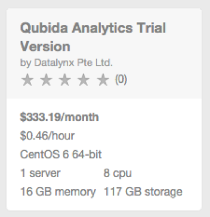
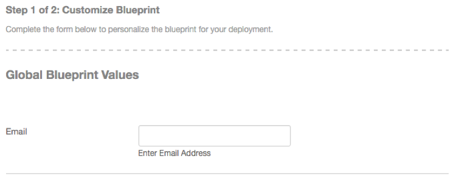
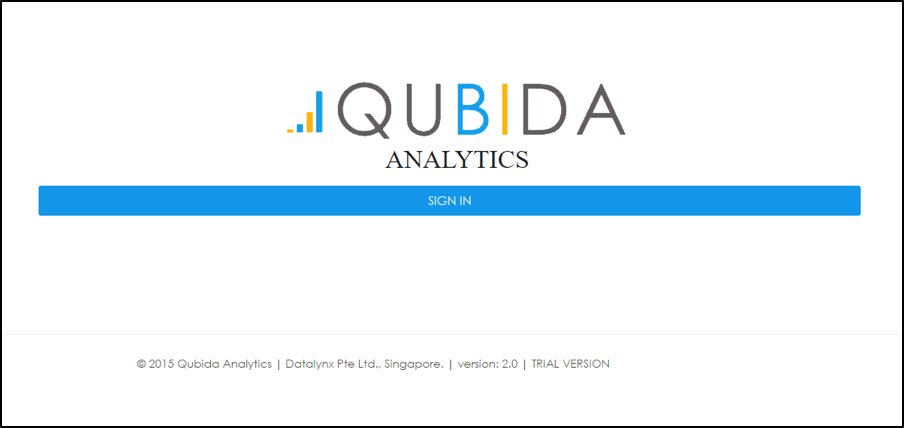
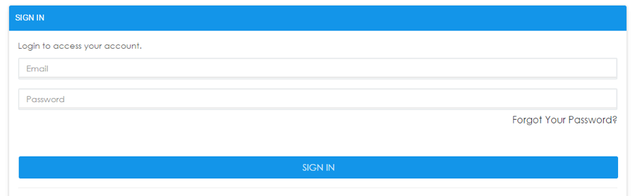

{{{
  "title": "Getting Started with Qubida - Blueprint",
  "date": "11-19-2015",
  "author": "<a href='https://twitter.com/KeithResar'>@KeithResar</a>",
  "attachments": [],
  "contentIsHTML": false
}}}

### Technology Profile

Qubida Analytics provides "Quick Big Data".

##### Customer Support

|Sales Contact   	| Support |
|:-	| :- |
|info@qubida.com   	| support@qubida.com |

### Description

Qubida Analytics has integrated their technology with the CenturyLink Cloud platform. The purpose of this KB article is to help the reader take advantage of this integration to achieve rapid time-to-value for this Cloud Analytics solution.

Technology from Qubida Analytics helps CenturyLink Cloud customers address the business challenge of analytics on demand by implementing an out of the box big data solution on the cloud - now available as part of the CenturyLink Cloud Blueprint Engine.

### Audience

* CenturyLink Cloud Users

### Impact

After reading this article, the user should feel comfortable getting started using the partner technology on 
CenturyLink Cloud.

After executing the steps in this Getting Started document, the users will have a functioning BI analytics solution.

### Deploying Qubida

You can achieve a single-button deployment of a new Qubida Analytics instance using CenturyLink Cloud Blueprints.  

1. **Locate the Blueprint in the Blueprint Library**

 Starting from the CenturyLink Control Panel, navigate to the Blueprints Library. Search for "Qubida Analytics Trial" in the keyword search on the right side of the page.

  

2. **Click the Deploy Blueprint button.**

3. **Set Required parameters.**

  

  * **Email** - Enter email address to receive email post successful deployment of Qubida Analytics server

4. **Set Optional Parameters**

  Password/Confirm Password (This is the root password for the server. Keep this in a secure place).  

  Set DNS to “Manually Specify” and use “8.8.8.8” (or any other public DNS server of your choice).

  Optionally set the server name prefix.

  The default values are fine for every other option.

5. **Review and Confirm the Blueprint**

6. **Deploy the Blueprint**

  Once verified, click on the **deploy blueprint** button. You will see the deployment details stating the Blueprint is queued for execution.

7. **Deployment Complete**

  Once the Blueprint has deployed you will receive an email confirming the newly deployed assets within a few minutes.  If you do not receive an email you may have had a deployment error - check the *Blueprints Queue* or review the *Blueprint Build Log* to for error messages.

8. **Accessing Qubida**
 
  Once the status messages in the previous step indicate your environment is ready then access Qubida Analytics 
  Client UI via port 80 on your new server (point your web browser to https://yourhost). 

  

  Click on “Sign in” and on “Not a Member? Sign up”

  

  Use your new login to Sign in and start using Qubida

  

  Signup for trial account to discover and explore your Big Data.

9. **Using Qubida**

  Review the [Qubida User Manual](https://qubida.atlassian.net/wiki/display/UM/Introduction) for help getting started.

### Pricing

The costs listed above in the above steps are for the infrastructure only.

The Blueprint offers a 30 Day Trial of Qubida Analytics for all CLC customers.
After the expiry of the trial period, for renewal option please contact info@qubida.com

### Frequently Asked Questions

**Where do I obtain my license?**

Contact info@qubida.com.

**Who should I contact for support?**

* For issues related to deploying Qubida, email support@qubida.com
* For issues related to cloud infrastructure, please open a ticket using the [CenturyLink Cloud Support Process](../../Support/how-do-i-report-a-support-issue.md).

