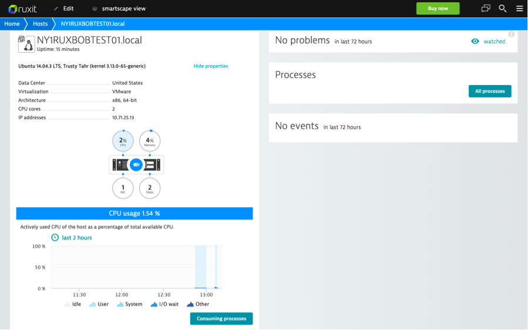

{{{
  "title": "Getting Started with Ruxit - Blueprint",
  "date": "11-30-2015",
  "author": "Bob Stolzberg",
  "attachments": [],
  "contentIsHTML": false
}}}

### Partner Profile
Ruxit provides an all-in-one full stack monitoring with automatic discovery of your complete environment, from processes, services to applications and their interdependencies. Ruxit is easy to be orchestrated from development teams working in startups, mid-sized companies and large organizations. Using proprietary artificial intelligence technology, Ruxit enables companies to manage thousands of servers with less than a single full-time resource. With its simple OneAgent approach Ruxit is running in less than 5 minutes and immediately provides you environment overviews. Ruxit streamlines application management, removing the complexities and manual work typically involved in problem analysis. Ruxit is the first monitoring solution to offer a pure pay-as-you-go pricing model.

Ruxit is a new offering for self-service monitoring by Dynatrace – the worlds leading application performance monitoring company. Gartner has recognized Dynatrace as a MQ Leader now for 5 consecutive years.

Data is good. Answers are better.

[http://www.Ruxit.com](http://www.Ruxit.com)

#### Contact Ruxit
##### Customer Sales and Support:
* Support Email - [support@Ruxit.com](mailto:support@Ruxit.com)
* Sales Email - [sales@Ruxit.com](mailto:sales@Ruxit.com)

### Description
Ruxit has integrated their technology with the Lumen Cloud platform. The purpose of this KB article is to help the reader take advantage of this integration to achieve rapid time-to-value for this full-stack monitoring solution.

Technology from Ruxit helps Lumen Cloud customers address the business challenge of performance issues & outages, business continuity and scaling, by implementing a SaaS based full-stack monitoring solution - now available as part of the Lumen Cloud Blueprint Engine.

### Solution Overview
Ruxit provides the following:
  * Java and JVM performance monitoring
  * Node.js and Web framework monitoring
  * Server and virtual infrastructure monitoring
  * Docker monitoring
  * Real-user response time in browsers
  * JavaScript error detection in browsers
  * Network monitoring at the process level
  * Stack trace analysis
  * Database throughput and response time analysis
  * Intuitive touch-first dashboards
  * Automatic root cause analysis with artificial intelligence
  * No misleading alerts —you’re only notified of real problems
  * .NET and IIS monitoring
  * PHP monitoring
  * Dynamic execution paths at the code level
  * Database statement inspection
  * Auto-detection of 3rd party performance impact
  * Apdex ratings and user action counts by region
  * Detection of end-user satisfaction levels
  * Breakdowns by web page

#### Benefits
**No alerting noise! Artificial Intelligence analysis and baselining**
Ruxit learns your environment and analyzes anomalies so you don’t have to. When something goes wrong, you get the solution—not just an alert. With the ability to discover all dependencies in your application stack, Ruxit delivers fast root-cause analysis.

**All-in-one solution. One agent covers everything**
The Ruxit all-in-one approach to monitoring combines user-experience-, network-, server-, and cloud-monitoring in a single agent. This makes deployment easy. Just install a single agent on each host.

**No data sampling! Response times are measured in customers' browsers**
Ruxit automatically measures response times and detects JavaScript errors directly in your customers’ browsers. Ruxit even monitors the performance of 3rd party calls or applications that you rely on (for example, Facebook, Twitter, or CDNs).

### Audience
Lumen Cloud Users, Developers, Application Owners, Operations and Engineering

### Impact
After reading this article, the user should feel comfortable getting started using the partner technology on Lumen Cloud. After executing the steps in this Getting Started document, the users will have a functioning Ruxit monitoring solution.

### Offer
Ruxit has provided a Blueprint that will easily add monitoring to your whole Lumen cloud environment and provide you the necessary performance and health answers of your environment.

### Prerequisite
* For running this Blueprint you first need to sign up for a free trial for Ruxit monitoring.
* Please browse to [https://Ruxit.com](https://Ruxit.com) to set up an account. You will receive an email with your account credentials and how to start monitoring with Ruxit.
  

### Deploy Ruxit Blueprint
Follow these step by step instructions to deploy Ruxit.

1. Open the Blueprint Library.
   * Login to the Control Portal. From the Nav Menu on the left, click **Orchestration > Blueprints Library**.

2. Search for the Blueprint.
   * To search for the Ruxit Blueprint, type “Ruxit” under “Refine Results” in the right panel.
   * Click the `Go` button.

3. Select the Blueprint.
   * Select the "Install Ruxit Agent on Linux" Blueprint.

4. Deploy the Blueprint.
   * Click on the `deploy blueprint` button to begin configuring your installation.

5. Configure the Blueprint.
   Ensure the following options are configured:
   * Ruxit tenant ID: Your Ruxit tenant ID is the unique identifier of your Ruxit environment.
   * You can find it easily by looking at the URL in your browser when you are logged into your Ruxit home page. `https://{tenant}.live.Ruxit.com` The subdomain {tenant} represents your tenant ID.
   * Ruxit token - You can get your token by following these steps.
     * Go to your Ruxit environment: `https://{tenant}.live.Ruxit.com`.
     * Click the burger menu in the right upper corner and select "Monitor another host".
     * You will see the Download Ruxit Agent wizard; click Linux.
     * You will see the wget command line. The token is the last part of the path after `/latest/`.

6. Review and Confirm the Blueprint.
   * You will come to a confirmation view of what your Blueprint looks like.
   * Verify your configuration details.
   * Then click the `deploy blueprint` button at the bottom.

7. Monitor the Activity Queue.
   * After clicking Deploy Blueprint, the job will be submitted into a queue and you will be taken to a monitoring page where you can see the progress of each step the Blueprint goes through.
   * To monitor progress, click **Queue** from the Nav Menu on the left.

### Access and use Ruxit
Once the Blueprint completes successfully, you will receive an email stating that the Blueprint build is complete. Please do not use the application until you have received this email notification.
* Once the Blueprint completes, simply review your Ruxit homepage and check if your servers are being monitored.
  

* If they are not, please open a support ticket by contacting Ruxit support.

### Pricing
The costs associated with this Blueprint deployment are for the Lumen Cloud infrastructure only. There are no Ruxit license costs or additional fees bundled in.

Ruxit is the first monitoring solution to offer a pure pay-as-you-go pricing model. You can get started monitoring for as little as 15 cents an hour—and you only pay for what you use. No long-term contract or commitments. We also offer a special program for startups. Our startup package allows you to monitor up to 10 machines and 2 million user visits per month for up to 12 months.

Free Trial: Get started for free with Ruxit today. The first 1,000 hours of monitoring are on us. Visit: [http://www.Ruxit.com](http://www.Ruxit.com) and sign-up with your email address (no credit card needed).

### Frequently Asked Questions

#### Where do I get my Ruxit License?
* To get your Ruxit license / Tenant ID please sign up at [http://www.Ruxit.com](http://www.Ruxit.com).

#### Who should I contact for support?
* For issues related to deploying the Ruxit Blueprint on Lumen Cloud or with the Ruxit software, please contact [support@Ruxit.com](mailto:support@Ruxit.com).
* For issues related to cloud infrastructure (VMs, network, etc.), or if you experience a problem deploying the Blueprint, please open a Lumen Cloud Support ticket by emailing [help@ctl.io](mailto:help@ctl.io) or [through the support website](https://t3n.zendesk.com/tickets/new).
