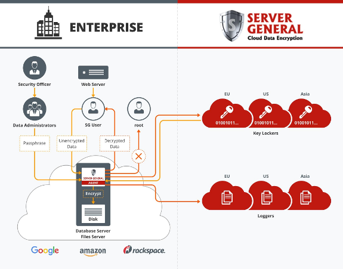

{{{
  "title": "Getting Started with Server General - Blueprint",
  "date": "02-20-2016",
  "author": "Ecosystem Team",
  "attachments": [],
  "contentIsHTML": false
}}}

### Partner Profile
Server General is a data encryption and key management service for customers who want to encrypt their cloud database or file server quickly. It generally takes less than 30 minutes to install, configure and encrypt. The service is ideal for customers who store sensitive/regulated information in a MongoDB, CouchDB, MySQL, PostgreSQL, Apache or Samba server.

[http://www.ServerGeneral.com](http://www.ServerGeneral.com)

#### Contact Server General
##### Customer Sales and Support:
* Support Email - [support@ServerGeneral.com](mailto:support@ServerGeneral.com)
* Sales and Marketing Email - [ctl@ServerGeneral.com](mailto:ctl@ServerGeneral.com)
* Website Sales - [http://www.servergeneral.com/centurylink](http://www.servergeneral.com/centurylink)

### Description
Server General has integrated their technology with the CenturyLink Cloud platform. The purpose of this KB article is to help the reader take advantage of this integration to achieve rapid time-to-value for this data-at-rest encryption solution.

Technology from Server General helps CenturyLink Cloud customers address the business challenge of complying with industry mandates and government regulations like HIPAA/HITECH, FERPA, FISMA, EU Privacy Law and PCI DSS by implementing data-at-rest encryption service solution - now available as part of the CenturyLink Cloud Blueprint Engine.

### Solution Overview
Almost all data security regulations require access to the sensitive information to be tightly controlled. However, it is not so easy to do so these days. Perimeter security concepts are no longer valid because the bad guys can get the firewall. Once inside, they can interrogate various servers at will and find treasure troves of data that can be sold or can be used to blackmail the compromised organization. Sony Corporation is a prime example of just such an act. So now the question is how to protect data from people who are on the inside and perhaps have privileged access to sensitive servers? Data-at-rest encryption can provide a layer of defense. However, encryption alone is not sufficient. It must be closely tied to advanced access control mechanisms. Moreover, the encryption keys must be stored at a secure location and should be available at all times to authorized entities. Lastly the logs have to be stored beyond the reach of all concerned parties to eliminate any possibility of contamination.

Server General and CenturyLink deliver data Encryption as a Service that addresses the above mentioned security concerns and enables customers to achieve regulatory compliance via the use of the following techniques:

* Transparent data-at-rest encryption using AES
* Lifetime key management service that includes key generation, key store, key rotation and revocation
* Protection against the "root" user
* Remote logging outside of the administrative domain of the interested parties
* Role-base management

Below is a solution architecture diagram that illustrates how a state of enhanced security is achieved.

It is important to note that both the CenturyLink and Server General staff does not have access to the actual encryption keys. The keys are re-encrypted using Master Keys of their respective data owners. Only the cipher blobs are stored in our global managed key locker infrastructure. Also, our customers have the option of using a dedicated managed key lockers deployed within their own own data center or within CenturyLink network.

#### Benefits of using Server General
* Encrypt your server data in 30 minutes.

* Most customers are able to install, configure and encrypt their sensitive information stored in a cloud server in 30 minutes or less.
  * Offload your data encryption and key management responsibilities to proven experts.
  * Pay as you go service plan.

* A monthly subscription plan with no annual commitment.
  * Reduce your data encryption cost by leveraging CenturyLink and Server General global highly redundant key management infrastructure.
  * Cut down your audit cost by storing your logs outside the reach of all interested parties.
  * Become compliant quickly.

* Mitigate non-compliance risk by encrypting your regulated data.
  * Get exemption from mandatory breach notification provision of the HIPAA/HITECH Act by rendering your ePHI indecipherable.
  * Limit your scope by storing your encryption keys on-premises.
  * Eliminate log manipulations.
  * Stop privileged users from accessing your sensitive information.
  * Lower your compliance cost.

### Audience
CenturyLink Cloud Users who want to protect their sensitive information stored in their MySQL, MongoDB, CouchDB, PostgreSQL, Samba, or File server.

### Impact
After reading this article, the user should feel comfortable getting started using the Server General data security service solution on CenturyLink Cloud. The Server General Blueprint will install the Server General encryption agent on your virtual server. The user will need a valid license in order to make use of the Server General data encryption service. The user can either buy or get a test license for 30-days by visiting [http://www.servergeneral.com/centurylink](http://www.servergeneral.com/centurylink).

No manual intervention is required if you are planning to use our cloud lockers.

After executing the steps in this Getting Started document, the users will have a functioning data-at-rest encryption solution which will allow them to encrypt sensitive information and control access to it.

After executing the steps in this Getting Started document, the users will have a functioning Server General monitoring solution.

### Offer
Server General has provided a Blueprint that will easily add monitoring to your whole CenturyLink cloud environment and provide you the necessary performance and health answers of your environment. You can try Server General data encryption service for free for 30-days. No credit card is required. If you like our service, then you should upgrade your trial license to a paid license. There is no need to reinstall and reconfigure your Server General.

### Prerequisite
* Access to the CenturyLink Cloud platform as an authorized user.
* A supported Linux VM. Currently we support Ubuntu 14.04, Debian 7, RHEL 6.x and CentOS 6.x. Please contact us if you are using another flavor of Linux.
* Allow outgoing traffic for port `443`.
* A valid Server General subscription license.

Here are some of the documents that you will need during and after installation:
* [SGA Quick Start Guide](https://docs.google.com/document/d/1lIwJ6fWeMtnbbIn1SDepzYwR7MKFxMmeCiL_4fqn0ak/edit)
* [Server-GENERAL Users, Roles, and Responsibilities](https://docs.google.com/document/d/1x_wNZ5gUtd-JXUhtwG-jKTltKl2TQG0QK1pfhJGl1DE/edit)
* [Server General Command Summary](https://docs.google.com/document/d/1wdYds5dc1Z_GXW6sOrmE8qFBi_OcSsXlgooSASen_eM/edit)

### Deploy Server General Blueprint
Server General Data Encryption Agent can be deployed on any supported Linux server. Follow these step by step instructions to deploy Server General on your CenturyLink Cloud server.

1. Locate the Blueprint in the Blueprint Library.
   * Login to the Control Portal. From the Nav Menu on the left, click **Orchestration > Blueprints Library**.
   * Search for "Server General" without quotes.
   * You may find other Blueprints published by Server General. However, for now we are just looking to install the Server General data encryption agent.

2. Choose the Blueprint.
   * Click the `deploy blueprint` button.

3. Configure the Blueprint.
   * In order to configure the Blueprint you will need a valid Server General subscription license. This can be a trial license or a purchased subscription license.
   * If you do not have a license, then you can get one easily by visiting www.servergeneral.com/centurylink. Once you have the license, you should paste it in the box where it says the "License key".
   * Next you will have to type in a passphrase for your "ssh" key. We’ll use this passphrase to encrypt your private key. This private ssh key will be used by the Server General Admin user - "sgadmin". We will tell you how to make use of this key later.

4. Review and Confirm the Blueprint.
   * Verify your configuration details.

5. Deploy the Blueprint.
   * Once verified, click the `deploy blueprint` button. You will see the deployment details.

6. Monitor the Activity Queue.
   * Monitor the Deployment Queue to view the progress of the Blueprint.
   * To monitor progress, click **Queue** from the Nav Menu on the left.
   * After the Blueprint deployment completes successfully, get busy!

### Pricing
The costs listed above in Steps 1 and 2 are for the infrastructure only. After deploying this Blueprint, the user can secure entitlements to the technology.

You can try Server General data encryption service for free for 30-days. No credit card is required. If you like our service, then you should upgrade your trial license to a paid license. There is no need to reinstall and reconfigure your Server General.

### Frequently Asked Questions
**Where do I get my Server General Subscription License?**
* To get your Server General license., please sign up at [http://www.ServerGeneral.com/centurylink](http://www.ServerGeneral.com/centurylink). You can also request a 30-day trial license.

**Who should I contact for support?**
* For issues related to deploying the Server General Blueprint on CenturyLink Cloud or with the Server General software, please contact [support@ServerGeneral.com](mailto:support@ServerGeneral.com).
* For issues related to cloud infrastructure (VMs, network, etc.), or if you experience a problem deploying the Blueprint, please open a CenturyLink Cloud Support ticket by emailing [help@ctl.io](mailto:help@ctl.io) or [through the support website](https://t3n.zendesk.com/tickets/new)

**How do I login as Server General Admin?**
* Access your server via ssh as the root user. You created this password during the server installation time. Once you are logged in, you should look for the ssh key for the sgadmin user in /home/sgadmin/.ssh directory.
* Copy the id_dsa file to your workstation.
* Change access permissions to 400 for this file (id_dsa). You can then log in to the server as the sgadmin user with help of this ssh key (ssh -i path_to where_you_stored_your_id_dsa_file sgadmin@IP_address_of_your_server.
