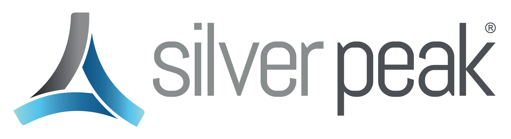

{{{
"title": "Getting Started with Silver Peak - Partner Template",
"date": "12-30-2015",
"author": "<a href='https://twitter.com/KeithResar'>@KeithResar</a>",
"attachments": [],
"contentIsHTML": false
}}}



### Overview
After reading this article, the reader should feel comfortable deploying the Silver Peak VX virtual WAN optimization software on Lumen Cloud.

### Partner Profile
Silver Peak Systems – Delivering Industry leading WAN optimization by combining the cost and flexibility benefits of virtualization with the performance.

http://www.silver-peak.com

#### Contact Silver Peak
|Sales Contact | Customer Support	|
|:- |:-	|
| [Customer Sales Site](http://www.silver-peak.com/company/contact)  | [Customer Support Site](http://www.silver-peak.com/support)|

### Description
Silver Peak Systems has integrated market leading WAN Optimization technology with the Lumen Cloud platform. The purpose of this KB article is to help the reader take advantage of this integration to achieve rapid time-to-value for WAN Optimization solution.

Silver Peak VX virtual WAN optimization software combines the cost and flexibility benefits of virtualization with the performance gains delivered by Silver Peak's industry-leading WAN optimization technology. Silver Peak VX virtual appliances support the full list of Silver Peak WAN optimization features for maximum functionality, including data reduction, path conditioning and traffic shaping. This enables customers to overcome bandwidth,
distance and quality challenges when moving data over the WAN.

The WAN optimization software runs on all major hypervisors (VMware vSphere, Microsoft Hyper-V, Citrix XenServer, KVM) and can integrate quickly and easily into existing virtual infrastructures to maximum cost savings. Awarded a "Perfect 10" for value by InfoWorld, Silver Peak VX software can save customers up to 80% in WAN optimization costs by switching from competing hardware to Silver Peak software.

### Solution Overview
Silver Peak’s Virtual Acceleration Open Architecture (VXOA) accelerates data movement between data centers, branch offices and the cloud. It uses real-time optimization techniques to solve network quality, capacity and distance challenges, resulting in fast and reliable access to information anywhere in the world. Various virtual and physical models exist for cost effective deployment in any enterprise location, from small branch/remote
locations to the largest data centers. All Silver Peak products support the same VXOA functionality to deliver the following benefits:

* **Ease of deployment / mobility** – instantly deploy Silver Peak’s WAN optimization technology anywhere in the world; Easily re-locate appliances as needed to follow workloads.

* **Reduced IT costs** – consolidate different applications onto common hardware platforms.

* **High availability** – Leverage existing high availability tools inherent in virtual solutions (e.g VMware’s vSphere High Availability (HA).

* **Flexible pricing** - Lower capital expense by purchasing a virtual appliance as a subscription service; upgrade licenses as more capacity is needed.

* **Security**: All Silver Peak appliances use AES encryption to protect data stored locally. IPSec encryption protects data sent between appliances. Advanced algorithms ensure that data security is achieved with no impact on application performance.

* **Flexible deployment options**: Silver Peak virtual appliances are typically deployed out of path. Traffic is redirected to these Real-Time Network Optimization Techniques All Silver Peak appliances use the following real-time optimization techniques to maximize available WAN bandwidth, extend distances, and improve WAN quality

* **Network Acceleration**: TCP and other protocol acceleration techniques minimize the effects of latency on application performance and significantly improve application response time across the WAN.

* **Network Integrity**: Adaptive Forward Error Correction (FEC) mitigates packet loss by reducing the need for retransmissions when routers are oversubscribed. Packet Order Correction (POC) is a real-time solution for overcoming out-of-order packet delivery across the WAN. Silver Peak appliances employ a variety of Quality of Service (QoS) and traffic shaping techniques to optimize traffic handling, including advanced queuing, scheduling, and standards-based packet-marking. VX appliances can honor existing QoS tags or create new policies for granular QoS control.

* **Network Memory™**: Each Silver Peak appliance inspects WAN traffic at the byte level and stores copies of content in high-capacity disk drives. Advanced finger-printing techniques recognize repetitive patterns for local delivery. Network Memory operates at the network layer and supports all IP-based protocols including TCP, UDP and RTP.

### Enterprise-Features
* **Silver Peak appliances optimize all IP applications.** This includes: - Backup and recovery applications, including asynchronous backup/replication tools from EMC, HDS, Dell, NetApp, and other leading vendors. - Traditional TCP applications, such as Windows file sharing, MS Exchange, MS Sharepoint, Lotus Notes/Domino, Siebel, Oracle, and VMware. - Non TCP applications, such as EMC VPLEX, Aspera, and FCIP. - Interactive applications, like Virtual Desktop Infrastructures (VDI), Citrix XenApp, Sunray, and Remote Desktop Protocol (RDP). - Real-time applications, like VoIP, video conferencing, video streaming and other unified communications. devices by networking equipment (e.g. routers), application servers, or other devices using standard peering protocols or static routing configurations. To maximize uptime, VX appliances can be deployed redundantly in 1+1 or N+1 configurations, with failover and load balancing.

* **Easy to Manage**: An intuitive Graphical User Interface (GUI) simplifies network monitoring, policy provisioning, and device management. Powerful wizards simplify configuration. A full-featured CLI is available via SSH. Larger deployments can easily be managed using Silver Peak’s Global Management System (GMS). This is a comprehensive platform for deployment, management, and monitoring of a Silver Peak–enabled WAN. In addition to centralizing the administration of Silver Peak appliances, GMS provides detailed visibility into all aspects of application delivery across a distributed enterprise, including application behavior, WAN performance, Quality of Service (QoS) policies, and bandwidth utilization.

### Offer
Silver Peak is making their VX WAN Optimization appliance available for Lumen Cloud Users to deploy to their account. In order to purchase a license or entitlement, please contact Silver Peak using the contact information above.

http://www.silver-peak.com/company/contact
http://marketplace.silver-peak.com/

### Audience
Lumen Cloud Customers

### Impact
After reading this article, the user should feel comfortable getting started using Silver Peak WAN Optimization VX technology on Lumen Cloud. Silver Peak has provided a Virtual Appliance - what we call a Blueprint - that can be deployed to your Lumen Cloud account via a Service Task.

### Howe to Deploy the Partner Image
1. Create an email to help@ctl.io.

2. Copy and paste the information below into the body of the email.

3. Edit the information as needed and send.

   ```
   TO: help@ctl.io

   EMAIL SUBJECT:   Ecosystem Partner Template Import Request

   CLC Support Team,

   Please create a ticket to import the Ecosystem Partner Template image  referenced below to my Lumen Cloud Account:

   - Import Lumen Ecosystem Partner Source Image: Silver Peak VX
   - My Lumen Cloud Account Alias: ####
   - My Lumen Cloud Account PIN:  ######
   - Data Center to import image to: ###
   - Server Name to import image as: ##########
   - VLAN in the account to add the Server to: ########
   - Additional Notes or work to be done: ########

   Please let me know if you have any questions or issues. Kindly send me a reply once the work has been completed and let us know the IP address of the server where this technology has been deployed.

   Thank you very much,

   Your_Name_Here
   ```

### Accessing and Configuring your Silver Peak virtual appliance
Once the Service Task team deploys your virtual appliance, you will get an email notification with details on your new devices. Follow these instructions to access and configure your virtual appliance:
1. Add a public IP to the virtual appliance.

2. Connect to the public IP over HTTPS using your web browser.
   * For more information review this [How To Video](http://www.silver-peak.com/info-center/optimizing-cloud-silver-peak-virtual-acceleration-open-architecture-vxoa).

### Pricing
The costs listed above in Steps 1 and 2 are for the infrastructure only. After deploying this Partner Template, the user can secure entitlements to the technology using the following steps:

 * Trial license by sending email  - http://www.silver-peak.com/company/contact
 * Purchase license by sending email - http://www.silver-peak.com/company/contact

#### Process to request credit for Service Task fee
Follow this process to request credit on your account to reimburse any expense to deploy the Partner Template:
* Please copy and paste the email below and send it to [ECOSystem@centurylink.com](mailto:ECOSystem@centurylink.com).

  ```
  TO: ECOSystem@centurylink.com

  EMAIL SUBJECT:   Requesting Credit for Silver Peak Partner Template Deployment

  CLC Ecosystem Team,

  I am requesting a credit be placed on my account to cover the fees associated with deploying the Silver Peak Partner Template to my account under the Service Task deployed on MM/DD/YYYY. My Lumen Cloud username or account alias the credit needs to be placed on is ######

  Thank you very much, your_name_here
  ```

### Frequently Asked Questions

#### Where do I obtain my License?
* Trial license by sending email - http://www.silver-peak.com/company/contact
* Purchase license by sending email - http://www.silver-peak.com/company/contact

#### Who should I contact for support?
* For issues related to deploying the Silver Peak partner template on Lumen Cloud, please contact [Silver Peak Customer Support](http://www.silver-peak.com/support).
* or issues related to cloud infrastructure, please open a ticket using the Lumen Cloud [Support Process](../../Support/how-do-i-report-a-support-issue.md).
