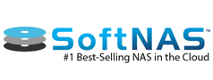

{{{
  "title": "Getting Started with SoftNAS Cloud File Gateway - Appliance",
  "date": "12-29-2015",
  "author": "<a href='https://twitter.com/KeithResar'>@KeithResar</a>",
  "attachments": [],
  "contentIsHTML": false
}}}

### Technology Profile
SoftNAS, LLC is a leading storage software company that provides Simply Powerful agile storage software that protects business data in the cloud.

SoftNAS is the #1 best-selling NAS in the cloud and believes that storage can be both powerful and frictionless, providing customers with the enterprise-grade, software-defined NAS storage required to safely and reliably operate business-critical IT systems and applications in the cloud.

http://www.softnas.com

##### Customer Support
| Sales Contact | Support Contact |
|:- |:- |
| sales@softnas.com (888) 801-7524 Option 1 &nbsp; | support@softnas.com (888) 801-7524 Option 4 [Support Web](https://www.softnas.com/wp/support/) |

### Description
SoftNAS has integrated their Cloud File Gateway and NAS technology with the CenturyLink Cloud platform, publishing their virtual appliance as a CenturyLink Cloud Partner Template. The purpose of this KB article is to help the reader take advantage of this integration to achieve rapid time-to-value for this encryption solution.

For more information including white papers and data sheets, please view the product information and documentation on [SoftNAS website](https://www.softnas.com/wp/support/documentation/).

### Solution Overview
SoftNAS Cloud is an enterprise-grade, full-featured cloud NAS filer and cloud storage gateway. Safely migrate business-critical applications to the CenturyLink Cloud without a physical storage appliance. Quick and easy to deploy, any IT professional can install and configure SoftNAS in minutes without specialized training. High-availability is included at no extra cost for CenturyLink Cloud users who deploy the two requisite instances.

SoftNAS Cloud runs as a Linux-based, 64-bit CentOS redistribution guest OS, treated as a VM in a virtual server environment. In many use cases, storage devices are attached to the physical hardware layer, then presented to SoftNAS Cloud as a VM running Linux.

SoftNAS Cloud operates on an industry-standard Linux platform, and uses a derivative of the Zettabyte File System (ZFS). This makes SoftNAS Cloud able to leverage many ZFS features and add layers of functionality for NAS solutions in virtual computing and cloud computing.

An Apache web server provides robust, secure access along with Secure Shell (SSH). Storage is accessible via TCP/IP protocols including NFS v3, NFS v4, SMB/CIFS (Microsoft Windows File Shares), and iSCSI.

SoftNAS Cloud is packaged with a primary administration interface called SoftNAS StorageCenter, which provides commercial-grade storage administration and management functionalities for businesses of all sizes.

SoftNAS Cloud File Gateway is now available for CenturyLink Cloud Users to deploy to their account. The SoftNAS appliance comes with a free trial that let's you use up to 100GB without having to purchase a license. In order to purchase a license or entitlement, please visit https://www.softnas.com/wp/pricing/ or contact sales@softnas.com

### Key Features
* NFS, CIFS and iSCSI support
* Connects to popular Cloud Storage services
* 99.999% reliability with cross-zone high-availability with SNAP HA(tm)
* Cross-region block replication with SnapReplicate(tm)
* Active Directory integration
* Compression, deduplication, thin-provisioning
* Easy set-up and configuration wizards, intuitive admin interface (StorageCenter)

### Audience
CenturyLink Cloud Users, Storage Administrators, IT Managers

### Prerequisites
* Access to the CenturyLink Cloud platform as an authorized user
* Control Portal account with password authentication (two-factor authentication not yet supported)
* Your network must have internet access. Specialized networks unable to complete setup via runner will require a service task to be completed.

### Steps to Deploy a New SoftNAS Appliance

1. **Locate the Appliance in the Runner Catalog**

 Starting from the CenturyLink Control Panel, navigate to Orchestration > Runner. Search for "SoftNAS" in the keyword search on the right side of the page.

2. **Click the SoftNAS tile.**

3. **Set Deployment Parameters.**

  * Specify the Datacenter, Network and Server Group you'd like to use.

  * Optionally customize the Name Prefix for the server.
  
  * Designate any additional storage desired

  * Provide your login credentials for Account Alias, Username and Password

4. **Click Run**

  Once verified, click on the **run** button. You will see the deployment log scrolling through.

   * **Note**: if you access the appliance via the Control Portal, it will report that it is an Ubuntu operating system. This is not accurate; the build process layers the appliance over the Ubuntu OS and modifies it to the operating system required by the appliance. This is expected behavior, and does not affect the operations of the appliance.
   
5. Adding Storage To Your Appliance.
   * Additional storage can be allocated at the time of deployment as noted above.
   * If additional storage is desired after initial deployment please [submit a support request](../../Support/how-do-i-report-a-support-issue.md) to reassign the /boot disk to 0:0
     * The method of deployment for the appliance results in /boot being assigned to disk 0:1
     * Without reassignment of the /boot disk to 0:0, adding a new disk in the Control Portal will result in the new disk being assigned to 0:0. Upon reboot the appliance will attempt to boot from the new disk 0:0.
   * After the support request is completed to reasign the /boot disk, add storage to the SoftNAS VM by using Control Portal.
     * Navigate to the SoftNAS server in the Control Portal.
     * Click on Edit Storage button.
     * Add a Partition and size appropriately.
     * Click the Save button.
     * Wait for the storage to be added.
   * Login to the SoftNAS Cloud Gateway and configure the new storage.

6. Accessing Your Appliance.
   * Access your appliance by navigating to the server's private IP address with your web browser over https (e.g. https://youripaddress/).
   * Login to the SoftNAS web console with the username `softnas` and password `Pass4W0rd`
   * Follow the on-screen instructions to accept the SoftNAS user agreements and proceed to using the service. Documentation is available within the application, as well as a helpful checklist to get started.
   * Add storage to the SoftNAS VM by using Control Portal.
     * Navigate to the SoftNAS server in the Control Portal.
     * Click on Edit Storage button.
     * Add a Partition and size appropriately.
     * Click the Save button.
     * Wait for the storage to be added.
   * Login to the SoftNAS Cloud Gateway and configure the new storage.

   * For more information on how to use the SoftNAS solution, please visit: [http://www.softnas.com/support/](http://www.softnas.com/support/)

7. Allowing Access from Public Internet (optional).
   * [Allow incoming traffic](../../Network/how-to-add-public-ip-to-virtual-machine.md) for ports below:
   * For administrative access and use, open the following ports:
     * TCP Ports: 443
     * UDP Ports: 1
     * ICMP: All

   * For CIFS Sharing, open the following ports:
     * TCP 137, 138, 139, 445
     * TCP 389 for Active Directory
     * TCP 445 for NetBIOS Post-Windows 2000 (CIFS)
     * TCP 901 for SWAT

   * For NFS Sharing, open the following ports:
     * TCP 111, 2010-2014, 2049
     * UDP 111, 2010-2014, 2049

   * For iSCSI Sharing, open the following ports:
     * TCP 3260

### Pricing
The costs listed above in the above steps are for the infrastructure only. After deploying this Blueprint, you may secure entitlements to the technology using the following steps:
* Email: sales@softnas.com

### Frequently Asked Questions
**Where do I obtain my license?**
Existing CenturyLink Enterprise Customers can contact their Account Representative for help obtaining a SoftNAS license, or contact SoftNAS directly:
* Contact SoftNAS Sales via Email: [sales@softnas.com](mailto:sales@softnas.com)
* Contact SoftNAS Sales via Phone: 1-888-801-7524, Option 1

**Who should I contact for support?**
* For issues related to accessing the SoftNAS partner template, setup of devices, volumes, pools or high availability, or for any licensing concerns, please visit the SoftNAS Support Website: http://www.SoftNAS.com/support
* For issues related to cloud infrastructure, please open a ticket using the [CenturyLink Cloud Support Process](../../Support/how-do-i-report-a-support-issue.md).

**What components are included in the SoftNAS licensing or entitlements?**
Customers are provided access to the SoftNAS virtual Appliance and support service for the software. Clients are still responsible for CenturyLink Cloud infrastructure services (compute, memory, storage, support, etc.) on top of the SoftNAS Licensing and support services. These are not bundled with SoftNAS services or products.
