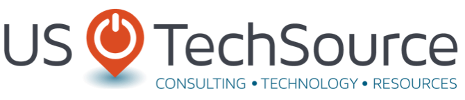
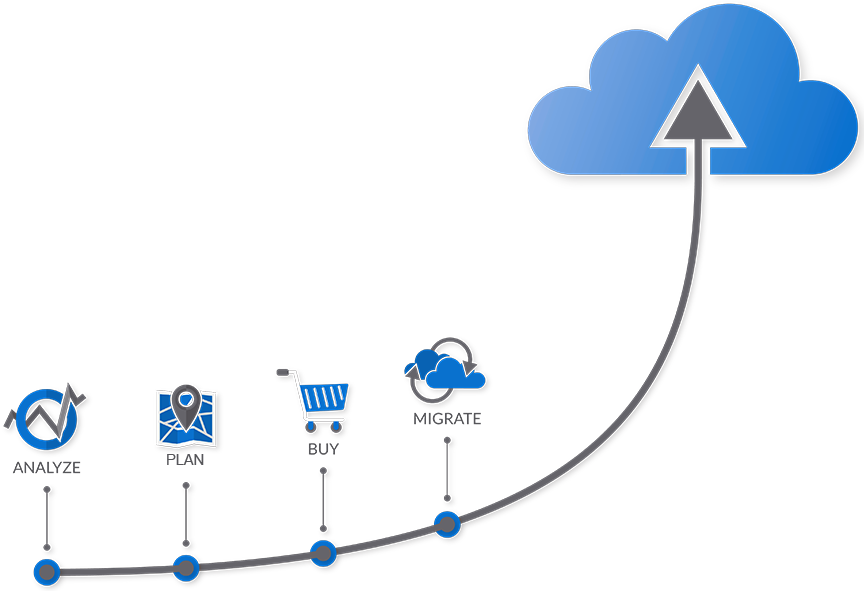
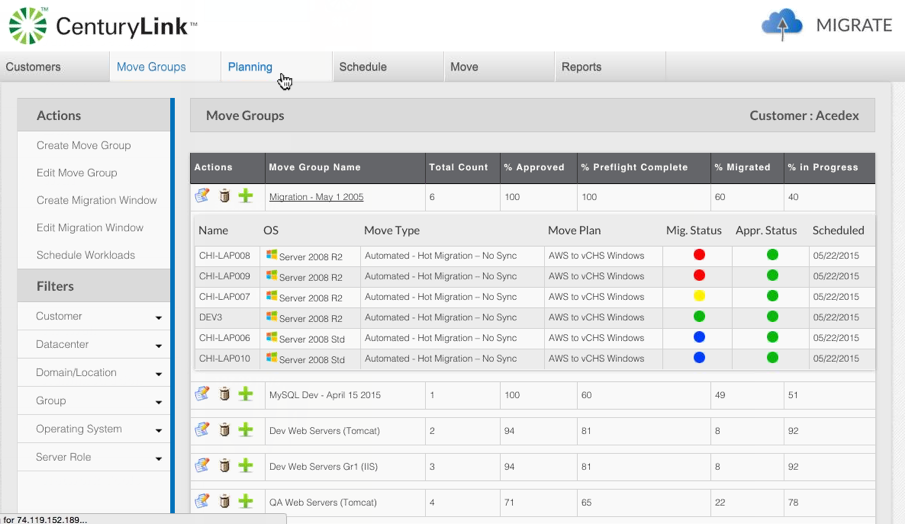

{{{
  "title": "Getting Started With US Techsource StratoZone",
  "date": "12-02-2015",
  "author": "<a href='https://twitter.com/KeithResar'>@KeithResar</a>",
  "attachments": [],
  "contentIsHTML": false
}}}

### Technology Profile

StratoZone provides end-to-end cloud migration services including discovery, classification, scheduling, and the migration itself.

http://www.ustechsource.com/
##### Customer Support
| Sales Contact |
|:- |
| info@ustechsource.com |

### Description
The StratoZone platform delivers an end-to-end solution from initial engagement to migration of customer assets into the Lumen Cloud environment. Through automation of data collection, end-state design, provisioning, migration planning and migration execution, we provide a low-touch, highly efficient automated processing including planning, onboarding and the actual migration.

StratoZone® CP reduces the complexity and level of manual effort through end-to-end automation, reducing the per-workload cost to customers by over 60%.

As a cloud-based solution, StratoZone® CP provides role-based access to the cloud provider, customers, channel partners, and third party services firms that may be involved in a customer migration effort. This creates a single environment for all of the customer information, workflows, project management, and migration tracking. All of the parties have interactive, real-time access to their necessary information, reports, data and dashboards.

### Steps to Access
For more information on US TechSource's StratoZone tooling, please visit: http://www.ustechsource.com/stratozoneustech.aspx.

### Frequently Asked Questions

**Where do I obtain my license?**
Contact US TechSource at info@ustechsource.com

**Who should I contact for support?**
* For issues related to using StratoZone email info@ustechsource.com.
* For issues related to cloud infrastructure, please open a ticket using the [Lumen Cloud Support Process](../../Support/how-do-i-report-a-support-issue.md).
