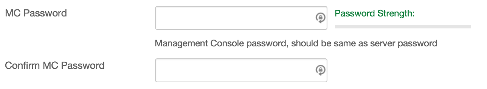

{{{
  "title": "Getting Started with SUREedge - Blueprint",
  "date": "9-24-2015",
  "author": "<a href='https://twitter.com/KeithResar'>@KeithResar</a>",
  "attachments": [],
  "contentIsHTML": false
}}}

### Overview

After reading this article, the reader should feel comfortable deploying the Pivotal Cloud Foundry (PCF) 1.5.5 on CenturyLink Cloud.

### Technology Profile

Sureline Systems Inc. is the provider of SUREedge, an Application Mobility Solution for Disaster Recovery (DR) and Migration that is Hardware Agnostic, Hypervisor Agnostic, and Cloud Agnostic. Sureline is the only company that fundamentally solves the problem of Any-to-Any DR and Migration, enabling seamless data migration and DR from any environment – physical or virtual – to CenturyLink Cloud.  By partnering with CenturyLink, SUREedge brings your enterprise Cloud strategy to life. 

Sureline provides the technology and solution for:

* **Onboarding/Migration to CenturyLink Cloud**
* **Disaster Recovery to CenturyLink Cloud **

SUREedge technology allows CenturyLink customers to rapidly migrate workloads from any physical or virtual system(s) into the CenturyLink Cloud, or use the CenturyLink Cloud as a DR site.

##### Customer Support

|Sales Contact   	|
|:-	|
|info@surelinesystems.com   	|

### Description

To use SUREedge for DR or onboarding to the Cloud, you must run an instance of SUREedge both on-prem and on-CenturyLink Cloud.   The on-prem instance provides the capability to capture and dedupe-replicate applications and data, while the on-cloud instance acts as the receiver, storage and recovery manager in the Cloud.

To create the in on-Cloud instance, use either of these two blueprints:

* SUREedge Migrator:  Use this for onboarding/migration to CenturyLink Cloud
* SUREedge-DR:  Use this for DR CenturyLink Cloud

To download and create the on-prem instance, go to [http://www.surelinesystems.com/centurylink/](http://www.surelinesystems.com/centurylink/)

### Audience

CenturyLink Cloud Users desiring: 
* Onboarding/Migration to CenturyLink Cloud
* Disaster Recovery to CenturyLink Cloud 

### Impact

After reading this article, the user should be able to:
* Install SUREedge cloud instance within CenturyLink Cloud
* Download and install on-prem SUREedge instance
* Configure on-prem and on-cloud instances
* Add clients for migration or DR 
* Create plans for migration and DR
* Execute migration/DR plans

### Prerequisites

* Access to the CenturyLink Cloud platform as an authorized user
* Resources for running the on-prem SUREedge instance

### Postrequisites

* None

### Deploying SUREedge

You can achieve a single-button deployment of a new Cloud Foundry using CenturyLink Cloud Blueprints.  

#### Deciding Which Blueprint to Use

There are two SUREedge blueprints available: 
* SUREedge Migrator:  Use this for onboarding/migration to CenturyLink Cloud
* SUREedge DR:  Use this for DR to CenturyLink Cloud

#### Steps to Deploy a New SUREedge Blueprint

1. **Locate the Blueprint in the Blueprint Library**

 Starting from the CenturyLink Control Panel, navigate to the Blueprints Library. Search for "SUREedge" in the keyword search on the right side of the page.
 Select either **Sureedge Migrator** or **SUREedge DR** depending on use case

  

2. **Click the Deploy Blueprint button.**

3. **Set Required parameters.**

  

  * **MC Password** - Repeat the root administrator credentials already given for the server

4. **Set Optional Parameters**

  Password/Confirm Password (This is the root password for the server. Keep this in a secure place).  

  Set DNS to “Manually Specify” and use “8.8.8.8” (or any other public DNS server of your choice).

  Optionally set the server name prefix.

  The default values are fine for every other option.

5. **Review and Confirm the Blueprint**

6. **Deploy the Blueprint**

  Once verified, click on the **deploy blueprint** button. You will see the deployment details stating the Blueprint is queued for execution.

7. **Deployment Complete**

  Once the Blueprint has finished execution you will receive an email confirming the newly deployed assets within a few minutes.  If you do not receive an email like the one shown below you may have had a deployment error - review the *Blueprint Build Log* to for error messages.

8. **Complete On-Premises SUREedge Component Installation**

 * To download the software go to [http://www.surelinesystems.com/centurylink/](http://www.surelinesystems.com/centurylink/).
 * Login to the your account in Sureline or register if you are new.
 * Download the software.  (The software is installed as a VM on any popular VM infrastructure.)
 * NOTE:   
  * Review the capacity planning guide to help size the SUREedge VM.
  * Your license file will be sent by email to you by Sureline team.
 * Once installed, the two instances of the SUREedge must be linked.
 * You can then add client systems, create plans for migration and DR and execute the plans.

### Pricing

The costs listed above in the above steps are for the infrastructure only.

After deploying this Blueprint, you may secure entitlements to the technology using the following steps:

 * Email: info@surelinesystems.com

### Frequently Asked Questions

**Where do I obtain my license?**

Contact info@surelinesystems.com.

**Who should I contact for support?**

* For issues related to deploying SUREedge, visit [Sureline Support](http://www.surelinesystems.com/support/).
* For issues related to cloud infrastructure, please open a ticket using the [CenturyLink Cloud Support Process](../../Support/how-do-i-report-a-support-issue.md).

