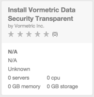
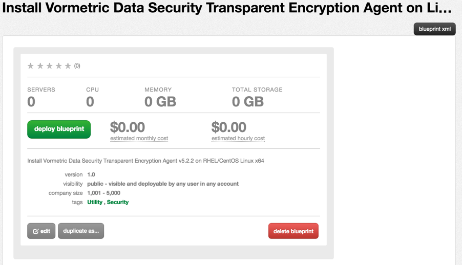
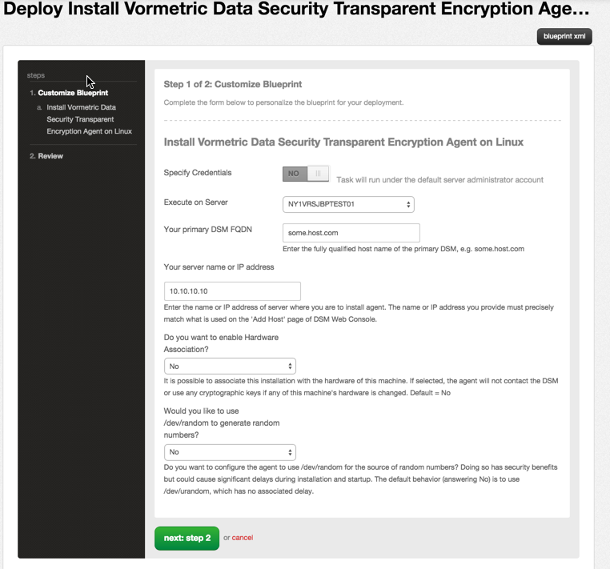
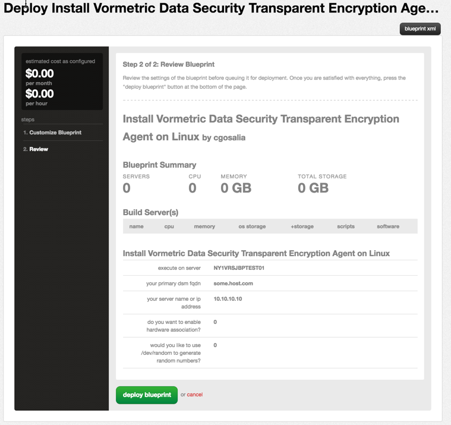

{{{
  "title": "Getting Started with Vormetric Encryption Agent Deployment - Blueprints",
  "date": "5-31-2015",
  "author": "Bob Stolzberg and Chintan Gosalia",
  "attachments": [],
  "contentIsHTML": false
}}}

### Partner Profile
A leader in data security solutions, Vormetric (@Vormetric) protects data-at-rest in physical, virtual, big data and cloud environments. Trusted by businesses and governments for over a decade, Vormetric’s Data Security Platform secures the data of more than 1,500 global enterprises—including 17 of the Fortune 30. With Vormetric, a single infrastructure and management environment protects data wherever it resides with file, volume and cloud storage encryption, tokenization with dynamic data masking, field-level application encryption, sophisticated access control policies, third party and integrated encryption key management.

Vormetric has partnered with CenturyLink to deliver and certify the Vormetric data-at-rest security solution on the CenturyLink Cloud platform.

[http://www.Vormetric.com](http://www.Vormetric.com)

#### Contact Vormetric
##### Vormetric Sales and Support:
- 24x7 Email Support - [support@vormetric.com](mailto:support@vormetric.com)
- 24x7 Telephone Support - (877) 267-3247
- Sales and Marketing - [centurylink@vormetric.com](mailto:centurylink@vormetric.com)

### Description
Vormetric has integrated their Encryption Agent technology with the CenturyLink Cloud platform by enabling users to install Vormetric agents via Blueprints.  The purpose of this KB article is to help the reader take advantage of this integration to achieve rapid time-to-value for this encryption solution.

Together, Vormetric and CenturyLink deliver data-centric security services that encrypts sensitive customer data and centralizes encryption key management and policy control for data-at-rest encryption, privileged user access control and value security intelligence to meet customer’s business and compliance requirements.

The Data-centric Security-as-a-Service (DSaaS) solution enables IT organizations to efficiently deploy data-centric security across CenturyLink Partner Templates with the Vormetric Transparent Encryption SW agents and the Vormetric Data Security Manager products.  Now, IT security managers can define what files and folders are restricted, who is allowed to view the data, when access is allowed and what operations can be performed by the individual or group.  With the Vormetric data security solution, businesses now reduce their data breach risk, guard against unauthorized data access, meet executive data privacy business requirements and satisfy security compliance regulations that govern your market.

Below is a solution diagram illustrating the Data Security Manager (DSM) deployment options available from the [CenturyLink Cloud Partner Template](https://www.ctl.io/knowledge-base/ecosystem-partners/getting-started-with-vormetric-dsm/).

### Offer
Vormetric is making their encryption agent technology available for CenturyLink Cloud Users to deploy to their VMs.  In order to purchase a license or entitlement, please contact [centurylinkcloud@vormetic.com](mailto:centurylinkcloud@vormetic.com)

### Audience
CenturyLink Cloud Users, IT Managers, IT Security Manager, CSO, CISO

### Impact
After reading this article, the user should feel comfortable getting started using Vormetric Agent Blueprints on CenturyLink Cloud.

### Prerequisite
- Access to the CenturyLink Cloud platform as an authorized user.
- The VM(s) you deploy the Agents to need to have network access to the Vormetric DSM host

### Postrequisite
- Validate your DSM registered the new agent

### Deploy Vormetric Agent Installation Blueprint
Follow these step by step instructions to deploy the Vormetric Agent to an existing server.

1.    **Locate the Vormetric Blueprint in the Blueprint Library**
  1. Starting from the CenturyLink Control Panel, navigate to the Blueprints Library.
  2. Search for “Vormetric” in the keyword search on the right side of the Blueprints Library page as shown in the image below.
  3. Locate the Vormetric "Install Vormetric Data Security Transparent Encryption Agent on Linux"

  

2. **Choose and Deploy the Blueprint. Click the “Install Vormetric Data Security Transparent Encryption Agent on Linux” Blueprint.**
- Click on the "Deploy Blueprint" green button.

  

3. **Configure the Blueprint**
Complete the information below:

  1. Your primary DSM FQDN - Enter the fully qualified host name of the primary DSM, e.g. some.host.com
  2. Your server name or IP address - Enter the name or IP address of server where you are to install agent. The name or IP address you provide must precisely match what is used on the 'Add Host' page of DSM Web Console.
  3. Do you want to enable hardware association? Default = No
  4. Would you like to use /dev/random to generate random numbers?  Default = No

  

4. **Review and Confirm the Blueprint**
1. Click “next: step 2”
2. Verify your configuration details.

  

5. **Deploy the Blueprint**
1. Once verified, click on the ‘deploy blueprint’ button. You will see the deployment details along with an email stating the Blueprint is queued for execution.
2. This will kick off the blueprint deploy process and load a page to allow you to track the progress of the deployment.

6. **Monitor the Activity Queue**
* Monitor the Deployment Queue to view the progress of the blueprint.
* You can access the queue at any time by clicking the Queue link under the Blueprints menu on the main navigation drop-down.
* Once the blueprint completes successfully, you will receive an email stating that the blueprint build is complete. Please do not use the application until you have received this email notification.

### Access and Configure the Vormetric Agent
Follow these steps to access and configure the Voretric Agent application

1.    Access the Agent VM
- Connect via SSH to the target VM you deployed the Blueprint on
- To validate the Vormetric Agent is properly installed and running, run the command `vmd -d`
- To manually configure the Vormetric agent, please [follow the instructions on the Vormetric support website](http://www.Vormetric.com)

### Pricing
The costs associated with this Blueprint deployment are for the CenturyLink Cloud infrastructure only.  There are no Vormetric license costs or additional fees bundled in.

### Frequently Asked Questions

#### Where do I obtain my Vormetric License or entitlements?
Existing CenturyLink Enterprise Customers can contact their Account Representative for help obtaining a Vormetric license, or contact Vormetric directly:
-   Contact Vormetric Support via telephone: (877) 267-3247
-   Contact Vormetric via their website: [http://www.Vormetric.com](http://www.Vormetric.com)
-   Email Sales via [centurylink@vormetric.com](mailto:centurylink@vormetric.com)

#### Who should I contact for support?
* For issues regarding the Vormetric DSM virtual appliance, please contact Vormetric via their Support Website: [http://www.Vormetric.com](http://www.Vormetric.com)
* For issues related to cloud infrastructure (VM’s, network, etc), or is you experience a problem deploying the Blueprint, please open a CenturyLink Cloud Support ticket by emailing [noc@ctl.io](mailto:noc@ctl.io) or [through the support website](https://t3n.zendesk.com/tickets/new)

#### What is the performance impact of Vormetric encryption?
Vormetric customers typically report no perceptible impact to the end-user experience. In almost every case, the impact of encryption overhead is minimal so IT teams can continue to meet their SLAs. In a benchmark conducted with Intel, Vormetric Transparent Encryption demonstrated under 2% performance overhead at 70% system utilization.

#### How difficult is it to deploy Vormetric?
With Vormetric Transparent Encryption, securing data is easy.  Unlike other encryption offerings, this product enables security teams to implement encryption, without having to make changes to their organization’s applications, infrastructure, or business practices. Plus, Vormetric Data Security Manager offers centralized, highly efficient policy and key administration.

#### What operating systems are supported?
Vormetric solutions provide support for a broad range of operating systems, including Microsoft Windows, Linux, Solaris, IBM AIX and HP-UX.

#### What deployment models are supported?
Through the platform’s centralized policy and key management, customers can efficiently address security policies and compliance mandates across databases, files and big data nodes – whether they’re located in the cloud (or in virtual or traditional) infrastructures.
