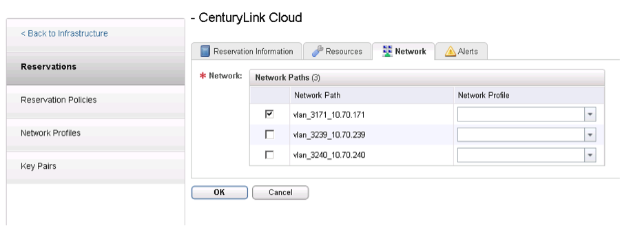
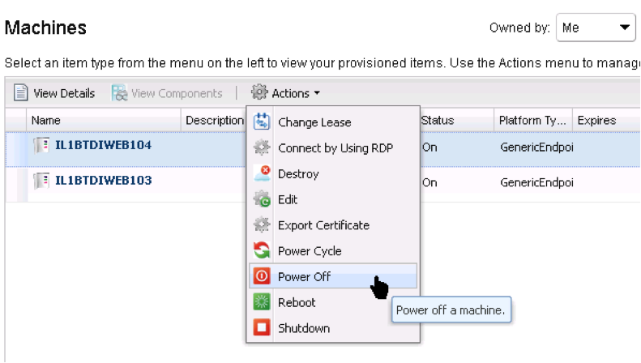
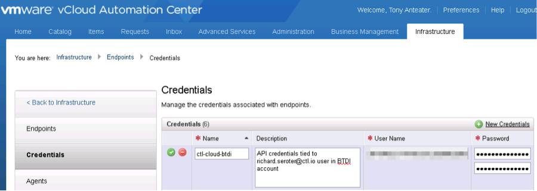
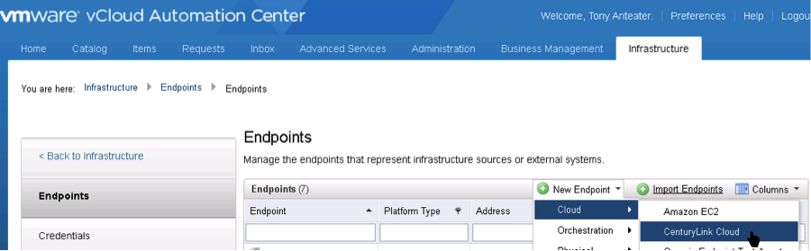
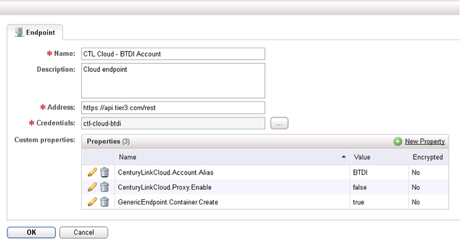
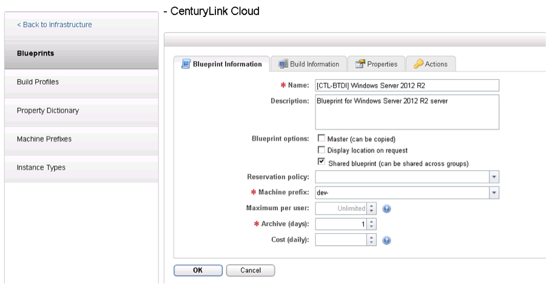
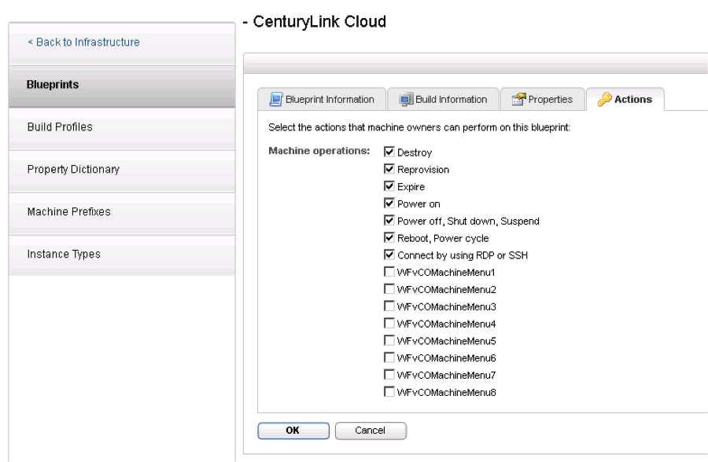
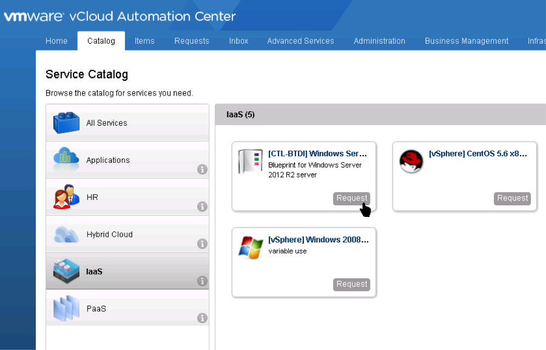
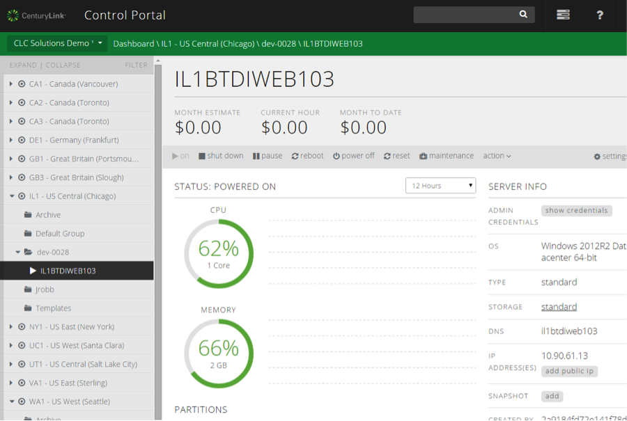

{{{
  "title": "Getting Started with vRealize 6.1 (formerly vCAC) for Lumen Cloud",
  "date": "12-16-2014",
  "author": "Jared Ruckle",
  "attachments": [],
  "contentIsHTML": false
}}}

*Updated 17 Dec 2014 by David Shacochis*

### vRealize Lumen Cloud

[vRealize](http://www.vmware.com/products/vrealize-suite/)(formerly vCloud Automation Center, or vCAC) is a cloud management platform that enables users to perform functions against VMware vSphere, other hypervisors, and select public clouds. vRealize gives IT pros:
* A self-service portal for building and managing virtual infrastructure
* An orchestration tool for designing multi-tier applications
* Policy-based controls for permissions, approvals, and capacity management
* Auditing and logging of management activities
* Cross-environment visibility from a single user interface

With its most recent release, VMware has built a vRealize “endpoint” to Lumen Cloud. This endpoint uses the Lumen Cloud API to provide basic creation and “day 2” management activities. Specifically vRealize offers the following capabilities for Lumen Cloud:
* **VM Creation** - Create VMs using host reservations. Host reservations allow you to create VMs while taking into account per data center OS templates, networks and capacity limits.
* **Data Collection** - Retrieves the list of data centers, available networks, available OS templates, public IP addresses in use, Server Groups, and virtual machines.
* **Display Inventory and Day 2 Operations** - Show servers and their current run state and power commands like power on, power off, reboot, reset, and shutdown.
* **Connect via RDP/SSH** - Connect to servers via private IP address.

For Lumen customers who have built custom private clouds using VCE or hybrid solutions with vCloud air, vRealize provides a seamless integration point for extending deployments to the Lumen Cloud. Likewise, VMware customers looking to extend their hybrid footprint into the Lumen Cloud can leverage vRealize to manage their Lumen Cloud virtual machines.

The vRealize endpoint for Lumen Cloud was created by VMware. As such, VMware will perform all ongoing support related to the integration. vRealize has a plug-in architecture that supports 3rd party [management packs](http://www.vmware.com/files/pdf/vrealize/vmware-vrealize-operations-management-packs-wp-en.pdf).

To enable the Lumen Cloud endpoint within vRealize, please reach out to your VMware sales representative.

### FAQs – vRealize Endpoint
**Q: What are the capabilities of the endpoint?**
**A:** The vRealize endpoint can do the following operations in the Lumen Cloud:
* **Data Collection** - The endpoint interrogates the platform and retrieves the list of data centers, available networks, available OS templates, public IP addresses in use, Server Groups, and virtual machines.
* **Host Reservations** - Create reservations per DC that take into account OS templates, networks, and capacity limits.

  

* **Display Inventory** - Show servers and their current run state.
* **Day 2 Operations** - Includes power operations like power on, power off, reboot, reset, and shutdown.

  

* **Connect via RDP/SSH** - Connect to servers via private or public IP address (not recommended).
* **VM Creation** - Create new, unmanaged VMs using host reservations and the vRealize concept of Blueprints.

**Q: How do I get this installed in my vRealize environment?
A:** Lumen will provide customers the installation components, and customers either partner with VMware or follow their instructions for installing the endpoint into their vRealize environment.

**Q: What version of vRealize does this work with?
A:** This endpoint only works with vRealize 6.1.

**Q: How do customers authenticate vRealize with the Lumen Cloud?
A:** Customers use API credentials from the Control Portal.

**Q: How does the endpoint show up for Lumen Cloud customers?
A:** The endpoint appears under “cloud endpoints” in the management portal.

**Q: Does the vRealize adapter work across a Lumen Cloud account hierarchy?
A:** A vRealize “endpoint” is tied to a specific account. Customers can create multiple endpoints to map to each of their sub-accounts.

**Q: Can customers execute Lumen Cloud Blueprints using the endpoint?
A:** No, the endpoint has no knowledge of Lumen Cloud Blueprints, and the vRealize system has their own concept of orchestration capabilities (which is also named Blueprints). A vRealize Blueprint uses reservations to define a build process for customers.

**Q: How do vRealize Blueprints pick which data center to deploy a server to?
A:** By default, a Blueprint will use an algorithm to choose which reservation (identified by an OS template and data center) to apply. If the customer wants to pin the server to a particular data center, they define a Reservation Policy and apply that to the Blueprint.

**Q: Can I create a managed server using this endpoint?
A:** No, this endpoint uses the Lumen Cloud v1 API that has no awareness of managed servers.

**Q: Does the endpoint let me manage servers that I created outside of the vRealize interface?
A:** No, vRealize just knows about – and manages – the servers that it has created.

**Q: Can I use a custom template with vRealize, or just the out of the box OS templates?
A:** vRealize retrieves all the available templates for an account and data center, including custom ones.

**Q: Q: Can I resize a server using the vRealize interface?
A:** No, servers cannot be resized using this version of the endpoint.

**Q: Can customers choose which operations they want to let administrators perform on a server?
A:** Yes, the vRealize Blueprint lets the designer choose the available actions.

**Q: How do customers provision new machines?
A:** Once a Blueprint is created and published in vRealize, users can access them via a Service Catalog. At deploy time, the user may have some choices about the size and storage of a server.

**Q: What does Control look like when a server has been provisioned by vRealize?
A:** Control shows the server as always, but puts each server into its own Group that vRealize knows about.

**Q: What vRealize-specific features help Lumen Cloud customers?
A:** vRealize adds some policy management that the Control Portal doesn’t have. For instance, certain operations can be set up for an approval workflow to prevent accidental or unauthorized activities. vRealize also supports the concepts of “leases” where a server is discarded after a certain period of time, and, through configurable archive properties, can remain available for a few remaining days. This encourages proper IT-as-a-Service thinking, while providing an escape valve for mistakenly deleted machines.
