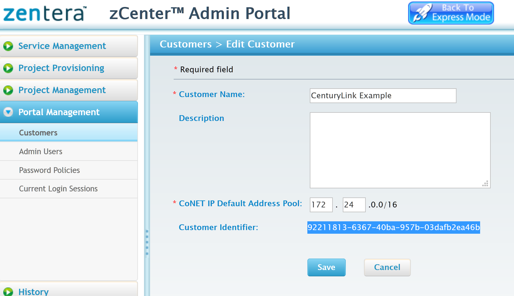
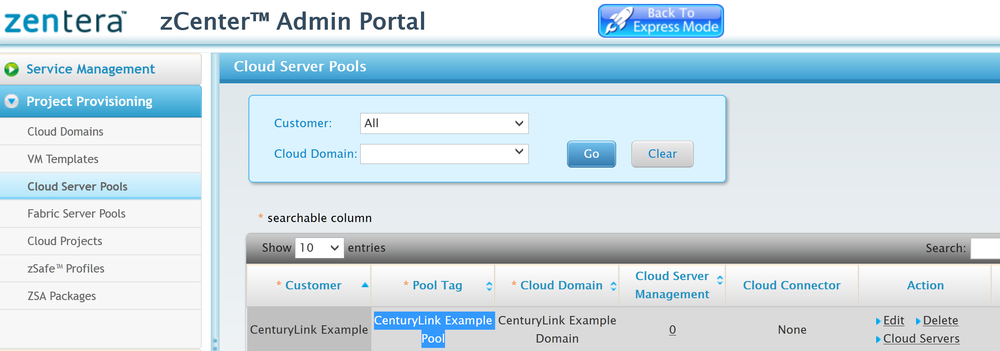
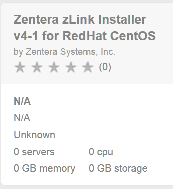
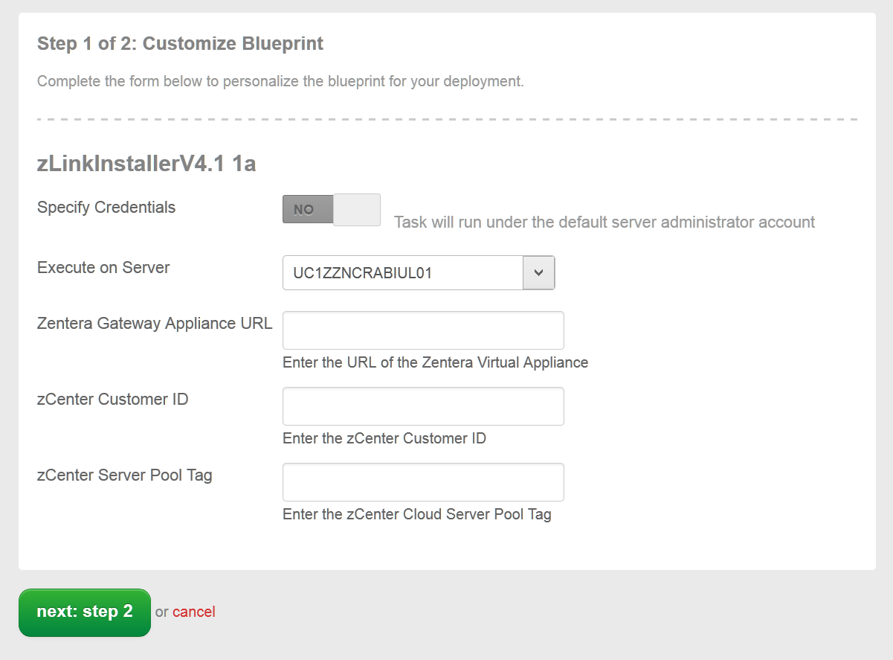
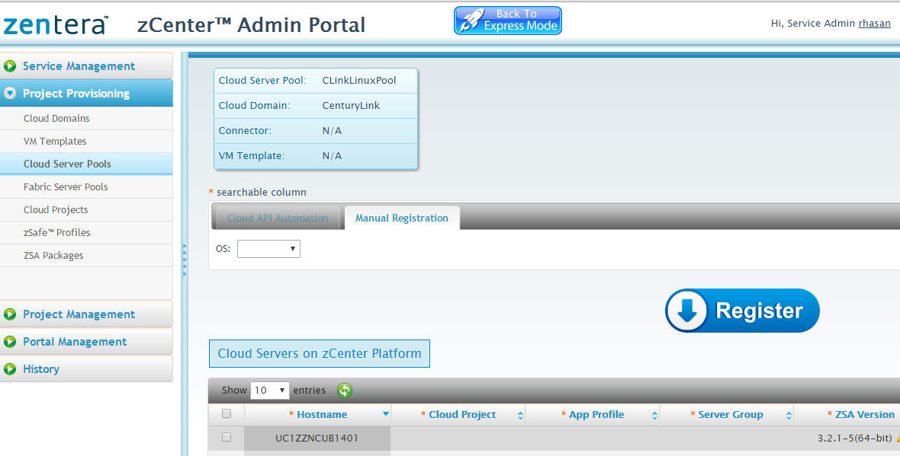

{{{
  "title": "Getting Started with Zentera CoIP",
  "date": "2016-01-28",
  "author": "Zentera Systems, Inc.",
  "attachments": [],
  "contentIsHTML": false
}}}

## Technology Profile
Zentera Systems, Inc., enables companies to secure production datacenter operations across public, private and managed hosted network domains.The Zentera CoIP secure networking platform for the cloud ecosystem creates a unified network plane across multiple private and cloud domains, connecting dispersed endpoint servers, virtual machines and containers. The CoIP platform offers enterprise-grade security for hybrid networks, connecting and protecting corporate compute resources while shielding applications and data deployed in on-premises and managed hosting environments as well as the public cloud. CoIP can be provisioned in hours over the existing IP infrastructure and does not require any infrastructure change.
[http://www.zentera.net](http://www.zentera.net)

## Description ##
The Zentera CoIP cross-cloud session network platform defines, provisions, secures and manages cloud overlay networks. It enables cloud endpoints to instantly and securely connect to one another across distributed and fragmented cloud environments as if they were a single private network. CoIP leverages underlying network infrastructure to enable hybrid cloud without requiring or making any changes to the underlying IP networks. CoIP can connect corporate data centers to public and private clouds, enable on-demand networking for cloud computing bursts, support rapid datacenter network migration and allow existing corporate authentication to operate across cloud domains.

## Solution Overview ##
The CoIP platform runs on a network appliance, available either as a virtual appliance. The CoIP platform includes the zCenter, zLInk, zChamber, CoIP LAN and CoIP WAN software components.

The Zentera CoIP platform offers the following benefits:
* Enterprise-controlled virtual network across cloud ecosystems
* High-performance overlay virtual network
* Extremely fast implementation within days/weeks not months/year

**zCenter** - The web management portal for Zentera's CoIP platform

**zLink** - Zentera software controller that runs on CoIP endpoints

**zChamber** - Software-based cloud firewall system that automatically provisions secure chambers in multi-tenant cloud environments and enterprise data centers.

**CoIP LAN and WAN** - CoIP supports dynamically provisioned virtual LAN and WAN using private routing with any public or private IP addresses and using the underlying datacenter networks as the high-speed forwarding fabric with optional transport encryptions.

## Audience ##
CenturyLink Cloud Customers

## Impact
After reading this KB, the user should feel comfortable getting started using Zenera CoIP on CenturyLink Cloud.

## Prerequisites
* Access to the CenturyLink Cloud platform as an authorized user
* [Create a New VM](https://www.ctl.io/guides/servers/create-a-custom-server/ "Create a New  VM") if you don't have an existing VM.
* Enable port `22` and `443`. Port `22` can be disabled after the Blueprint has been successfully installed.
* Zentera currently supports RedHat, CentOS and Ubuntu in 64-bit mode only.

### Steps to Deploy the Zentera CoIP Blueprint:
1. Request a trial license at [http://www.zentera.net/try-it-now](http://www.zentera.net/try-it-now).
   * This will trigger Zentera to provision a Zentera Gateway Virtual Appliance (VA) for the your zCenter (CoIP web management portal).
   * Zentera will send you an email with your zCenter VA URL and your login credentials.

2. Log into zCenter (CoIP management portal) and Save the zCenter URL for Later Use with the Blueprint.
   * ave your zCenter URL. You will need it in a later step.
   * Log into your zCenter with the URL and credentials received from Zentera via email in Step 1.
   * **Note:** We recommend skipping the training videos until after you have completed this Blueprint. Also, if you see an Express Mode screen after you log in, click on the **Advanced Mode** button on the lower right to continue following these directions.

3. Create a Customer in zCenter and Save the Customer Identifier for Later Use with the Blueprint.
   * Click the **Portal Management** menu item on the left to begin.
   * Click **Customers** and create a customer by filling out the dialogue box, then click the **Save** button.
   * Find your customer and click on the **Edit** link.
   * Locate the Customer Identifier. Copy the Customer Identifier - a 32-character alphanumeric string - and save it into a text file. You will need it in a later step.

    

4. Create a Cloud Server Pool on zCenter and Save the Cloud Pool Tag for Later Use with the Blueprint.
   * Click the **Project Provisioning** menu on the left to begin.
   * Click on **Cloud Domains** and create a cloud domain: provide a Domain Name, select the Customer you just created from the drop-down list and set Cloud Connector to None, then click the **Save** button.
   * Click **Cloud Server Pools** and create a cloud server pool. Provide a Pool Tag, then select Customer and the Cloud Domain you just created from the drop-down lists. Then click the **Save** button.
   * Locate the Pool Tag and save it into your text file. You will need it later.
   

   * You can remain logged in. You will be returning to zCenter at the end of this Blueprint.

### Step to Deploy Blueprint on CenturyLink to Install CoIP zLink into Your Server (VM)
1. Locate the Zentera Blueprint from the CenturyLink Control Panel by selecting the green dashboard area on the top.
   * Select **Blueprints Library** and using the search function to locate the Zentera Blueprint.

2. Choose, Customize and Deploy the Zentera Blueprint.
   * lick on **Zentera zLink Agent Installer for RedHat, CentOS and Ubuntu**.
   

   * Click on **Deploy Blueprint**.
   * Select your server from the **Execute on Server** drop-down list.
   * From your text file, copy and paste the **Zentera Gateway Applicance URL** (your zCenter URL), **zCenter Customer ID** and **zCenter Cloud Server Pool Tag** into the dialogue box.
   

   * Click **Next Step 2**.
   * Review your information and click **Deploy Blueprint**.

3. Monitor the Deployment Queue for progress.
   * You can access the queue at any time by clicking the Queue link under the Blueprints menu on the main navigation drop-down.

6. Verification in zCenter of CoIP zlink Installation into Your Server.
   * Once the Blueprint completes successfully, verify that your server is registered on zCenter.
   * In your zCenter, click **Project Provisioning** then choose **Cloud Server Pools**.
   * Find your Pool Tag and click on its **Cloud Servers** link.
   * Verify that your VM is listed here.
   

## Post-Installation Note
If you want to access your CoIP web management portal, zCenter, from a computer that is outside of the CenturyLink Cloud network, you need to [add a public IP](https://www.ctl.io/knowledge-base/network/how-to-add-public-ip-to-virtual-machine/ "Add a Public IP") to your server through the CenturyLink Control Portal.

## Pricing
The costs associated with the Zentera CoIP Blueprint deployment are for the CenturyLink Cloud infrastructure only. The Zentera CoIP Proof of Concept (PoC) comes with 60-day trial license. For a production license, please contact: [ctl-sales@zentera.net](mailto:ctl-sales@zentera.net).

#### Frequently Asked Questions ####
#### Where do I obtain my License? ####
* Trial License:[http://www.zentera.net/try-it-now](http://www.zentera.net/try-it-now).
* Purchase license by sending email: [ctl-sales@zentera.net](mailto:ctl-sales@zentera.net).

#### Who should I contact for support? ####
* For issues related to deploying the Zentera CoIP on CenturyLink Cloud, please contact [ctl-support@zentera.net](mailto:ctl-support@zentera.net).
* For issues related to cloud infrastructure (VMs, network, etc.), or if you experience a problem deploying the Blueprint or Script Package, please open a CenturyLink Cloud Support ticket by emailing [noc@ctl.io](mailto:noc@ctl.io) or [through the CenturyLink Cloud Support website](https://t3n.zendesk.com/tickets/new).
