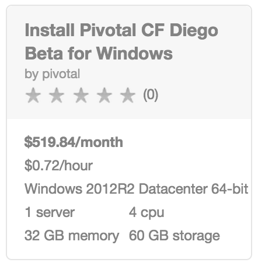
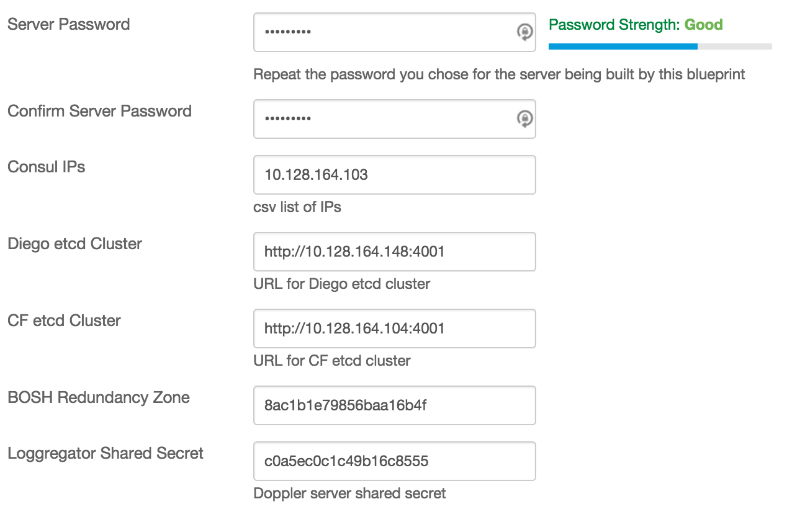

{{{
  "title": "How to Install Pivotal CF Diego Beta for Windows - Blueprint",
  "date": "9-25-2015",
  "author": "<a href='https://twitter.com/KeithResar'>@KeithResar</a>",
  "attachments": [],
  "contentIsHTML": false
}}}

### Overview

After reading this article, the user should feel comfortable adding Diego-based Windows Cell to an existing 
[Pivotal CF](getting-started-with-pivotal-cloud-foundry.md) environment on CenturyLink Cloud.

### Partner Profile

Pivotal Cloud Foundry – “Streamline application development, deployment and operations on a centrally-managed Platform as a Service for public and private cloud.”

http://pivotal.io/platform-as-a-service/pivotal-cloud-foundry

##### Customer Support

|Sales Contact      |
|:- |
|sales-clc@pivotal.io       |

### Description

Pivotal CF users wishing to deploy .NET-based apps can take advantage of the Diego Beta for Windows on CenturyLink Cloud.  As bosh is not yet able
to natively instrument Windows-based IaaS deployments there are some manual steps required to bring support into your existing PaaS.

This steps are outlined in this guide [Deploying Diego Beta for Windows](http://docs.pivotal.io/pivotalcf/opsguide/deploying-diego.html).
Following the steps below and this guide to collect the information necessary to complete and validate a successful install.

### Audience

CenturyLink Cloud Users who have already [deployed Pivotal Cloud Foundry](getting-started-with-pivotal-cloud-foundry.md) and need to add .NET support.

### Steps

1. **Login to your existing Operations Manager Instance**

  Capture the information requested in the [Deploying Diego Beta for Windows](http://docs.pivotal.io/pivotalcf/opsguide/deploying-diego.html) guide -
  The Blueprint executed in step (n) will need this data for successful deployment.

  * CONSUL_IPS
  * ETCD_CLUSTER
  * CF_ETCD_CLUSTER
  * REDUNDANCY_ZONE - Note that a bug exists where the password presented in the GUI is not correct.  Search for *username: rec* in the `/var/tempest/workspaces/default/deployments/p-diego-*.yml` file for the actual password
  * LOGGREGATOR_SHARED_SECRET - Note the secret is the first of two parameters listed

2. **Locate the Blueprint in the Blueprint Library**

  Starting from the CenturyLink Control Panel, navigate to the Blueprints Library. Search for "Pivotal Cloud Foundry" in the keyword search on the right side of the page.

  

  Starting from the CenturyLink Control Panel, navigate to the Blueprints Library. Search for “Pivotal Greenplum” in the keyword search on the right side of the page.

3. **Click the Deploy Blueprint button.**

4. **Set Required parameters.**

  

  * **Server Password** - Repeat the same password used for the server itself
  * All other parameters - reference [Deploying Diego Beta for Windows](http://docs.pivotal.io/pivotalcf/opsguide/deploying-diego.html) guide for how to obtain values for the other parameters

5. **Set Optional Parameters**

  Password/Confirm Password (This is the root password for the server. Keep this in a secure place).

  Set DNS to “Manually Specify” and use “8.8.8.8” (or any other public DNS server of your choice).

  Optionally set the server name prefix.

  The default values are fine for every other option.

6. **Review and Confirm the Blueprint**

7. **Deploy the Blueprint**

  Once verified, click on the `deploy blueprint` button. You will see the deployment details stating the Blueprint is queued for execution.

  This will kick off the Blueprint deploy process and load a page where you can track the deployment progress. Deployment will typically complete within 15 to 20 minutes.

8. **Deployment Complete**

  Once the Blueprint has finished execution you will receive an email confirming the newly deployed assets.  If you do not receive an email you may have had a deployment error - review the *Blueprint Build Log* to look for error messages.

### Frequently Asked Questions

