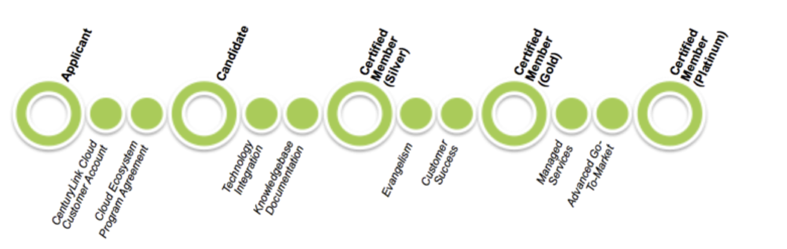

{{{
  "title": "CenturyLink Marketplace Provider Program Guide",
  "date": "03-31-2015",
  "author": "David Shacochis",
  "attachments": [],
  "stickyt": true,
  "contentIsHTML": false
}}}

### Description
This CenturyLink Marketplace Provider Program Guide is designed to outline the process expectations for technology companies seeking to integrate their products and services with CenturyLink Cloud.  Partners who enter this program and meet the certification requirements will be eligible to have their deployable technology listed in the CenturyLink Cloud Marketplace.  To express interest in joining the program, prospective partners can visit the CenturyLink Cloud [Marketplace Provider Program](//www.ctl.io/marketplace/program) web page or send email to [ECOSystem@centurylink.com](mailto:ECOSystem@centurylink.com).

### Audience
* CenturyLink Cloud Marketplace Applicant, Candidate and Provider firms
* CenturyLink Cloud Customers
* CenturyLink Employees

### CenturyLink Marketplace Provider Program
The CenturyLink Marketplace Provider Program is designed to provide additional value within CenturyLink’s enterprise cloud computing platform through partnerships with innovative cloud technology and service providers. By integrating their technology into CenturyLink Cloud, our technology partners can take advantage of a differentiated, digital route-to-market: presented as part of a enterprise-grade automation platform which powers one of the largest pools of IT infrastructure in the world.

This document explains the process for onboarding technology into the CenturyLink Marketplace Provider Program, and how progressively successful outcomes can be achieved in partnership with CenturyLink.

### Joining The Marketplace Provider Program

Entry into the Marketplace Provider Program consists of two primary steps: **Application** and **Certification**. Once a potential technology is identified, the company is classified as an Applicant. Once a company becomes a Customer of CenturyLink Cloud, they accept the Marketplace Provider Program Supplemental Terms.  Upon engaging with the [Ecosystem team](mailto:ECOSystem@centurylink.com), validating an integration strategy, the Applicant is referred to as a Candidate. Once the solution is certified, the Candidate becomes a **Certified Provider**.

### Application

Applications to the Program will be reviewed as they are received by the CenturyLink Cloud Ecosystem team with consideration given to the following items:

* The value proposition and/or financial benefit the feature provides to clients
* The function that will be provided relative to the existing and/or planned features in the CenturyLink Cloud platform
* The density of other Marketplace Providers already providing similar capability
* The fee structure and pricing model for the function or feature
* High-level compatibility with the CenturyLink Cloud automation framework
* Maturity and performance of the product and company
* Being a CenturyLink Cloud customer in good standing

Applicants selected to move forward will have access to the Cloud Ecosystem Integration Team to help develop an integration plan with the CenturyLink platform. At this point, the Customer’s account would be configured as an Marketplace Provider Program Candidate.

### Certification
To ensure Candidate solutions deliver both business value and trouble-free use, CenturyLink requires each Candidate successfully pass a certification process. This includes validation that:

+ The solution performs as advertised and described in the application
+ The user guides and applicable documentation are simple to follow, accurate and publishable to the CenturyLink Cloud Knowledge Base
+ The solution integrates seamlessly with the CenturyLink Cloud automation framework in a manner that achieves low time-to-value in a self-service model
+ The solution delivers the business value outlined in the application

Candidates have up to three months to complete any integration needed, validate functionality and create the necessary documentation. During this period, CenturyLink will provide the Candidate access to a fully functioning, production cloud environment with a 2,000 USD monthly usage credit to be used for automation testing. Once the technology integration has been certified, the Partner will continue to have access to the same integration environment with the same 2,000 USD monthly integration credit in order to ensure compatibility with new features and versions. In order to continue receiving this ongoing integration benefit, Candidates will need to be a cloud customer in good standing, through standard online terms and conditions found on [ctl.io/legal](//www.ctl.io/legal).

Please note the Partner technology must function with the standard CenturyLink Cloud feature set as no feature development on the part of the CenturyLink Cloud Development Center will be performed to enable a Candidate through the process. During this development period and throughout the term of the Program, the Partner will be provided access, on a limited basis, to CenturyLink Cloud Integration Engineers as needed for detailed technology questions and roadmap exploration.

### Documentation

Two types of [KnowledgeBase](//www.ctl.io/knowledge-base) (KB) articles should be created for all Marketplace Provider technologies: focused on Public end-users and Internal cloud support personnel.

**Public Articles** should be used to practically guide end-users through deploying the technology upon CenturyLink Cloud. The documentation should be intuitive and provide step-by-step guidance in such a way that all skill levels can use the solution.  These should be accessible online through the CenturyLink Cloud knowledgebase (KB). The primary goal of Public KB articles is to ensure customer success: _what should the user know about how to take advantage of this technology integration with CenturyLink Cloud?_

**Internal Articles** will be used to provide detailed information to the CenturyLink Cloud Support teams so they can appropriately handle operational questions from customers and users. The documentation should include any support expectations worked out during the certification process, and should always include contact information for the Partner support organization. The Internal KB article should be more detailed than Public KB articles around how blueprints are designed, how tools are referenced, and how the Partner technology works in production. The primary goal of these Internal KB articles is to ensure quality customer service: _what does the CenturyLink Cloud support team need to know to make sure that a customer gets supported correctly and routed to the appropriate Partner support team?_

Once these KB articles are completed and published, the Partner will coordinate with the CenturyLink Cloud Ecosystem team to validate the automated deployment works as intended and the documentation is fit for purpose. In the case of SaaS-oriented connections, a testing account will need to be provided to the assigned CenturyLink Cloud Ecosystem integrator along with all applicable documentation. For software-based solutions, a copy of the software will need to be loaded into the Blueprint Engine along with all applicable documentation. For successful validation, CenturyLink Cloud Ecosystem Integrators should be able to use the provided documentation to completely build and validate all features through our standard platform without the need for support outside of any unexpected issues.

### Progression

CenturyLink defines progressive levels of Partnership, with deeper integration between Partner technologies and the Hybrid IT solutions offered by CenturyLink at each step. Each level offers a variety of business and marketing benefits designed to drive partner business success.  All newly certified partners enter the program at the Silver level and have an opportunity to advance to higher levels by earning Reward Points with increased benefits.

CenturyLink supports technology partners that invest their valuable time and resources integrating with the platform. This support takes the form of integration resources, but also includes support for business development activities and joint marketing. Advancement through the Marketplace Provider Program will is based on a "points" system that rewards partner engagement with progressive benefits:

| **Silver Tier "Evangelism" Phase (0-500 points)** | Progression |
| ------------------------------------------------- | ----------- |
| _Integration Credit_ | _$2,000/mo_ |
| Admission to Cloud Marketplace Provider Program | 25 points |
| Successful Technology Certification & Documentation | 50 points |
| Press Release Approved and Issued | 25 points |
| Ecosystem Showcase: Business Blog Publication | 50 points |
| Ecosystem Showcase: Tech Tutorial Blog | 50 points |
| Ecosystem Showcase: Tech Tutorial Video | 75 points |
| “CloudWalk” Lesson Syllabus Approved | 50 points |
| Partner Success Manager Assigned | 25 points |
| Brown-Bag Training for Field Engineers (150 point pre-req) | 50 points |
| Featured in Release Notes | 25 points |
| Featured in VIEW, the CenturyLink user eZine | 25 points |
| Provider-of-the-Quarter Award | 75 points |
| Exhibition at the CenturyLink Channel Alliance (CCA) Expo | 50 points |
| Successful Customer Deployment (Each) | 50 points |
| Eligibility for Professional Services Development | Included |
| Listing On CenturyLink Cloud Website | Included |

| **Gold Tier "Evangelism" Phase (500-5,000 points)** | Progression |
| --------------------------------------------------- | ----------- |
| _Integration Credit_ | _$7,000/mo_ |
| Development of OnBoarding QuickStart offering | 200 points |
| CenturyLink Channel Alliance (CCA) Activation as Qualified Workload | 150 points |
| CloudWalk or other Co-Marketing Event Supported | 100 points |
| CloudWalk, Co-Marketing, or Champions Event Sponsored | 200 points |
| CenturyLink Billing API Integration | 100 points |
| Battlecard Development for Sellers | 100 points |
| Successful Customer Deployment (Each) | 75 points |
| Preferred Placement On CenturyLink Cloud Website | Included |

| **Platinum Tier "Evangelism" Phase** | Progression |
| ------------------------------------ | ----------- |
| _Integration Credit_ | _$15,000/mo_ |
| Eligibility For Managed Services Development | Included |
| Global account teaming and strategic sales alignment | Included |

### Partnership Responsibilities
After successful certification, the Certified Partner will be notified of acceptance at which time the CenturyLink Platform Enablement team will begin planning evangelism and communication efforts around the new successful integration. Cloud Marketplace Provider Partners will be responsible for a number of tasks in order to remain certified and eligible:

**Business Development**

+ Partner shall, within proper usage guidelines, contribute co-branded marketing collateral for use by both CenturyLink and Partner sales organizations.
+ Partner shall identify a use case to serve as the center-point of a content marketing strategy for which CenturyLink will publish a blog, video walkthrough, or both to the CenturyLink Cloud blog under the “Ecosystem Showcase” feature.
+ Partner will provide sales and offer development support for solution development around their technology

**Training:**

+ As the Partner’s product changes or as needed and with reasonable notice, Partner will be expected to update KnowledgeBase articles and support the recording of recorded training videos for CenturyLink’s customer base.
+ Upon request, Partner will provide supplementary technical training for the CenturyLink Cloud Support team.
+ Upon request, Partner will provide supplementary technical training for the CenturyLink Cloud Sales and Solution Architecture team.

**Account Management:**

+ Partner is responsible for all aspects of their client management.
+ CenturyLink will not act on behalf of or interact directly with the client on matters related to the usage of the Partner’s product.

**Support:**

+ Partners are responsible for providing 24x7 (email and telephone) customer support for their technology.
+ By default, all Partners will receive support from CenturyLink at the 'Developer' support tier, with the ability to request support for common support items via the [Service Task](//www.ctl.io/service-tasks) process. Please see [this matrix](../../Support/ticket-prioritization-matrix.md) for support details
+ Ecosystem Partners may upgrade their level of support, subject to the corresponding fees. Professional-level of support can be requested via a NOC ticket and Enterprise-level support can be upgraded by requesting a quote for a Dedicated Service Engineer.

**Renewal**
In an effort to ensure the Program participant pool is adequately sized and delivering tangible value to our customers, evaluation of each integration at regular intevals will be necessary.

At each anniversary of certificaiton, both parties will evaluate the Program value during the participation period. If nothing is identified and communicated between parties it shall be assumed that the business value has proven sufficient, and the program will renew for an additional term.

**NOTE:** This article supercedes the static document most recently titled “Ecosystem Partner Program Guide CLEAN FINAL v2.1 7-14-14.pdf” which had been circulated to partners during Q2 and Q3 of 2014.
