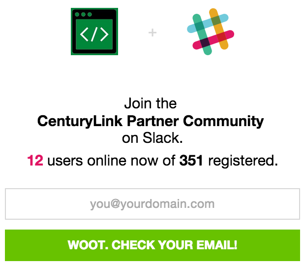

{{{
  "title": "Ecosystem Program Partner Resource Guide",
  "date": "7-21-2015",
  "author": "Andrew Brunette",
  "attachments": [],
  "sticky": true,
  "contentIsHTML": false
}}}

<strong>The AppFog service was retired on June 29, 2018. The AppFog Platform-as-a-Service is no longer available, including all source code, env vars, and database information. </strong>

### Overview

CenturyLink [Ecosystem Program Partner Members](centurylink-cloud-ecosystem-program-guide.md) gain access to a bevy of resources that make integrations easy and minimize time to successful customer adoption.  Leverage the assets below to make use of the investments CenturyLink has already made on your behalf so you can minimize your engineering and marketing learning curve.

### Technical Integration

Integration of 3rd party technology with CenturyLink Cloud can be achieved by leveraging one of our automation methods.  Follow the links below to your specific interest.

|Templates|Blueprints|APIs|Add-Ons|
|------|--------|---------|--------|
|[Supporting virtual appliances](ecosystem-program-resources-templates.md) |[Applying your software to customer assets](ecosystem-program-resources-blueprints.md)|[Programmatic access to cloud services](ecosystem-program-resources-api.md) |[Web service integration](ecosystem-program-resources-addons.md)  |

### Integration support

Get live support with any integration questions directly from our community of experts!

