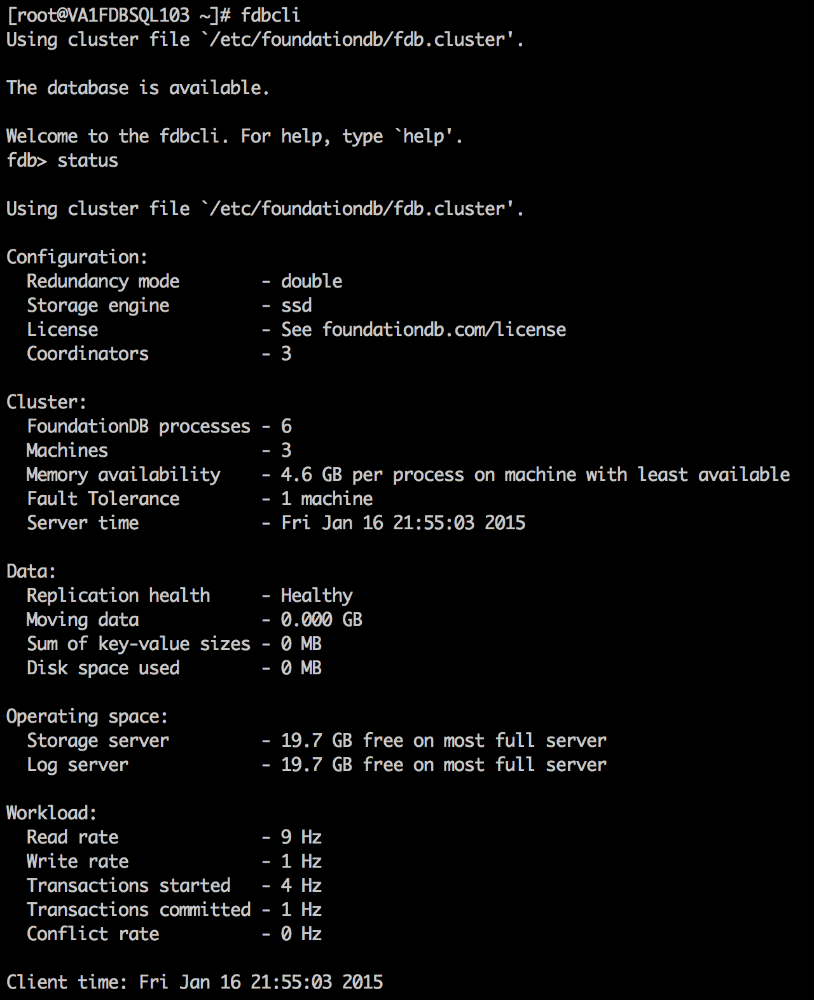
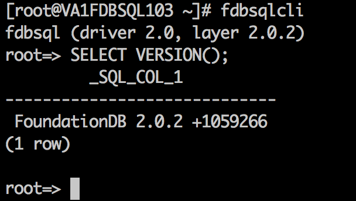

{{{
  "title": "Getting Started with FoundationDB - Blueprint",
  "date": "2-5-2014",
  "author": "Keith Resar",
  "attachments": [],
  "contentIsHTML": false
}}}

### Overview

After reading this article, the user should feel comfortable getting started using the partner technology on CenturyLink Cloud.

### Partner Profile

FoundationDB – “A multi-model database for all of your needs.”

http://www.foundationdb.com

####Customer Support

centurylinkcloud-sales@foundationdb.com

CenturyLink Cloud Account Alias: FDB

### Description

FoundationDB has integrated their technology with the CenturyLink Cloud platform.  The purpose of this KB article is to help the reader take advantage of this integration to achieve rapid time-to-value for this FoundationDB solution.

FoundationDB's mission is to provide data storage technology that frees engineers and companies to focus on problems other than building their data stack. To that end, FoundationDB is creating a new generation of database technology that combines the advantages of modern NoSQL databases with the power and reliability of ACID transactions.

### Audience

CenturyLink Cloud Users

### Deploy in Two Flavors

#### [Key-Value Store](https://foundationdb.com/key-value-store)

The Key-Value Store is a database that combines scalability, fault-tolerance, and high performance with incredibly powerful multi-key ACID transactions.

This deploys on CenturyLink Cloud with the following configuration:

FoundationDB key-value store version 3.0.4, deployed as a 3-node, 6-process cluster with the SSD storage engine and double redundancy.

#### [SQL Layer](https://foundationdb.com/layers/sql)

The SQL Layer is an ANSI SQL engine that stores its data in the Key-Value Store, inheriting its incredible properties. It is best suited for operational (OLTP) applications with high concurrency.

This deploys on CenturyLink Cloud with the following configuration:

FoundationDB 3.0.4 (3-node, 6-process cluster) with a single instance of the SQL Layer on a dedicated node.

### Steps

1. **Locate the Blueprint in the Blueprint Library**

  Click either of the items at right to access that Blueprint directly.

   

  Alternately, starting from the CenturyLink Control Panel, navigate to the Blueprints Library. Search for “FoundationDB” in the keyword search on the right side of the page.

2. **Click the Deploy Blueprint button.**
3. **Set Required parameters.**

  Select "FD1" in the drop down if not pre-populated - this will be your master server.

4. **Set Optional Parameters**

  

  Password/Confirm Password (This is the root password for the server. Keep this in a secure place).

  Set DNS to “Manually Specify” and use “8.8.8.8” (or any other public DNS server of your choice).

  Optionally set the server name prefix.

  The default values are fine for every other option.

5. **Review and Confirm the Blueprint**

6. **Deploy the Blueprint**

  Once verified, click on the ‘deploy blueprint’ button. You will see the deployment details stating the Blueprint is queued for execution.

  This will kick off the blueprint deploy process and load a page to allow you to track the progress of the deployment. Generally, it will take 15 to 20 minutes to configure all of the components.

7. **Deployment Complete**

  Once the Blueprint has finished execution you will receive an email confirming the newly deployed assets.

8. **Validate Foundation DB Core Installation**

  

  Login to your master server and execute the fdbcli tool.  If your display looks similar to the image at right your database is ready to use.

9. **Validate SQL Layer Installation (optional)**

  

  Login to your SQL server and execute the 'fdbsqlcli' tool.  Execute a command like 'SELECT VERSION();' and verify a response similar to the image at right.

10. **Getting started with FoundationDB - Key-Value Store**

  Click the link at right to get started with using the Foundation DB application.

11. **Getting started with FoundationDB - SQL Layer**

  Click the link at right to get started with using the Foundation DB application.

12. **Enable public access (optional)**

  Servers are built using private IPs only with access with client or IPSEC VPN.  For access from the Internet at large add a public IP to your master server.

### Pricing

The costs listed above in the above steps are for the infrastructure only.

After deploying this Blueprint, you may secure entitlements to the technology using the following steps:

Get started with a paid Silver, Gold, and Platinum support plans are available from https://foundationdb.com/pricing.

Email: centurylinkcloud-sales@foundationdb.com

### Frequently Asked Questions

**Where do I obtain my FoundationDB license?**

Paid Silver, Gold, and Platinum support plans are available from https://foundationdb.com/pricing.

**Who should I contact for support?**

* For issues related to cloud infrastructure, please open a ticket using the [CenturyLink Cloud Support Process](../Support/how-do-i-report-a-support-issue.md).
* For issues related to deploying the FoundationDB Blueprints and application operation on CenturyLink Cloud and you have a paid license, please contact centurylinkcloud-sales@foundationdb.com or follow your existing FoundationDB support process if known.
* For issues related to deploying the FoundationDB Blueprints and application operation on CenturyLink Cloud and you do not have a paid license, [sign up for access to the support community](https://foundationdb.com/get).

**How do I learn more about the application?**

[FoundationDB](https://foundationdb.com/key-value-store/documentation/index.html) has a massive store of [documentation](https://foundationdb.com/key-value-store/documentation/index.html) to help you get started and tutorials to make you successful.
