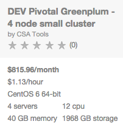
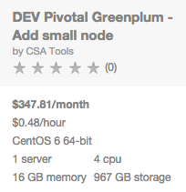

{{{
  "title": "Getting Started with Pivotal Greenplum - Blueprint",
  "date": "3-2-2015",
  "author": "Keith Resar",
  "attachments": [],
  "contentIsHTML": false
}}}

<!--

TODO:
* Customer support email address

-->


### Overview

After reading this article, the user should feel comfortable getting started using the partner technology on CenturyLink Cloud.

### Partner Profile


Pivotal Greenplum – “Best-in-class, enterprise-grade analytical data warehouse..”

http://pivotal.io/big-data/pivotal-greenplum-database

#####Customer Support

|Cloud Alias   	|Sales Contact   	|
|:-	|:-	|
|GOGO   	|centurylinkcloud-sales@pivotal.com   	|


### Description

Pivotal has integrated their Greenplum technology with the CenturyLink Cloud platform.  The purpose of this KB article is to help the reader take advantage of this integration to achieve rapid time-to-value for this FoundationDB solution.

Greenplum incorporates key performance capabilities, flexible data analytics, enterprise grade robustness, seamless integration with analytics stacks and a database management framework focused on reducing total cost of ownership.


### Audience

CenturyLink Cloud Users

### Deployment Packages


*option a*

|   |   |
|:- |:- |
|[](#) <p>[](#)  |<p>[Deploy a New Cluster](#deploying-a-new-cluster)<p>Deploy a minimal cluster sized for testing.<p>When you're ready, deploy a production capable cluster using the same pattern.<p>See [Deploying a new cluster](#deploying-a-new-cluster) to get started.   	|
|[](#) <p>[](#)   |<p>[Expand an Existing Cluster](#expanding-an-existing-cluster)<p>Grow existing clusters to their optimal size from day zero or to accommodate growth over time.<p>We'll cleanly add capacity and leave any application disrupting work to you.<p>See [Expanding an existing cluster](#expanding-an-existing-cluster) to get started.  |


*option b*

|[Deploy a New Cluster](#deploying-a-new-cluster)   	|[Expand an Existing Cluster](#expanding-an-existing-cluster)   	|
|:-	|:-	|
|[](#) <p>[](#)     	|[](#) <p>[](#)  |
|<p>Deploy a minimal cluster sized for testing.<p>When you're ready, deploy a production capable cluster using the same pattern.<p>See [Deploying a new cluster](#deploying-a-new-cluster) to get started.   	|<p>Grow existing clusters to their optimal size from day zero or to accommodate growth over time.<p>We'll cleanly add capacity and leave any application disrupting work to you.<p>See [Expanding an existing cluster](#expanding-an-existing-cluster) to get started.   	|


### Deploying a New Cluster

Single button deploy of a new cluster including a master host, a standby master for failover, and two nodes.  These are architected for deployment on both on standard cloud servers and Hyperscale servers.  1TB data space and two segments are available on each node.

#### Steps


1. **Locate the Blueprint in the Blueprint Library**

  Determine whether you will be building a test cluster with small nodes or a production cluster whose nodes have increased CPU and RAM available.

  Click one of the deployment cards below to begin.

  [](#)
  [](#)

  Alternately, starting from the CenturyLink Control Panel, navigate to the Blueprints Library. Search for “Pivotal Greenplum” in the keyword search on the right side of the page.

2. **Click the Deploy Blueprint button.**

3. **Set Required parameters.**

  TODO

4. **Set Optional Parameters**

  

  Password/Confirm Password (This is the root password for the server. Keep this in a secure place).

  Set DNS to “Manually Specify” and use “8.8.8.8” (or any other public DNS server of your choice).

  Optionally set the server name prefix.

  The default values are fine for every other option.

5. **Review and Confirm the Blueprint**

6. **Deploy the Blueprint**

  Once verified, click on the ‘deploy blueprint’ button. You will see the deployment details stating the Blueprint is queued for execution.

  This will kick off the blueprint deploy process and load a page where you can track the deployment progress. Deployment will typically complete within 15 to 20 minutes.

7. **Deployment Complete**

  Once the Blueprint has finished execution you will receive an email confirming the newly deployed assets.

  *TODO insert screencap*

8. **Web Command Center** (optional)

  If you elected to install the optional web command center you may access it via http on port 20800.  Authenticate using the `gpadmin` user and your administrative credentials

  *TODO insert screencap*

8. **Demo Application** (optional)

  If you elected to install the optional demo application you may access the database from the master server.  Follow the [Pivot Greenplum demo lab](#) to quickly get up to speed on the Greenplum platform.  Authenticate using the `gpadmin` user and your administrative credentials

  ```
  TODO - insert demo app
  ```

12. **Enable public access** (optional)

  Servers are built using private IPs only with access with client or IPSEC VPN.  For access from the Internet at large add a public IP to your master server.

  <a href="../network/how-to-add-public-ip-to-virtual-machine/">
    
    Adding a public IP to your virtual machine
  </a>


---


### Expanding an Existing Cluster


#### Steps


----


### Pricing

The costs listed above in the above steps are for the infrastructure only.

After deploying this Blueprint, you may secure entitlements to the technology using the following steps:

Email: centurylinkcloud-sales@pivotal.com

### Frequently Asked Questions

**Where do I obtain my license?**

*TODO*

**Who should I contact for support?**

* For issues related to cloud infrastructure, please open a ticket using the [CenturyLink Cloud Support Process](../Support/how-do-i-report-a-support-issue.md).
* For issues related to deploying the Pivotal Greenplum Blueprints and application operation on CenturyLink Cloud and you have a paid license, please contact centurylinkcloud-sales@pivotal.com or follow your existing Pivotal support process if known.


**How do I learn more about the application?**

*TODO insert screenshots and links*
